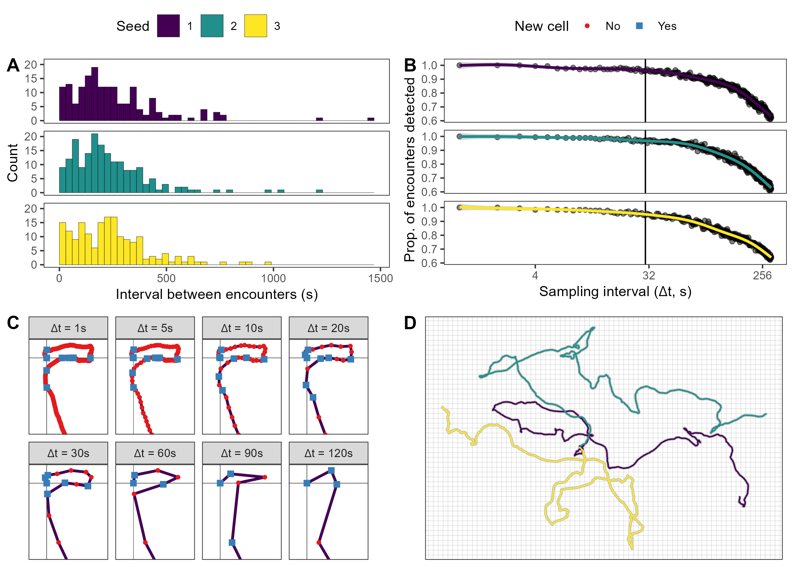

<!-- set default code chunk options -->

```{r, echo=FALSE}
knitr::opts_chunk$set(eval = FALSE, echo = TRUE, message = FALSE)
```

<!-- add custom commands for formulae -->

\newcommand{\e}{\mathbb E}
\newcommand{\var}{\mathbb V}
\newcommand{\vpos}{\mathbb V(\text{position})}

<!-- have table of contents on pages of its own -->

\newpage

\tableofcontents

# To do {-}

* change all references to scripts to the correct file locations
* give an overview of how the sims work at the beginning of the pdf
* explain the checks in `delta-t-sensitivity.R`
* reduce scaling of figure 2

\newpage

# Overview {-}

This appendix illustrates all the steps necessary to produce the simulation figures in the main manuscript. For ease of reference, we also include the figures here:

```{r 5-5-sims, eval=TRUE, echo=FALSE, fig.cap="Simulated spatial requirements for animals living in habitats where the mean and variance in resource availability ($R$) are constant, linearly increasing, cyclical, drifting, or erratic over time. The bottom line indicates the animal's core home range (0.5 quantile), while the top line indicates the 0.95 utilization quantile. Note how both quantiles decrease nonlinearly as $\\mathbb E(R)$ increases, and they increase approximately linearly as $\\mathbb V(R)$ increases. Additionally, the variance in both quantiles is higher when $\\mathbb V(R)$ is higher, and changes in $\\mathbb V(R)$ have greater impacts when $\\mathbb E(R)$ is low.\nSimulations were run such that animals followed the same 1000 tracks at each time point starting from the point $\\langle 0, 0\\rangle$ until they reach satiety, at which point they returned to $\\langle 0, 0\\rangle$ over the same amount of time. The animal's spatial variance parameter was then calculated using an OUF model via the $\\tt{ctmm}$ package", out.width='100%'}
knitr::include_graphics('../figures/mean-variance-5-by-5-hr-sims.png')
```

\newpage

```{r 5-5-reg, eval=TRUE, echo=FALSE, fig.cap="Effects of $\\e(R)$ and $\\var(R)$ on simulated spatial requirements. The bottom line indicates the relationships with the animal's core home range (0.5 quantile), while the top line indicates the relationship with the 0.95 utilization quantile. Note the nonlinear decrease in both utilization quantiles as $\\e(R)$ increases and the nonlineear increase in both utilization quantiles as $\\var(R)$ increases.", out.width='100%'}
knitr::include_graphics('../figures/simulation-regression-plots.png')
```

## explain how the sims work

To achieve full transparency while minimizing computational times, the code illustrated in this pdf is not executed during the knitting of the document. Instead, the R Markdown document ($\tt{writing/appendix-1-simulations.Rmd}$) contains code chunks that import the `RDS` files saved by the scripts used during the analysis via `R` code that is not printed in the pdf file. Although one can replicate the analyses by running the code in this pdf, we suggest only using this document for illustrative purposes and as a general guide. To replicate the simulations, we suggest using the `R` scripts, instead.

# Simulating the movement tracks

To reduce sampling variance between simulations, we use the same set of simulated tracks for each time point in each panel. In the $\tt{analysis/simulations/tracks.R}$ script, we generate $2^{10} = 1024$ tracks to check how many tracks are necessary to obtain stable home range estimates in the best- and worst-case scenarios. Most intermediate and diagnostic checks included in the `R` scripts are not included in this document for the sake of brevity and simplicity.

```{r load-packages, eval=TRUE, comment=FALSE}
# NOTE: change your working directory to be "env-var-review/writing", or
# modify all file paths as needed
library('ctmm')   # for generating movement models and movement modeling
library('raster') # for working with raster data
library('dplyr')  # for data wrangling
library('purrr')  # for functional programming
source('../functions/label_visits.R') # decides when animal encounters food

DELTA_T <- 60 # sampling interval in seconds
SAMPLES <- seq(0, 60 * 60 * 12, by = DELTA_T) # 12h every DELTA_T seconds

# projected raster of resources
PROJECTION <- '+proj=aeqd +lon_0=0 +lat_0=0 +datum=WGS84'
HABITAT <- matrix(data = 1, nrow = 500, ncol = 500) %>%
  raster(xmx = 1e3, xmn = -1e3, ymx = 1e3, ymn = -1e3, crs = PROJECTION)

# infinitely diffusive movement model
model <- ctmm(tau = c(Inf, 1e3), sigma = 0.1, mu = c(0, 0))
# summary(model) # FAILS TO KNIT BECAUSE OF TAU CHARACTER # check the parameters of the model
```

```{r simulate-tracks}
N_DAYS <- 2^10 # number of "days" (i.e., tracks with different seeds)

# extracts tracks from a ctmm movement model for given sample times
get_tracks <- function(day, times = SAMPLES) {
  simulate(model, # ctmm movement model
           t = times, # sampling times in seconds
           seed = day, # for a consistent track each day
           complete = TRUE, # add lat, long, and timestamp to telemetry
           crs = PROJECTION) # CRS projection string
}

# generate simulated tracks (will be truncated at satiety later)
tracks <- tibble(day = 1:N_DAYS, # a simulation for each day
                 tel = map(.x = day, # set a seed for consistent results
                           .f = get_tracks)) # function to generate tracks

# find patch visits and calories consumed from the tracks
tracks <-
  transmute(tracks, # drop tel column
            day, # keep day column
            track = map(.x = tel, # add a column of full tracks
                        .f = \(x) {
                          label_visits(.tel = x, .habitat = HABITAT)
                        }))

# make a single, large tibble (will need lots of RAM)
tracks <- tidyr::unnest(tracks, track)
```

After generating the tracks, we performed the following tests to ensure the tracks were appropriate and results would be stable:

## Checking whether adding return trips is necessary

This check was performed with the code in the $\tt{analysis/figures/simulations/return-sensitivity.R}$ script. Adding return trips to $\langle0, 0\rangle$ after an animal reached satiety doubled computational times without appreciable improvements on the home range estimates (including the 95% CIs). 

## Checking whether the sampling interval is sufficiently small

This check was performed with the code in the $\tt{analysis/figures/simulations/delta-t-sensitivity.R}$ script. ***explain what I did***

```{r dt-sensitivity, fig.cap="Diagnostic tests used to decide an appropriate sampling interval. (a.) Histograms of the number of encounters as a function of the interval between envounters, with a binwith of 30 seconds. Although some encounters occur with less than 30 seconds between them, most of them occur at least 60 seconds apart. (b.) Number of encounters with food detected as a function of sampling interval. The colored lines indicate the estimated relationship based on a Generalized Additive Model fit using the $\\tt{geom\\_smooth}$ function from the $\\tt{ggplot2}$ package. Although the number of encounters detected decreases as sampling interval doubles, the loss at 30 seconds is negligible. (c.) Beginning of the track generated with seed \"1\" (purple line) with the location of each sample for different sampling intervals. Red dots indicate samples where the animal remained in the same cell, while the blue squares indicate when an animal was in a new cell, and thus encountered food. While the number of feeding events detected decreases as the sampling interval increases, most of the feeding events lost at $\\Delta t = 30$s occured because the animal remained almost adjacent to the borders between cells. (d.) The three tracks used in these tests over the raster used to determine when the animals encountered food.", out.width='100%', echo=FALSE, eval=TRUE}

```

## Checking how many tracks were necessary

This check was performed with the code in the $\tt{analysis/simulations/hr-simulation-extreme-scenarios.R}$ script. ***explain, add figures***

# Main scripts (to be run in the following order)

2. $\tt{analysis/simulations/hr-mean-variance-simulations-days.R}$
3. $\tt{analysis/simulations/hr-mean-variance-simulations-days-summarized.R}$
4. $\tt{analysis/simulations/hr-mean-variance-simulations-modeling.R}$
5. $\tt{analysis/simulations/hr-mean-variance-simulations-hrs.R}$
