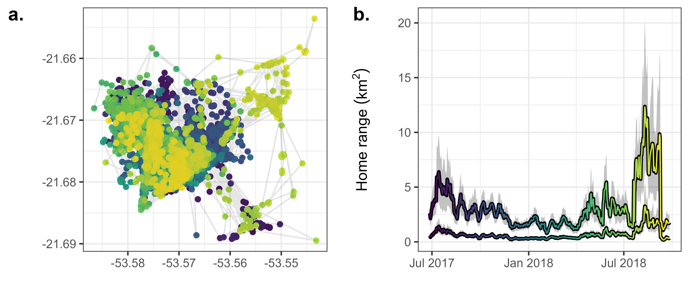

<!-- set default code chunk options -->

```{r, echo=FALSE}
knitr::opts_chunk$set(eval = FALSE,         # do not run R code
                      echo = TRUE,          # print R code
                      message = FALSE,      # hide messages
                      comment = '',         # don't add anything before outputs
                      fig.align = 'center', # change figure alignment
                      cache = TRUE)         # cache all chunk outputs
```

<!-- add custom commands for formulae -->

\newcommand{\e}{\mathbb E}
\newcommand{\var}{\mathbb V}
\newcommand{\vpos}{\mathbb V(\text{position})}

<!-- have table of contents on pages of its own -->

\newpage

\tableofcontents

# To do {-}

* add scripts to the correct folders and check

\newpage

This appendix illustrates the steps necessary to reproduce the tapir movement analysis and figures in the main manuscript. The tapir data used here is from the work of @medici_movement_2022 and can be found at the GitHub repository located at https://github.com/StefanoMezzini/tapirs. For ease of reference, we also include the figure below (figure \@ref(fig:mw-examples)).

```{r mw-example, fig.cap="Seven-day home range size of a tapir ($Tapirus~terrestris$) in response to changes in mean and variance in resource abundance. (a.) GPS tracking data of the tapir. (b.) Mean resource abundance esimated as the mean NDVI at the locations visited by the tapir. (c.) Varince in resource abundance esimated as the average variance in NDVI at the locations visited by the tapir. (d.) Estimated home range size during each seven-day period, based on 50\\% (bold) and 95\\% (thin) utilization quantiles. (e.) Effect of resource abundance on home range size. (f.) Effect of resource unpredictability on home range size. The effects in panels e and f were estimated using generalized linear models with Gamma conditional distributions. The tapir movement data corresponds to the individual named \"Anna\" from the Cerrado sample of Medici $et~al.$ (2022).", out.width='100%', eval=TRUE, echo=FALSE}
knitr::include_graphics('../figures/tapir-example.png')
```

Estimating the effects of resource abundance and unpredictability on the tapir's spatial needs requires us to first estimate the changes in the tapir's spatial needs (section \@ref(movement)) and the changes in resource abundance and variance (section \@ref(ndvi)) before we can estimate the relationship between resource dynamics and spatial use to recreate the final figure (section \@ref(final-fig)).

To minimize the computational costs of creating this appendix, we load the necessary objects through hidden `R` chunks rather than running all the code in the final pdf. Still, those interested in replicating the analysis can do so by using the code in the pdf document or the related `R` markdown (`Rmd`) document. Listed below are all the packages and source scripts required to run the analyses in this document. For spatial data, we use the `MODIStsp` package [version 2.0.9, @busetto_modistsp_2016] to download the NDVI rasters, the `raster` package [version 3.6-3, @hijmans_raster_2022] to work with the NDVI rasters, and the `sf` package [version 1.0-8, @pebesma_simple_2018]. We use the `dplyr` [version 1.0.10, @wickham_dplyr_2022], `purrr` [version 0.3.5, @henry_purrr_2022], and `tidyr` [version 1.2.1, @wickham_tidyr_2022] packages for data wrangling and the `lubridate` package [version 1.8.0, @grolemund_dates_2011] for converting calendar dates to decimal dates. Finally, we used the `ctmm` package [version 1.1.0, @fleming_ctmm_2021] and the `mgcv` package [version 1.8-41, @wood_generalized_2017] for modeling and the `ggplot2` [version 3.4.0, @wickham_ggplot2_2016] and `cowplot` [version 1.1.1, @wilke_cowplot_2020] packages for plotting.

```{r, eval=TRUE, comment=FALSE}
# NOTE: to replicate the analyses, you need to change your working directory
#       to "hr-resource-stoch/writing", or
# modify all file paths as needed

# attach all necessary packages
library('raster')    # to import and save rasters
library('dplyr')     # for data wrangling
library('purrr')     # for functional programming
library('tidyr')     # for data wrangling
library('ggplot2')   # for fancy plots
library('cowplot')   # for fancy multi-panel plots
library('ctmm')      # for movement modeling
library('mgcv')      # for empirical Bayesian modeling
library('lubridate') # for smoother date wrangling
library('sf')        # for spatial features
library('MODIStsp')  # for downloading NDVI rasters

# resolve conflicts between packages
select <- dplyr::select

# source all necessary scripts
source('../analysis/figures/default-figure-styling.R') # NDVI color palette
source('../earthdata-login-info.R') # personal login info for EarthData
source('../analysis/figures/default-figure-styling.R') # for color palettes
source('../functions/window_hr.R') # function to calculate HRs
```

\newpage

# Modeling the tapir's movement over time {#movement}

The script `analysis/tapir/tapirs-moving-window.R` estimates the seven-day spatial use of various tapirs from the Brazilian Cerrado. Here, we simplified the code so that it only estimates the spatial use of the tapir in the manuscript, Anna:

```{r}
# import tapir data from https://github.com/StefanoMezzini/tapirs
anna <- readRDS('../../tapirs/models/tapirs-final.rds') %>%
  filter(name.short == 'ANNA')
anna_tel <- anna$data[[1]] # telemetry data

# projection for the region in the Brazilian Cerrado
ctmm::projection(anna_tel) <- '+proj=utm +zone=22 +datum=NAD83 +units=m'

# calculate the 7-day home range estimate
anna_mw <-
  window_hr(
    anna_tel,
    window = 7 %#% 'day', # 1 week of data for sufficient sample size
    dt = 1 %#% 'day', # move window over by a single day each time
    fig_path = '../figures',
    rds_path = '../models'
  )
```

```{r, echo=FALSE, eval=TRUE}
anna <- readRDS('../../tapirs/models/tapirs-final.rds') %>%
  filter(name.short == 'ANNA')
anna_tel <- anna$data[[1]] # telemetry data

# projection for the region in the Brazilian Cerrado
ctmm::projection(anna_tel) <- '+proj=utm +zone=22 +datum=NAD83 +units=m'

anna_mw <- readRDS('../models/CE_31_ANNA-window-7-days-dt-1-days.rds')
```

The `window_hr()` function estimates the tapir's home range using a sliding window approach with a window size of 7 days that starts with the first seven days of data (2017-06-24 to 2017-07-01) and then repeats the analysis for the second seven-day set (2017-06-25 to 2017-07-02) until it reaches the last set of days (2018-09-23 to 2018-09-30). It then saves an exploratory figure (figure \@ref(fig:mw)) to the `figures` folder and the list of movement models to the `models` folder.

```{r mw, eval=TRUE, echo=FALSE, fig.cap="Exploratory figure created by the $\\tt{window\\_hr()}$ function. Panel $\\mathbf{a.}$ shows the tapir's movement data, while panel $\\mathbf{b.}$ shows the seven-day home range estimates (95\\% and 50\\% utilization quantiles) with 95\\% confidence intervals."}

```

\newpage

# Modeling $\e(R)$ and $\var(R)$ over time {#ndvi}

To estimate the resources in the tapir's habitat, we used satellite-measured Normalized Difference Vegetation Index [NDVI, see @pettorelli_using_2005; @pettorelli_normalized_2011]. We downloaded the data using the `MODIStsp` `R` package with the following code:

```{r}
anna_ud <- anna$akde[[1]]

bbox <-
  SpatialPolygonsDataFrame.UD(anna_ud,
                              level.UD = 0.9995, # utilization quantile
                              level = 0) %>% # no CIs
  st_as_sf() %>%
  st_transform(crs = '+proj=longlat') %>%
  st_bbox()

# download NDVI rasters (if needed, create all necessary folders first)
MODIStsp(gui = FALSE, # do not use the browser GUI, only run in R
         out_folder = '../data/ndvi-rasters/tapir-anna',
         selprod = 'Vegetation Indexes_16Days_250m (M*D13Q1)',
         prod_version = '061', # 2022 raster version
         bandsel = 'NDVI', # NDVI layer only
         sensor = 'Terra', # only terrestrial values, ignore water
         user = USERNAME, # Earthdata username for urs.earthdata.nasa.gov
         password = PASSWORD, # your Earthdata password
         start_date = format(min(anna_tel$timestamp) - 16, '%Y.%m.%d'),
         end_date = format(max(anna_tel$timestamp) + 16, '%Y.%m.%d'),
         spatmeth = 'bbox', # use a bounding box for the extent
         bbox = bbox, # spatial file for raster extent
         out_projsel = 'User Defined', # use specified projection
         output_proj = '+proj=longlat', # download unprojected raster
         resampling = 'bilinear', # raster resampling method for new proj
         delete_hdf = TRUE, # delete HDF files after download is complete
         scale_val = TRUE, # convert from integers to floats within [-1, 1]
         out_format = 'GTiff', # output format
         verbose = TRUE) # print processing messages

# save NDVI data as an rds file of a tibble
anna_ndvi <-
  list.files(
    path = '../data/ndvi-rasters/tapir-anna/VI_16Days_250m_v61/NDVI/',
    pattern = '.tif', full.names = TRUE) %>%
  stack() %>% # import all rasters as a single stack
  rasterToPoints() %>% # convert to a matrix of points
  data.frame() %>% # convert to a data frame
  pivot_longer(-c(x, y)) %>% # change to long format (x, y, name, value)
  transmute(long = x, # rename x column
            lat = y, # rename y column
            date = substr(name, # change name to a date
                          start = nchar('MOD13Q1_NDVI_x'),
                          stop = nchar(name)) %>%
              as.Date(format = '%Y_%j'), # format is year_julian date
            ndvi = value, # rename value column
            dec_date = decimal_date(date))
```

```{r, echo=FALSE, eval=TRUE}
# import NDVI data
anna_ndvi <-
  readRDS('../data/tapir-anna-ndvi-data.rds') %>%
  mutate(dec_date = decimal_date(date))
```

We removed the raster for 2017-12-19 because the values were unusually low for the region. We hypothesize the change in NDVI was drastic, temporary, and widespread because of a sudden flood (which is common for the Cerrado):

<!-- using echo = TRUE and eval = TRUE because this needs to be both visible and evaluated -->

```{r, echo=TRUE, eval=TRUE, fig.height=4, fig.width=5, out.width='100%'}
anna_ndvi %>%
  filter(date >= as.Date('2017-08-29'), date <= as.Date('2018-04-07')) %>%
  ggplot() +
  facet_wrap(~ date, nrow = 3) + # a raster for each date
  coord_equal() + # keep the scaling of x and y equal
  geom_tile(aes(long, lat, fill = ndvi)) +
  scale_x_continuous(NULL, breaks = NULL, expand = c(0, 0)) +
  scale_y_continuous(NULL, breaks = NULL, expand = c(0, 0)) +
  scale_fill_gradientn('NDVI', colours = ndvi_pal, limits = c(-1, 1)) +
  theme(legend.position = 'top')

anna_ndvi <- filter(anna_ndvi, date != '2017-12-19') # remove bad values
```

Next, we estimate the mean and variance in NDVI using a Generalized Additive Model for location and scale (GAMLS) [@wood_generalized_2017; @simpson_modelling_2018; @stasinopoulos_generalized_2007]. Ideally, we would model NDVI using a family of distributions that accounts for the fact that NDVI cannot be less than -1 or greater than 1. The beta family would be appropriate after applying the linear transformation $$y^* = \frac{y + 1}{2},$$ where $y$ is the original NDVI value (between -1 and 1) while $y^*$ is the NDVI value scaled between 0 and 1. However, the `mgcv` package [@wood_generalized_2017] does not allow one to model changes in variance in NDVI using a location-scale model with a beta family. Although the `brms` package allows one to fit beta location-scale models [@burkner_brms_2017; @burkner_advanced_2018], the computational costs of using a fully Bayesian approach can be prohibitive for large datasets. Therefore, we decided to use a location-scale Gaussian model via the `mgcv` package (`family = gaulss()` in the code chunk below). Given the large amounts of data, the predictions are sufficiently far from -1 and 1 that any bias appears to be negligible.

```{r}
m_ndvi <-
  gam(list(
    # mean predictor
    ndvi ~
      s(long, lat, bs = 'ds', k = 20) + # mean over space (k = 20 * 20)
      s(dec_date, bs = 'tp', k = 20),   # high k to account for adaptions
    # precision (1/standard deviation) predictor
    ~
      s(long, lat, bs = 'ds', k = 10) + # precision over space
      s(dec_date, bs = 'tp', k = 10)),  # precision over time
    family = gaulss(b = 0.0001), # minimum standard deviation of 0.0001
    data = anna_ndvi,
    method = 'REML') # performs better than GCV (the default)

# plot smooths (note: predictions are on the link scales!)
plot(m_ndvi, pages = 1, scheme = 3, n = 250, scale = 0)
```

```{r, echo=FALSE, eval=TRUE}
m_ndvi <- readRDS('../models/CE_31_ANNA-mgcv-ndvi-gaulss.rds')
plot(m_ndvi, pages = 1, scheme = 3, n = 250, scale = 0)
```

Note that when fitting location-scale GAMs, one should pay particular attention to the number of knots used for each smooth term. While using a penalized maximum likelihood method such as REML (`method = 'REML'`) helps avoid over-fitting the model, finding the right balance between each of the `k` values is crucial. Excessively smooth terms for the mean can inflate the variance (figure \@ref(fig:undersmooth)), while excessively wiggly smooth terms for the mean can cause the variance to be under-estimated (figure \@ref(fig:oversmooth)). Ultimately, each of the `k` values should be decided while in such a way as to mimic the animal's responsiveness, adaptability, motility, and memory (or ability to predict cycles or events). If one is unsure where to start from, keeping the `k` for the scale smooth terms below half the `k` for the mean smooth terms is a good starting point. Additionally, note that computation time depends strongly on the complexity of the two-dimensional spatial terms, since changes in `k` alter the size of the term quadratically (since the total size is $\tt k \times \tt k = \tt k^2$).

```{r}
gam(list(
  # mean predictor
  ndvi ~
    s(long, lat, bs = 'ds', k = 10) + # default k (too small)
    s(dec_date, bs = 'tp', k = 10),
  # precision (1/standard deviation) predictor
  ~
    s(long, lat, bs = 'ds', k = 20) + # excessively high k
    s(dec_date, bs = 'tp', k = 20)),
  family = gaulss(b = 0.0001),
  data = anna_ndvi,
  method = 'REML') %>%
  plot(pages = 1, scheme = 3, n = 250, scale = 0)
```

```{r}
gam(list(
  # mean predictor
  ndvi ~
    s(long, lat, bs = 'ds', k = 50) + # k too large
    s(dec_date, bs = 'tp', k = 29), # k too large
  # precision (1/standard deviation) predictor
  ~
    s(long, lat, bs = 'ds', k = 5) + # k too low
    s(dec_date, bs = 'tp', k = 5)),  # k too low
  family = gaulss(b = 0.0001),
  data = anna_ndvi,
  method = 'REML') %>% # performs better than GCV (the default)
  plot(pages = 1, scheme = 3, n = 250, scale = 0)
```

<!-- chunks to create the plots -->

```{r undersmooth, fig.cap="Estimated mean and variance in NDVI with excessively small basis size $\\tt{k}$ for the mean smooth terms and excessively large for the variance smooth terms.", echo=FALSE, eval=TRUE}
gam(list(
  # mean predictor
  ndvi ~
    s(long, lat, bs = 'ds', k = 10) + # default k (too small)
    s(dec_date, bs = 'tp', k = 10),
  # precision (1/standard deviation) predictor
  ~
    s(long, lat, bs = 'ds', k = 20) + # excessively high k
    s(dec_date, bs = 'tp', k = 20)),
  family = gaulss(b = 0.0001), # minimum standard deviation of 0.0001
  data = anna_ndvi,
  method = 'REML',
  control = gam.control(nthreads = 4)) %>%
  plot(pages = 1, scheme = 3, n = 250, scale = 0)
```

```{r oversmooth, fig.cap="Estimated mean and variance in NDVI with excessively large basis size $\\tt{k}$ for the smooth term of time ($\tt{dec\\_date}$) for the mean in NDVI and excessively low for the variance temporal smooth term.", echo=FALSE, eval=TRUE}
gam(list(
  # mean predictor
  ndvi ~
    s(long, lat, bs = 'ds', k = 50) +
    s(dec_date, bs = 'tp', k = n_distinct(anna_ndvi$dec_date)), # k too large
  # precision (1/standard deviation) predictor
  ~
    s(long, lat, bs = 'ds', k = 5) + # k too low
    s(dec_date, bs = 'tp', k = 5)),  # k too low
  family = gaulss(b = 0.0001),
  data = anna_ndvi,
  method = 'REML',
  control = gam.control(nthreads = 4)) %>%
  plot(pages = 1, scheme = 3, n = 250, scale = 0)
```

\newpage

# Modeling the effects of $\e(R)$ and $\var(R)$ on spatial needs {#final-fig}

We start by simulating a movement track that passes near all recorded locations using the movement model estimated from the telemetry data. Note that this step can take hours to run, so we suggest skipping it if one is only interested in replicating the most important portions of the analysis (since the track is only used for panel $\mathbf{a.}$ in the figure).

```{r}
# simulate the movement track with an interval of 100 seconds
anna_ouf <- anna$model[[1]]
track <-
  predict(anna_ouf, data = anna_tel, dt = 100, complete = TRUE) %>%
  data.frame() %>%
  select(timestamp, longitude, latitude) %>%
  rename(long = longitude, lat = latitude) %>%
  mutate(dec_date = decimal_date(timestamp))
```

```{r, eval=TRUE, echo=FALSE}
track <- readRDS('../models/CE_31_ANNA-track-dt-100.rds')
```

To create panels $\mathbf{b.}$-$\mathbf{f.}$, we use the NDVI Gaussian location-scale model to estimate the mean and variance in NDVI for each known location of the tapir.

```{r, eval=TRUE}
# function to make predictions from the NDVI model based on telemetry data
ndvi_preds <- function(.data) {
  .data <- .data %>%
    data.frame() %>% # convert telemetry data to a data.frame
    mutate(year = year(timestamp),
           doy = yday(timestamp))
  
  predict.gam(m_ndvi, newdata = .data, type = 'response', se.fit = FALSE)%>%
    data.frame() %>% # from list to data frame
    tibble() %>% # from data frame to tibble
    transmute(mu = X1, # rename mean column
              sigma2 = (1/X2)^2) %>% # convert precision to variance
    return()
}

anna_tel <- data.frame(anna_tel) %>%
  tibble() %>%
  rename(long = longitude, lat = latitude) %>%
  mutate(dec_date = decimal_date(timestamp))
anna_tel <- bind_cols(anna_tel, ndvi_preds(anna_tel))
```

We also apply the function to the subset of the telemetry data belonging to each of the seven-day periods.

```{r, eval=TRUE}
anna_mw <-
  mutate(
    anna_mw,
    # estimate mean and variance in NDVI
    preds = map(dataset, \(.d)
                filter(anna_tel, timestamp %in% .d$timestamp)),
    # extract the column of mean NDVI and take the average
    mu = map_dbl(preds, \(.d) mean(.d$mu)),
    # extract the column of variance in NDVI and take the average
    sigma2 = map_dbl(preds, \(.d) mean(.d$sigma2))) %>%
  # only keep necessary coliumns
  select(t_center, mu, sigma2, hr_lwr_50, hr_est_50, hr_upr_50, hr_lwr_95,
         hr_est_95, hr_upr_95) %>%
  # change to long format (one column for both utilization quantiles)
  pivot_longer(c(hr_lwr_50, hr_est_50, hr_upr_50, hr_lwr_95, hr_est_95,
                 hr_upr_95), names_to = c('.value', 'quantile'),
               names_pattern = '(.+)_(.+)') %>%
  mutate(t_center = as.POSIXct(t_center, origin = '1970-01-01'),
         quantile = paste0(quantile, '%'),
         quantile = factor(quantile))
anna_mw
```

We now have all the necessary objects to create the final figure:

```{r}
# min and max of the tracking dates
date_labs <- range(anna_tel$timestamp) %>% as.Date()

p_track <-
  ggplot() +
  coord_equal() +
  geom_path(aes(long, lat), track, alpha = 0.3) +
  geom_point(aes(long, lat, color = dec_date), anna_tel) +
  scale_color_viridis_c(NULL, breaks = range(anna_tel$dec_date),
                        labels = date_labs) +
  labs(x = NULL, y = NULL)

p_mu <-
  ggplot(anna_mw, aes(t_center, mu)) +
  geom_line(color = pal[1]) +
  labs(x = NULL, y = '\U1D707(t)')

p_sigma2 <-
  ggplot(anna_mw, aes(t_center, sigma2)) +
  geom_line(color = pal[2]) +
  labs(x = NULL, y = '\U1D70E\U00B2(t)')

p_hr <-
  ggplot(anna_mw) +
  geom_line(aes(t_center, hr_est, group = quantile, lwd = quantile),
            color = pal[3], show.legend = FALSE) +
  geom_ribbon(aes(t_center, ymin = `50%`, ymax = `95%`),
              anna_mw %>%
                select(t_center, hr_est, quantile) %>%
                pivot_wider(values_from = hr_est, names_from = quantile),
              fill = pal[3], color = 'transparent', alpha = 0.2,
              inherit.aes = FALSE) +
  labs(x = NULL, y = expression(Home~range~size~(km^2)~'   ')) +
  scale_size_manual(values = c(1, 0.5))
```

To ensure all panels are properly aligned, we convert each plot to a grid object (a "grob") and then align each grob.

```{r}
# convert to grid graphical objects (grobs)
grobs <- map(list(p_track, p_mu, p_sigma2, p_hr), as_grob)

# align left margins of all plots
aligned_widths <- align_margin(map(grobs, function(x) {x$widths}), 'first')

# Setting the dimensions of plots to the aligned dimensions
for (i in seq_along(grobs)) {
  grobs[[i]]$widths <- aligned_widths[[i]]
}
# create a panel of the plots
p_left <- plot_grid(plotlist = grobs, ncol = 1,
                    labels = paste0(letters, '.'))
```

Finally, we estimate the effects of $\e(R)$ and $\var(R)$ on the tapir's space use using the `geom_smooth()` function from the `ggplot2` package. Although one would ideally model the relationships with a formal model, we use `geom_smooth()` because the sampling of the estiamted means and variance are both *auto*correlated (figure \@ref(fig:)) and correlated, so the risk for biased estimates is high (figure \@ref(fig:mu-s2-rel)).

```{r mu-s2-rel, eval=TRUE, echo=FALSE, fig.cap="Scatterplot of estimated mean NDVI and variance in NDVI. Both variables are higly temporally autocorrelated, and there is also strong correlation between the two variables."}
knitr::include_graphics('H:/GitHub/hr-resource-stoch/figures/mean-variance-relationship.png',
                        rel_path = TRUE)
```


```{r}
# mean
reg_mu <-
  ggplot(anna_mw) +
  coord_cartesian(ylim = c(0, 13)) +
  geom_point(aes(mu, hr_est, group = quantile, shape = quantile), alpha = 0.3,
             color = pal[3]) +
  geom_smooth(aes(mu, hr_est, group = quantile, lwd = quantile),
              color = pal[1], se = FALSE, method = 'gam',
              formula = y ~ x, method.args = list(family = "Gamma")) +
  scale_x_continuous('Resource abundance') +
  scale_y_continuous(expression(Home~range~size~(km^2)), expand = c(0, 0)) +
  scale_size_manual(values = c(1, 0.5)) +
  theme(legend.position = 'none')

# variance
reg_s2 <-
  ggplot(anna_mw) +
  coord_cartesian(ylim = c(0, 13)) +
  geom_point(aes(sigma2, hr_est, group = quantile, shape = quantile),
             alpha = 0.3, color = pal[3]) +
  geom_smooth(aes(sigma2, hr_est, group = quantile, lwd = quantile),
              color = pal[2], se = FALSE, method = 'gam',
              formula = y ~ x, method.args = list(family = "Gamma")) +
  scale_x_continuous('Resource unpredictability') +
  scale_y_continuous(expression(Home~range~size~(km^2)), expand = c(0, 0)) +
  scale_size_manual('Quantile', values = c(1, 0.5)) +
  scale_shape('Quantile') +
  theme(legend.position = 'none')

leg <-
  get_legend(
    ggplot(anna_mw) +
      geom_smooth(aes(sigma2, hr_est, group = quantile, lwd = quantile),
                  se = FALSE, method = 'gam', color = 'black',
                  formula = y ~ x, method.args = list(family = "Gamma")) +
      geom_point(aes(sigma2, hr_est, group = quantile, shape = quantile),
                 color = pal[3]) +
      scale_size_manual('Utilization quantile', values = c(1, 0.5)) +
      scale_shape('Utilization quantile') +
      theme(legend.position = 'top')
  )

# add a legend on the top 
p_regs <- plot_grid(leg, reg_mu, reg_s2, ncol = 1,
                    rel_heights = c(0.1, 1, 1), labels = c('', 'e.', 'f.'))

# group all the plots together
plot_grid(p_left, p_regs)
```

```{r, echo=FALSE, eval=TRUE, out.width='100%'}
knitr::include_graphics('../figures/tapir-example.png')
```

\clearpage

# References {-}
