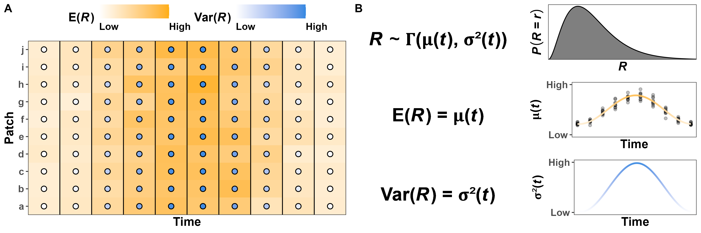

\newcommand*\e{\text{E}} <!-- expectation; non-italic E -->
\newcommand*\var{\text{Var}} <!-- variance; non-italic Var -->

\newpage

```{r setup, include=FALSE}
# set chunk defaults: don't print code, images 75% of page width and centered
knitr::opts_chunk$set(echo = FALSE, fig.align = 'center', out.width = '100%')
```

\noindent In this appendix, we presents the foundational concepts and terms used in the main manuscript. We introduce each concept without assuming a statistical or quantitative background to maximize accessibility and minimize misunderstandings and misinterpretations.

## Probability distributions

\noindent Random variables are defined by specifying the distribution the variable is assumed to follow (e.g., Gaussian, Gamma, Poisson, Bernoulli). Since the variable is random, it can take multiple possible values, each with different probabilities. The set or range of values which have non-zero probabilities in a distribution is referred to as the distribution's support.

There are many distributions we can assign to $R$ depending on how we quantify it. For instance, if we measure $R$ using the Normalized Difference Vegetation Index [NDVI, see @pettorelli_normalized_2011], we should use a distribution with support over the interval $[-1, 1]$, since NDVI can only take on values between -1 and 1 (extremes included). However, there is no commonly used distribution with that support, so the best option is to rescale NDVI to (0, 1) and use a beta distribution (see the section below on applying this framework). Alternatively, if $R$ is the number of calories an animal is able to access from food in a given location, we can let $R$ follow a distribution with support positive real numbers, such as a Gamma or log-normal distribution. If $R$ is a discrete integer variable, such as the number of prey in a location during a period of time, we can use a Poisson or negative binomial distribution.

## Expected resources, $\e(R)$

\noindent Since the exact value of $R$ at a given time and location is unknown, comparing the magnitude in $R$ between two locations or time periods requires a quantitative measure of what value we believe $R$ will take, on average. The expectation of a random variable is the value one can expect the random variable to take, on average, in the long term. Here we use $\e(R)$ to indicate the expectation of the random variable $R$. When the mean changes over time, such as in strongly seasonal regions, we explicitly indicate that $\e(R)$ changes over time by writing $\e(R)$ as a function of time, $t$: $\e(R|t) = \mu(t)$ (Fig. A\@ref(fig:multipanel-constant-var)). We indicate the estimated average amount of resources over time by adding a caret on the symbol: $\hat \mu(t)$. Note, however, that the estimate of $\mu(t)$ and what values it can take depend on what distribution we assume $R$ follows. For a Gamma distribution, $\mu(t)$ can take any positive value, but if we use NDVI as a proxy for $R$, then $\mu(t)$ is necessarily within the interval $(-1, 1)$. See the section on modeling $R$ in the main manuscript for more information on how to choose probability distributions.

```{r multipanel-constant-var, fig.cap="Fictitious example of variation in resources in a heterogeneous environment with constant variance (after accounting for changes in the mean). (A) Resources ($R$, orange fill) vary over time and space with a constant the variance (dot color). (B) Arbitrary definition of $R$ as following a Gamma distribution with time-varying mean $\\mu(t)$ and constant variance $\\var(R) = \\sigma^2$. The points in the central panel indicate the ralizations of $R$ in panel a.", fig.pos='!h'}
knitr::include_graphics('../figures/habitat-examples-constant-variance.png')
```

## Variance in resources, $\var(R)$

\noindent In viewing resources as a random variable, we not only obtain a formal framework for describing $\e(R)$, but also the spread around $\e(R)$. A random variable's variance is a measure of its unpredictability (i.e., variability). We use the notation $\var(R)$ to indicate the variance in $R$ after accounting for changes in $\mu(t)$, and we use $\sigma^2(t)$ to indicate its function over time (with estimate $\widehat{\sigma^2}(t)$; see Fig. A\@ref(fig:multipanel-changing-var)). <!-- Consequently, while $R$ may vary within years, we define $\var(R)$ as the variation in $R$ after accounting for the fact that $R$ is (predictably) lower during some seasons and higher in others due to changes in $\sigma^2(t)$. Additionally, we distinguish between two different sources of variation. We refer to known or expected spatiotemporal differences or changes as heterogeneity, which we consider as a change in $\mu(t)$. In contrast, we use the term stochasticity for unpredictable variation (i.e., due to $\sigma^2(t)$).--> For example, the time at which berry bushes produce fruit may seem highly stochastic (i.e., unpredictable) to a young bear, but it becomes predictable as it learns to understand and predict how the mean amount of berry changes with the seasons. Still, whether next year will be a good or bad year for berries remains stochastic because it depends on factors the bear cannot predict (e.g., droughts, fires), but the bear can still expect $\sigma^2(t)$ to be lower in the winter since it does not expect to find berries (i.e., $\mu(t) \approx 0$). Also note that, like with $\mu(t)$, the estimate of $\sigma^2(t)$ and what values it can take depend on what distribution we assume $R$ follows. Figure A\@ref(fig:ex) shows four examples of Gamma distributions with different means and variances.

```{r multipanel-changing-var, fig.cap="Fictitious example of variation in resources in a heterogeneous environment with changing variance (even after accounting for changes in the mean). (A) Although resources ($R$, orange fill) varies over time and space, the variance (dot color) is lowest at the beginning and end of the observational period and highest when $\\e(R)$ peaks. (B) Arbitrary definition of $R$ as following a Gamma distribution with time-varying mean $\\mu(t)$ and variance $\\sigma^2(t)$. The points in the central panel indicate the ralizations of $R$ in panel a.", fig.pos='!h'}

```

```{r ex, eval=TRUE, echo=FALSE, fig.height=5, fig.cap="Examples of Gamma distributions with different means ($\\mu$) and variances ($\\sigma^2$).", fig.pos='!h', message=FALSE, warning=FALSE, out.width = '75%'}
library('dplyr') # for data wrangling
library('tidyr') # for data wrangling
library('ggplot2') # for fancy plots

# to help visualize the consequences of different E(R) and V(R) if R ~ Gamma
dgamma2 <- function(x, mu, sigma2, lower.tail = FALSE) {
  # mean = k * theta
  # sigma^2 = k * theta^2
  dgamma(x = x,
         shape = mu^2 / sigma2, # (k * theta)^2 / (k * theta^2)
         scale = sigma2 / mu)   # (k * theta^2) / (k * theta)
}

expand_grid(x = tibble(x = seq(0, 10, length.out = 1000)),
            mean = c(1, 5),
            var = c(0.5, 5)) %>%
  unnest(x) %>%
  mutate(dens = dgamma2(x = x, mu = mean, sigma2 = var)) %>%
  ggplot(aes(x, dens)) +
  coord_cartesian(xlim = c(-0.5, 10.5), ylim = c(0, 0.8)) +
  # using '\U03BC' because mu results in \propto, for some reason
  facet_wrap(. ~ mean + var,
             labeller = label_bquote('\U03BC' == .(mean)~','~sigma^2 == .(var)))+
  geom_line(na.rm = TRUE) +
  geom_area(alpha = 0.3, na.rm = TRUE) +
  scale_y_continuous(expand = c(0, 0)) +
  scale_x_continuous(expand = c(0, 0)) +
  labs(x = 'r', y = 'Density') +
  theme_bw()
```

\clearpage <!-- reference on a new page without figures -->

# References

\hangparas{1em}{1} <!-- indent all lines but the first -->
