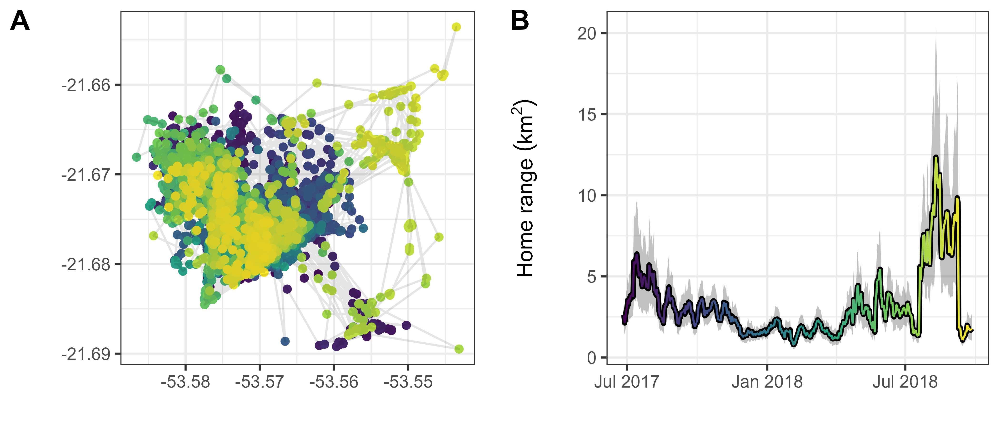

<!-- set default code chunk options -->

```{r setup, echo=FALSE}
hook_chunk <- knitr::knit_hooks$get('chunk')

knitr::knit_hooks$set(chunk = function(x, options) {
  regular_output = hook_chunk(x, options)
  # add latex commands if chunk option singlespacing is TRUE
  if (isTRUE(options$singlespacing)) 
    sprintf("\\singlespacing\n %s \n\\doublespacing", regular_output)
  else
    regular_output
})

knitr::opts_chunk$set(eval = FALSE,         # do not run R code
                      echo = TRUE,          # print R code
                      message = FALSE,      # hide messages
                      comment = '',         # don't add anything before outputs
                      fig.align = 'center', # change figure alignment
                      cache = TRUE,         # cache all chunk outputs
                      singlespacing = TRUE) # use single spacing for code chunks
```

<!-- add custom commands for formulae -->

\newcommand{\e}{\text{E}}
\newcommand{\var}{\text{Var}}

<!-- have table of contents on pages of its own -->

\tableofcontents

\newpage

We start by providing examples and considerations on how one may model $R$ and the effects of $\e(R)$ and $\var(R)$ on organisms' space-use requirements. Next, we apply the methods to the tapir's GPS tracking data and use NDVI as a proxy for $R$. Finally, we offer suggestions on how this approach can be used to inform conservation-related decisions, including assessing habitat quality and estimating organisms' space-use requirements under different scenarios.

# Modeling $R$ {#modeling-r}

\noindent Location-scale models [theory: @rigby_generalized_2005; @stasinopoulos_generalized_2007; examples: @bjorndahl_abrupt_2022; @marien_timing_2022; @gushulak_impacts_2024] are a class of statistical models that allow us to estimate changes in a random variable's mean (i.e. its location) and variance (which depends on its scale) while allowing the mean-variance relationship to vary. `mgcv` [@wood_generalized_2017] is a commonly used package for `R` [@r_core_team_r_2023] that allows one to fit Generalized Linear Models [GLMs, see @zuur_mixed_2009] and Generalized Additive Models [GAMs, see @wood_generalized_2017], including hierarchical and location-scale GLMs and GAMs. Currently, the `mgcv` package allows one to fit location-scale models with various families of distributions, including Gaussian (i.e., normal), gamma, and Tweedie location-scale families.

The Gaussian location-scale family of distributions is very flexible, since the mean and variance parameters are assumed to be independent, and the response can be either positive or negative. However, the distribution's flexibility can also result in unreliable estimates for non-Gaussian responses, such as strictly positive data (e.g. available biomass), count data (e.g., number of prey), proportions (e.g., percentage of forested habitat), and bounded ratios [e.g., NDVI, see @pettorelli_normalized_2011].

The Gamma location-scale family is best for strictly positive responses, such as areas (including home ranges), elemental compositions [e.g., carbon to nitrogen ratio, see @rizzuto_forage_2021], total biomass<!-- (e.g., kg of carbon per m$^2$)-->, or energetic intake<!-- (e.g., kcal/day)-->. The Tweedie location-scale family is similar to the Gamma family, but it allows for zero data, so it is appropriate for data with a non-trivial amount of zeros, such as daily precipitation or prey density [but see zero-inflated distributions: @zuur_zero-truncated_2009]. In this paper, we estimate $R$ by modeling NDVI using `mgcv` and a beta location-scale family (not available in `mgcv` at the time of publication). If one is interested in families of distributions which are not available in `mgcv`, we suggest using the `brms` package [@burkner_brms_2017], which allows full control over all of a family's parameters via a fully Bayesian approach [as opposed to `mgcv`'s Empirical Bayes method -- see @burkner_advanced_2018].

Modeling the mean and variance terms of $R$ should be done carefully. Since trends in both $\e(R)$ and $\var(R)$ can be spatiotemporally nonlinear and non-monotonic, we suggest using a GAM rather than a GLM. However, the complexity of the spatiotemporal terms should be chosen carefully, particularly for the mean's terms. An excessively wiggly $\hat \mu(t)$ will cause $\sigma^2(t)$ to be under-estimated, while an excessively smooth $\hat \mu(t)$ will cause $\sigma^2(t)$ to be over-estimated. Although there is no error-proof system, choosing the complexity of the terms based on the organism's ability to detect change and adapt is a reasonable starting point. Additionally, setting the basis dimension (`k`) of the scale terms to be half or less than that of the mean terms and using restricted marginal likelihood [@wood_fast_2011] should provide reasonably accurate results. We suggest starting with low values of `k` and adjusting `k` based on the trends in the residuals. Note that since $R$ is likely spatiotemporally autocorrelated, it may be easy to overfit the model. @simpson_modelling_2018 provides a useful introduction to GAMs for biological time series.

# Estimating $R$ using NDVI

\noindent Although there is no commonly-used distribution with a support over the full range of NDVI (i.e., $[-1, 1]$), we use beta distribution (support (0, 1)) since the all NDVI values were sufficiently greater than 0 (range: 0.3534 to 0.9475). Thus, here we can define $R$ as following a beta distribution with mean and variance that depend on time using the notation $B (\mu(t), \sigma^2(t))$. We use this parameterization here for ease of explanation, but note that beta distributions are generally parameterized using the shape parameters $\alpha$ and $\beta$ such that the mean is

\singlespace

\begin{equation}
\e(R) = \frac{\alpha}{\alpha + \beta}
(\#eq:beta-mean)
\end{equation}

\noindent while the variance is

\begin{equation}
\var(R) = \frac{\alpha\beta}{(\alpha+\beta)^2(\alpha+\beta+1)}.
(\#eq:beta-var)
\end{equation}

\doublespace <!-- back to double spaced -->

Particular attention should be be given when deciding what distribution to use and how to estimate means and variances in $R$. Improper models and simulations of resource abundance can fail to produce robust, sensible, and accurate estimates of $R$. The following section addresses these concerns.

<!--
## Movement as a stochastic process

### Drivers of movement

\noindent @nathan_movement_2008 suggested we can generalize movement from location $\vec l_t$ to location $\vec l_{t+1}$ using the model

\begin{equation}
\vec l_{t+1} = F(\Omega, \Phi, \vec w_t, \vec l_t, \vec \xi_t),
(\#eq:nathan-movement)
\end{equation}

\noindent such that an organism's position as time $t+1$ depends on its motion capacity ($\Omega$), navigation capacity ($\Phi$), internal state ($\vec w_t$) and current location ($\vec l_t$), as well as how each of the parameters may change in response to the current environmental factors ($\vec \xi_t$). This model is conceptually useful, as it can form the basis for many models, experiments, and hypotheses, but fitting such a model would be very difficult in practice (if not impossible). The parameters $\Omega, \Phi, \vec w_t$ and $\vec \xi_t$ cannot be quantified directly, and although it may be possible to monitor proxies for the parameters (e.g., limb length, body size, site fidelity, cortisol levels, reproductive stage), doing so with sufficient frequency and accuracy would not be simple. Thus, we can instead focus on organisms' movement and space-use requirements as a response to overall resource abundance and unpredictability while accepting other drivers of movement as causes of stochastic behaviors.

### Visualizing movement as a stochastic process

\noindent To understand how movement can be viewed as a stochastic process, imagine an organism that leaves its den or nest to collect resources and returns to it once it has collected enough resources for the day. If we do not know why the organism is choosing to move in one direction or another, nor do we know what the environment is like, we cannot predict where the organism may move from one time point to another. However, we can use the organism's positional data to estimate the amount of time it spends collecting resources before returning "home" (or the time required for the position to "decay" back to the average position). This period is often referred to as the range crossing time or the positional autocorrelation parameter, $\tau_p$. Similarly, we can define $\tau_v$ to be the amount of time the organism moves with the same direction and speed, or the time required for an organism's velocity to "decay" back to the average velocity, $\e(v)$, estimated by $\widehat{\e(v)} = \bar v$. $\tau_v$ is referred to the organism's directional persistence or the velocity autocorrelation parameter.

By modeling movement via stochastic models which account for autocorrelation in position [e.g., Ornstein–Uhlenbeck or OU models, see @uhlenbeck_theory_1930] and autocorrelation in velocity [Ornstein–Uhlenbeck Foraging or OUF models, see @fleming_fine-scale_2014], one is able to account for and leverage autocorrelation in tracking data. While autocorrelation is problematic for models that assume locations to be independent, modeling movement as a stochastic, autocorrelated process avoids systematic biases in the estimation of home ranges [@noonan_comprehensive_2019] as well as travelling distances and speeds [@noonan_scale-insensitive_2019].

Accurate speed estimates require the sampling interval, $\Delta t$, to be sufficiently small [$\Delta t < \tau_v$, see @noonan_scale-insensitive_2019], since the data must contain multiple consecutive samples where the organism is moving with a similar speed and direction. However, since the time required for an organism to cross its home range is orders of magnitude larger than the time it moves with a consistent behavior (i.e., $\tau_p > \tau_v$), it is still possible to produce good estimates of range crossing time even if there is no information on the organism's speed. Similarly, if the data is too sparse to estimate $\tau_p$, one can still obtain good estimates of the organism's space-use requirements and home-range size, provided that the total sampling duration, $T$, is sufficiently long. Model selection procedures with criteria such as the Akaike Information Criterion [@akaike_new_1974] can help choose the most appropriate model for the available data [@silva_autocorrelationinformed_2022].

Predicting movement using stochastic models may seem less straightforward and more complex than using deterministic models, but ignoring the exact causes and decisions that determine the movement allows us to focus on how the organism moved and less on why it moved. Organisms may temporarily change their behavior in response to many causes, including predators [mule deer: @ciuti_effects_2012; shovelnose sturgeon: @hintz_shovelnose_2013; rodents: @randler_predator_2020; macaques: @liu_predator_2022; but also see beaked whales: @siegal_beaked_2022], competitors [Capuchin monkeys: @torrez-herrera_monkeys_2020], weather [framework: @gibert_crossing_2016; giant anteaters: @giroux_role_2022], and mates or mating periods [feral cats: @zhang_home_2022; yellow mongoose: @cronk_home_2021]. Accounting for these causes of variation as a sum of stochastic processes allows us to account for the unpredictability in organism movement while focusing on the organisms' movement behaviors rather than the causes.

### Quantifying space-use requirements

\noindent The concept of a home range has a long history in ecological research as an indicator of the space an organism requires to satisfy its essential requirements during a period of time [@burt_territoriality_1943], but home range analysis is not appropriate for organisms which are not range-resident, such as migrating organisms [e.g., @jonzen_rapid_2006; @geremia_migrating_2019; @abrahms_memory_2019] and nomadic organisms [e.g., @morato_space_2016; @nandintsetseg_variability_2019]. Although here we quantify organism's space-use requirements using 95% home-range estimates, we expect that similar conclusions can be drawn about the positional variance, $\vpos$, of organisms that are not range-resident. In the case of organisms that are range resident for short periods of time, we can model their movement and short-term space-use requirements within distinct and discrete periods or using a sliding window approach (see the discussion section). Note, however, that although range-resident organisms will generally have smaller positional variance ($\vpos$) than migratory and nomadic organisms, $\vpos$ is not sufficient to distinguish between range residency, migration, and nomadism, since $\vpos$ determines the scale and size of an organism's movement but not its behavior. Instead, the organism's $\tau_p$, $\tau_v$, and $\bar v$ can help discriminate between different behaviors. Organisms with a $\tau_p$ shorter than a year are likely range-resident, while organisms with a $\tau_p$ on the order of a year are likely to be migratory (as long as their life expectancy is greater than a year). In contrast, when an organism's $\tau_p$ is on the order of its expected lifespan, it is most often nomadic, since it does not have an average position it returns to regularly.
-->

<!-- ### Modeling space-use requirements -->

<!-- \noindent Recent improvements in animal tracking technologies (e.g., increasing sampling duration and frequency of GPS units) have allowed scientists to demonstrate that changes in animals movement and behavior may be more common than previously thought [leatherback turtles: @hays_flexible_2006; arctic foxes: @lai_movement_2017; elephants: @foley_severe_2008; bison and mule deer: @geremia_migrating_2019; bald eagles: @wheat_migrate_2017]. However, most commonly used movement models assume organisms' behaviors to remain consistent during the entirety of the tracking period [but see behavior-switching state-space models, e.g., @michelot_movehmm_2016]. -->

<!-- To quantify an organism's changes in behavior in response to $\e(R)$ and $\var(R)$, we suggest using a sliding window approach. The width of the window, $w$, should be a fixed value greater than two or three times the organism's expected range crossing time [@fleming_overcoming_2019]. If the organism's spatial use is relatively consistent over time, one may determine $w$ using the value of $\tau_p$ estimated using the whole dataset. Alternatively, if the organism's behavior changes repeatedly (e.g., uses a small area for a short period of time before moving to a new one), then one may want to test multiple values of $w$ to find a value sufficiently large for an effective sample size of at least 2 or 3 range crossings (i.e., $w \gtrapprox 2.5 \,\tau_p$). -->

<!-- Modeling movement as a continuous-time stochastic process is particularly useful in this approach, since it accounts for the uncertainty and limited amount of information contained in short periods of (autocorrelated) tracking data by differentiating between the sample size (i.e., the number of locations) and effective sample size [i.e., the number of range crossings, see @noonan_scale-insensitive_2019; @noonan_comprehensive_2019]. In this paper, we model tracking data using continuous-time movement models via the `ctmm` package [@fleming_ctmm_2021] for `R` [@r_core_team_r_2023]. -->

# Reproducing the analyses

This section of the appendix illustrates the steps necessary to reproduce the tapir movement analysis and the related figure in the manuscript (fig. 5). The tapir data used here is from the work of @medici_movement_2022 and can be found at the GitHub repository located at [https://github.com/StefanoMezzini/tapirs](https://github.com/StefanoMezzini/tapirs). Estimating the effects of resource abundance and unpredictability on the tapir's space-use requirements requires us to first estimate the changes in the tapir's space-use requirements (section \@ref(movement)) and the changes in resource abundance and variance experienced by the tapir (section \@ref(ndvi)) before we can estimate the relationship between resource dynamics and space use (section \@ref(final-fig)).

To minimize the computational costs of creating this appendix, we load the necessary objects through hidden `R` chunks rather than re-running all the code. Still, those interested in replicating the analyses can do so by using the code in the pdf document or the related `R` Markdown (`Rmd`) document (as well as the `R` scripts). All the packages and source scripts required to run the analyses in this document are listed in the code chunk below. For spatial data, we use the `MODIStsp` package [version 2.0.9, @busetto_modistsp_2016] to download the NDVI rasters, the `terra` package [version 1.7-39, @hijmans_terra_2023] to work with the NDVI rasters, and the `sf` package [version 1.0-8, @pebesma_simple_2018]. We use the `dplyr` [version 1.0.10, @wickham_dplyr_2022], `purrr` [version 0.3.5, @henry_purrr_2022], and `tidyr` [version 1.2.1, @wickham_tidyr_2022] packages for data wrangling and the `lubridate` package [version 1.8.0, @grolemund_dates_2011] for converting calendar dates to decimal dates. Finally, we used the `ctmm` package [version 1.1.0, @fleming_ctmm_2021] and the `mgcv` package [version 1.8-41, @wood_generalized_2017] for modeling and the `ggplot2` [version 3.4.0, @wickham_ggplot2_2016] and `cowplot` [version 1.1.1, @wilke_cowplot_2020] packages for plotting.

We start by attaching all necessary packages and custom functions we need:

```{r, eval=TRUE, warning=FALSE}
# attach all necessary packages
library('terra')     # to import and save rasters
library('dplyr')     # for data wrangling
library('purrr')     # for functional programming
library('tidyr')     # for data wrangling
library('ggplot2')   # for fancy plots
library('cowplot')   # for fancy multi-panel plots
library('ctmm')      # for movement modeling
library('mgcv')      # for empirical Bayesian GAMs
library('lubridate') # for smoother date wrangling
library('sf')        # for spatial features
library('MODIStsp')  # for downloading NDVI rasters
library('dagitty')   # for directed acyclical graphs
library('ggdag')     # for directed acyclical graphs
library('gratia')    # for ggplot-based GAM figures
theme_set(theme_bw()) # change default theme
source('../functions/betals.r') # betals family written by Simon Wood
source('../analysis/figures/default-figure-styling.R') # for color palettes
source('../earthdata-login-info.R') # personal login info for EarthData
source('../functions/window_hr.R') # function to calculate HRs
```

\newpage

# Modeling the tapir's movement over time {#movement}

\noindent The script `analysis/tapir/tapirs-moving-window.R` estimates the seven-day spatial use of various tapirs from the Brazilian Cerrado. Here, we simplified the code so that it only estimates the spatial use of the tapir in the manuscript, Anna:

```{r}
# import tapir data from https://github.com/StefanoMezzini/tapirs
anna <- readRDS('../../tapirs/models/tapirs-final.rds') %>%
  filter(name.short == 'ANNA')
anna_tel <- anna$data[[1]] # telemetry data

# re-project using the appropriate UTM projection for the Brazilian Cerrado
ctmm::projection(anna_tel) <- '+proj=utm +zone=22 +datum=NAD83 +units=m'

# calculate the 7-day home range estimate
window_hr(
  tel = anna_tel,
  window = 7 %#% 'day', # 1 week of data for sufficient sample size
  dt = 1 %#% 'day', # move window over by a single day each time
  fig_path = 'figures',
  rds_path = 'models')
anna_mw <-readRDS('../models/tapirs/CE_31_ANNA-window-7-days-dt-1-days.rds')
anna_mw
```

```{r, echo=FALSE, eval=TRUE}
anna <- readRDS('../../tapirs/models/tapirs-final.rds') %>%
  filter(name.short == 'ANNA')
anna_tel <- anna$data[[1]] # telemetry data

# projection for the region in the Brazilian Cerrado
ctmm::projection(anna_tel) <- '+proj=utm +zone=22 +datum=NAD83 +units=m'

anna_mw <- readRDS('../models/tapirs/CE_31_ANNA-window-7-days-dt-1-days.rds')
anna_mw
```

The `window_hr()` function estimates the tapir's home range using a sliding window approach with a window size of 7 days (using `ctmm`'s `%#%` operator for unit conversions) that starts with the set of days from `r format(as.POSIXct(anna_mw$t_start[1]), format = '%Y-%m-%d')` to `r format(as.POSIXct(anna_mw$t_end[1]), format = '%Y-%m-%d')` (extremes included), then shifts by one day (`dt = 1 %#% 'day'`), repeats the analysis for the next seven-day set (`r format(as.POSIXct(anna_mw$t_start[2]), format = '%Y-%m-%d')` to `r format(as.POSIXct(anna_mw$t_end[2]), format = '%Y-%m-%d')`), and continues doing so until it reaches the last set of days, `r format(as.POSIXct(anna_mw$t_start[nrow(anna_mw)]), format = '%Y-%m-%d')` to `r format(as.POSIXct(anna_mw$t_end[nrow(anna_mw)]), format = '%Y-%m-%d')`. For each set of days, it fits a positional variogram, a continuous-time movement model [@fleming_ctmm_2021], and a utilization distribution via autocorrelated kernel density estimation [@silva_autocorrelationinformed_2022; @noonan_comprehensive_2019]. Finally, it saves an exploratory figure (fig. C\@ref(fig:mw)) to the `figures` folder and the tibble of times, telemetries, movement models, utilization distributions, and home range estimates (with 95% confidence intervals) to the `models` folder.

```{r mw, eval=TRUE, echo=FALSE, fig.cap="Exploratory figure created by the $\\tt{window\\_hr()}$ function. Panel $\\mathbf{A}$ shows the tapir's GPS locations, while panel $\\mathbf{B}$ shows the seven-day home range estimates (95\\% utilization quantile) with 95\\% confidence intervals.", out.width='\\textwidth'}

```

\newpage

# Modeling $\e(R)$ and $\var(R)$ over time {#ndvi}

To estimate the resources in the tapir's habitat, we used satellite-measured Normalized Difference Vegetation Index [NDVI, see @pettorelli_using_2005; @pettorelli_normalized_2011]. We downloaded the data using the `MODIStsp` `R` package with the following code:

```{r}
anna_ud <- anna$akde[[1]] # extract the tapir's utilization distribution

bbox <-
  SpatialPolygonsDataFrame.UD(anna_ud, # convert to a spatial object
                              level.UD = 0.9995, # utilization quantile
                              level = 0) %>% # no CIs
  st_as_sf() %>%
  st_transform(crs = '+proj=longlat') %>%
  st_bbox()

# download NDVI rasters (if needed, create all necessary folders first)
MODIStsp(gui = FALSE, # do not use the browser GUI, only run in R
         out_folder = 'data/ndvi-rasters/tapir-anna',
         selprod = 'Vegetation Indexes_16Days_250m (M*D13Q1)',
         prod_version = '061', # 2022 raster version
         bandsel = 'NDVI', # NDVI layer only
         sensor = 'Terra', # only terrestrial values, ignore water
         user = USERNAME, # Earthdata username for urs.earthdata.nasa.gov
         password = PASSWORD, # your Earthdata password
         start_date = format(min(anna_tel$timestamp) - 16, '%Y.%m.%d'),
         end_date = format(max(anna_tel$timestamp) + 16, '%Y.%m.%d'),
         spatmeth = 'bbox', # use a bounding box for the extent
         bbox = bbox, # spatial file for raster extent
         out_projsel = 'User Defined', # use specified projection
         output_proj = '+proj=longlat', # download unprojected raster
         resampling = 'bilinear', # raster resampling method for new proj
         delete_hdf = TRUE, # delete HDF files after download is complete
         scale_val = TRUE, # convert from integers to floats within [-1, 1]
         out_format = 'GTiff', # output format
         verbose = TRUE) # print processing messages
```

\newpage

```{r}
# save NDVI data as an rds file of a tibble
list.files(path = 'data/ndvi-rasters/tapir-anna/VI_16Days_250m_v61/NDVI/',
           pattern = '.tif', full.names = TRUE) %>%
  rast() %>% # import all rasters as a single stack
  as.data.frame(xy = TRUE) %>% # convert to a data frame
  pivot_longer(-c(x, y)) %>% # change to long format (x, y, name, value)
  transmute(long = x, # rename x column
            lat = y, # rename y column
            date = substr(name, # change name to a date
                          start = nchar('MOD13Q1_NDVI_x'),
                          stop = nchar(name)) %>%
              as.Date(format = '%Y_%j'), # format is year_julian date
            ndvi = value, # rename value column
            dec_date = decimal_date(date)) %>%
  saveRDS('data/ndvi-rasters/tapir-anna/tapir-anna-data.rds')

# import NDVI data
anna_ndvi <-
  readRDS('data/ndvi-rasters/tapir-anna/tapir-anna-data.rds') %>%
  mutate(dec_date = decimal_date(date))
anna_ndvi
```

```{r, echo=FALSE, eval=TRUE}
# import NDVI data
anna_ndvi <-
  readRDS('../data/ndvi-rasters/tapir-anna/tapir-anna-data.rds') %>%
  mutate(dec_date = decimal_date(date))
anna_ndvi
```

We removed the raster for 2017-12-19 because the values were unusually low for the region. We hypothesize the change in NDVI was drastic, temporary, and widespread because of a sudden flood. While sudden floods are common for the Cerrado, we believe NDVI was not representative of the available forage availability.

<!-- using echo = TRUE and eval = TRUE because this needs to be both visible and evaluated -->

```{r, echo=TRUE, eval=TRUE, fig.height=8, fig.width=10, out.width='100%', }
anna_ndvi %>%
  filter(date >= as.Date('2017-08-29'), date <= as.Date('2018-04-07')) %>%
  ggplot() +
  facet_wrap(~ date, nrow = 3) + # a raster for each date
  coord_equal() + # keep the scaling of x and y equal
  geom_tile(aes(long, lat, fill = ndvi)) +
  scale_x_continuous(NULL, breaks = NULL, expand = c(0, 0)) +
  scale_y_continuous(NULL, breaks = NULL, expand = c(0, 0)) +
  scale_fill_gradientn('NDVI', colours = ndvi_pal, limits = c(-1, 1)) +
  theme(legend.position = 'top')

anna_ndvi <- filter(anna_ndvi, date != '2017-12-19') # remove bad values
```

Next, we estimate the mean and variance in NDVI using a Generalized Additive Model for location and scale [GAMLS: @stasinopoulos_generalized_2007]. Ideally, we would model NDVI using a family of distributions that accounts for the fact that NDVI cannot be less than -1 or greater than 1, but no such family is available in the `mgcv` package. However, since the NDVI data is far from 0 (see the histogram below), we decided to keep NDVI unscaled. This prevents the model from predicting values that correspond to water or snow (which are not expected to occur in the study area). Mathematically, this approach would be comparable to predicting in a Bayesian framework with a prior with zero probability for any NDVI values below zero. In environments where values below zero are probable, one could use the beta family after applying the linear transformation $$y^* = \frac{y + 1}{2},$$ where $y$ is the original NDVI value (between -1 and 1) and $y^*$ is the NDVI value scaled between 0 and 1.

We fit the beta GAMLS via the `mgcv` package (note `family = betals()` in the code chunk below). The `betals` family accepts a list of two predictors: one for the mean parameter, $\mu$, and one for the scale parameter, $\phi$, and it uses logit link functions for both parameters (see fig. C\@ref(fig:gamls-terms)). The variance of the distribution is a function of both parameters: $\sigma^2 = \mu (1 - \mu) \phi$.

```{r, echo=FALSE, eval=TRUE, fig.height=2}
ggplot(anna_ndvi, aes(ndvi)) +
  geom_histogram(na.rm = TRUE, color = 'black', fill = 'grey') +
  labs(x = 'NDVI', y = 'Count') +
  xlim(c(-1, 1)) +
  theme_bw()
```

\clearpage

```{r}
m_ndvi <-
  gam(list(
    # mean predictor
    ndvi ~ # not scaling because range is in (0, 1)
      s(long, lat, bs = 'ds', k = 50) + # mean over space
      s(dec_date, bs = 'tp', k = 10), # mean over time
    # scale predictor (sigma2 = mu * (1 - mu) * scale)
    ~
      s(long, lat, bs = 'ds', k = 30) + # scale over space
      s(dec_date, bs = 'tp', k = 10)),  # scale over time
    family = betals(),
    data = anna_ndvi,
    method = 'REML') # REstricted Maximum Likelihood 
```

Note that when fitting location-scale GAMs, one should pay particular attention to the number of knots used for each smooth term. While using a penalized maximum likelihood method such as REML (`method = 'REML'`) helps avoid over-fitting the model, it does not prevent over-fitting, so finding the right balance between each of the `k` values is crucial. Excessively smooth terms for the mean can inflate the scale term, while excessively wiggly terms for the mean can cause the scale to be under-estimated. Ultimately, each of the `k` values should be decided in such a way as to mimic the animal's responsiveness, adaptability, motility, and memory (or ability to predict cycles or events). If one is unsure where to start from, keeping the `k` for the scale terms below half the `k` for the mean terms is a good starting point.

\clearpage

```{r gamls-terms, echo=FALSE, eval=TRUE, fig.height=8, fig.cap="Estimated spatiotemporal trends in mean and scale parameters using the model detailed in the code chunk above. Estimates are provided on the logit link scale. The estimated degrees of freedom for each term can be seen in parentheses in the title of the spatial terms and the y-axis labels of the temporal terms. Shaded ribbons inticate the 95\\% credible intervals for the temporal terms.", fig.height=6, fig.pos='!h'}
m_ndvi <- readRDS('../models/tapirs/CE_31_ANNA-mgcv-ndvi-betals.rds')
draw(m_ndvi, rug = FALSE) &
  theme_bw() + theme(panel.grid = element_blank())
```

\newpage

# Modeling the effects of $\e(R)$ and $\var(R)$ on space use {#final-fig}

We start by predicting the mean and variance in NDVI experienced by the tapir in the known positions using the beta GAMLS.

```{r, eval=TRUE}
anna_tel <-
  data.frame(anna_tel) %>% # convert telemetry to data frame
  rename(long = longitude, lat = latitude) %>%
  mutate(dec_date = decimal_date(timestamp)) %>% # needed for predictions
  bind_cols(., # bind telemetry to predictions
            predict(m_ndvi, newdata = ., type = 'response',
                    se.fit = FALSE) %>%
              data.frame() %>% # convert list of predictions to data frame
              # didn't scale NDVI to [0, 1], so no need to back-transform
              transmute(mu = X1, sigma2 = X1 * (1 - X1) * X2)) %>%
  as_tibble()
```

Next, we can estimate the mean and variance in NDVI for each 7-day period by taking the average for the GPS locations within each period.

```{r}
tapir <-
  readRDS('models/tapirs/CE_31_ANNA-window-7-days-dt-1-days.rds') %>%
  mutate(sub_tel = map(dataset,
                       \(.d) filter(tel, timestamp %in% .d$timestamp)),
         mu = map_dbl(sub_tel, \(.d) mean(.d$mu)),
         sigma2 = map_dbl(sub_tel, \(.d) mean(.d$sigma2))) %>%
  select(date, mu, sigma2, hr_est_95)
```

We now have all we need to create the left side of figure 5 from the main manuscript.

```{r, eval=TRUE, echo=FALSE}
tapir <- readRDS('../data/anna-hr-ndvi-data.rds')
```

\clearpage

```{r, eval=TRUE, fig.height=4, fig.width=12, out.width='\\linewidth'}
# need to set the theme again for some reason
theme_set(theme_bw() + theme(panel.grid = element_blank()))

# axis labels (unicode characters removed because they knitting errors)
e_r <- bquote(paste(bold('Resource abundance')))
v_r <- bquote(paste(bold('Resource stochasticity')))
hr_lab <- bquote(bold(paste('7-day space-use requirement (', km^2, ')')))

l_grobs <- lapply(
  list(ggplot(tapir, aes(date, mu)) + # mean
         geom_line(color = pal[1], linewidth = 2) +
         labs(x = NULL, y = e_r),
       ggplot(tapir, aes(date, sigma2)) + # variance
         geom_line(color = pal[2], linewidth = 2) +
         labs(x = NULL, y = v_r),
       ggplot(tapir, aes(date, hr_est_95)) + # 95% home range
         geom_line(color = pal[3], linewidth = 2) +
         labs(x = NULL, y = hr_lab)),
  as_grob) # convert to grid graphical objects (grobs)

# align left margins of all plots
aligned_widths <- align_margin(map(l_grobs, \(x) {x$widths}), 'first')

# Setting the dimensions of plots to the aligned dimensions
for(i in seq_along(l_grobs)) l_grobs[[i]]$widths <- aligned_widths[[i]]

# Draw aligned plots
plot_grid(plotlist = l_grobs, nrow = 1, labels = 'AUTO')
```

\clearpage

To create the right side of the figure, we will need to estimate the effects of $\e(R)$ and $\var(R)$ on the tapir's space use. To do this, we fit a GAM to the the tapir's 7-day home range estimates using the mean and variance in NDVI as predictors.<!-- However, since the two predictors are highly correlated, using a regular GAM causes the effects to be non-monotonic (after strongly restricting `k` to avoid over-fitting; see fig. C\@ref(fig:hr-gam)).-->

We can now fit a GAM similar to the one used for the simulated data. However, since this dataset is much smaller and autocorrelated, we should be more parsimonious with the number of terms and their complexity. A model with a Gamma family of distributions and relatively smooth (i.e., not wiggly) marginal terms of $\mu(t)$ and $\sigma^2(t)$ is a reasonable start. This dataset is too small (and autocorrelated) to estimate changes in scale parameters with reasonable accuracy and precision. As in Appendix B, we provide the causal Directed Acyclical Graph (DAG) in figure C\@ref(fig:dag). See the section on strengths and limitations of the empirical approach in the main text for a discussion of the DAG.

```{r dag, eval=TRUE, fig.cap="Directed Acyclical Graph assumed for inferring the causal effects of $\\e(R)$ and $\\var(R)$ on $H$, where NDVI was used as a proxy for $R$. $Z$ and $S$ indicate unaccounted confounding factors that result from habitat-level variables (e.g., competition, predation, etc.) and satellite-level variables (e.g., noise, cloud cover).", fig.height=4, fig.width=6, out.width='50%'}
dag <- dagitty('dag{
Z -> R -> "NDVI" <- S <- R
R -> H <- Z
}')
coordinates(dag) <- list(x = c(R = 0, 'NDVI' = 0, Z = 1, S = 1, H = 0),
                         y = c(R = 0, 'NDVI' = 1, Z = 0, S = 1, H = -1))
ggdag(dag) + theme_dag()
```

\clearpage

```{r hr-gam, eval=TRUE, fig.pos='!h', fig.height=3, fig.cap="Marginal effects of $\\mu(t)$ and $\\sigma^2(t)$ on the tapir's space use (on the log link scale). The estimated degrees of freedom for each term can be seen in parentheses in the y-axis labels. Shaded areas inticate the 95\\% credible intervals.", fig.height=3}
m <- gam(hr_est_95 ~ s(mu, k = 4) + s(sigma2, k = 4),
         family = Gamma('log'), data = tapir, method = 'REML')
draw(m) & theme_bw() + theme(panel.grid = element_blank())
```

We can now create the predictions from the GAM.

```{r, eval=TRUE, out.width='\\linewidth'}
# predict marginal effects for each term
preds <- tibble(mu = gratia:::seq_min_max(tapir$mu, n = 250),
                sigma2 = seq(5e-4, 25e-4, length.out = 250)) %>%
  bind_cols(
    # predictions for the marginal effect of mu
    predict(m, newdata = ., exclude = 's(sigma2)',
            type = 'link', se.fit = TRUE, unconditional = TRUE) %>%
      as.data.frame() %>%
      transmute(hr_mu_est = exp(fit),
                hr_mu_lwr = exp(fit - 1.96 * se.fit),
                hr_mu_upr = exp(fit + 1.96 * se.fit)),
    # predictions for the marginal effect of sigma2
    predict(m, newdata = ., exclude = 's(mu)',
            type = 'link', se.fit = TRUE, unconditional = TRUE) %>%
      as.data.frame() %>%
      transmute(hr_sigma2_est = exp(fit),
                hr_sigma2_lwr = exp(fit - 1.96 * se.fit),
                hr_sigma2_upr = exp(fit + 1.96 * se.fit)))
```

```{r, eval=TRUE, fig.height=4, fig.width=12, out.width='\\linewidth'}
theme_set(theme_bw() + theme(panel.grid = element_blank()))

p_d <- ggplot() +
  coord_cartesian(ylim = c(0, 12.5)) +
  geom_point(aes(mu, hr_est_95), tapir, alpha = 0.3, color = pal[3]) +
  geom_ribbon(aes(mu, ymin = hr_mu_lwr, ymax = hr_mu_upr), preds,
              fill = pal[1], alpha = 0.3) +
  geom_line(aes(mu, hr_mu_est), preds, color = pal[1], linewidth = 2) +
  labs(x = e_r, y = hr_lab)

p_e <- ggplot() +
  geom_point(aes(sigma2, hr_est_95), tapir, alpha = 0.3, color = pal[3]) +
  geom_ribbon(aes(sigma2, ymin = hr_sigma2_lwr, ymax = hr_sigma2_upr),
              preds, fill = pal[2], alpha = 0.3) +
  geom_line(aes(sigma2, hr_sigma2_est), preds, color = pal[2],
            linewidth = 2) +
  labs(x = v_r, y = hr_lab)

p_f <-
  expand_grid(mu = seq(from = floor(min(tapir$mu) * 100) / 100,
                       to = ceiling(max(tapir$mu) * 100) / 100,
                       length.out = 250),
              sigma2 = seq(from = 0, to = 0.0035, length.out = 250)) %>%
  mutate(hr_full_est = predict(m, newdata = ., type = 'response')) %>%
  ggplot() +
  geom_raster(aes(mu, sigma2, fill = hr_full_est)) +
  geom_contour(aes(mu, sigma2, z = hr_full_est), color = 'black') +
  geom_point(aes(mu, sigma2), tapir, alpha = 0.3, show.legend = FALSE) +
  scale_x_continuous(e_r, expand = c(0, 0)) +
  scale_y_continuous(v_r, expand = c(0, 0)) +
  scale_fill_gradient(bquote(atop(bold('7-day space-use'),
                                  paste(bold('requirement (km'), '\U00B2',
                                        bold(')')))),
                      low = 'grey90', high = pal[3], limits = c(0, NA)) +
  theme(legend.position = c(1, 1),
        legend.justification = c('right', 'top'),
        legend.box.background = element_rect(),
        legend.background = element_rect(),
        legend.key.width = unit(0.35, 'in')) +
  guides(fill = guide_colorbar(
    title.position = 'top',
    theme = theme(legend.title = element_text(hjust = 1)),
    direction = 'horizontal'))

# align right margins of all plots
r_grobs <- map(list(p_d, p_e, p_f), as_grob)
aligned_widths <- align_margin(map(r_grobs, \(x) {x$widths}), 'first')
for(i in seq_along(r_grobs)) r_grobs[[i]]$widths <- aligned_widths[[i]]

plot_grid(plotlist = r_grobs, ncol = 3, labels = c('D', 'E', 'F'))
```

\clearpage

# References {-}

\hangparas{1em}{1} <!-- indent all lines but the first -->
