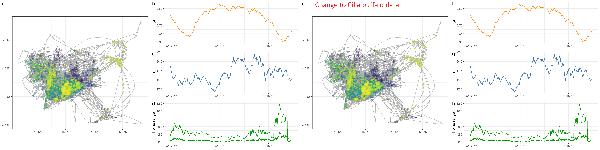

<!--
TO DO:
- write conclusion paragraph
- write discussion (2-3 pages)
    - add headers for sections
- trim down and edit intro and other previous sections
- move empirical examples within each relevant section (i.e., abundance examples for abundance section)
- simple figure for demonstrating idea of nonlinear relationship between R and H, with animal moving in empty space?
    - explain the idea in the caption, straight line can't work because can't have negative space, and there's need for saturation
    - line increasing as R decreases, 3 options: death, more increase (nomadism), sub-optimal saturation
- make same figure for V(R), but focus on temporal variance in time:
    - use grey or low alpha for curves with high uncertainty
- focus on V(R) as temporal variance rather than spatial one. people have already focused on patchiness, but temporal variation is more risky
- drop figure 1? (Fictitious example of variation)
- move 5x5 figure to interactive effects section
- add median NDVI behind tracking data of tapir, buffalo, and ??? figure
-->

\newpage <!-- start main body on a new page -->

```{r setup, include=FALSE}
knitr::opts_chunk$set(echo = FALSE, out.width = '75%', fig.align = 'center')
```

```{r wrap-figure-function, include = FALSE}
# code modified from https://stackoverflow.com/questions/54100806/r-markdown-how-do-i-make-text-float-around-figures

# this chunk is needed to wrap text around or beside figures

defOut <- knitr::knit_hooks$get('plot')  # save the default plot hook

knitr::knit_hooks$set(plot = function(x, options) {  # set the new plot hook ...
  
  x <- defOut(x, options)  # first apply the default hook
  
  # if wrapfigure options are given, create the new opening string for the wrapfigure
  # environment using custom figure alignment and text width
  if(!is.null(options$wrapfigure)) {
    
    # options must be numeric, they cannot be characters
    wf <- sprintf('\\begin{wrapfigure}{%s}{%g\\textwidth}',
                  options$wrapfigure[[1]], # figure alignment
                  options$wrapfigure[[2]]) # caption width relative to text width
    x  <- gsub(pattern = '\\begin{figure}', # and replace the default one with it
               replacement = wf,
               x = x,
               fixed = TRUE) # pattern is a string, so evaluate as is
    x  <- gsub(pattern = '{figure}', # also replace the environment ending
               replacement = '{wrapfigure}',
               x = x,
               fixed = TRUE)
  }
  return(x)
}
)

# chuck options used to wrap figures:
## fig.align = "right":          align figures right
## out.width = "0.5\\textwidth": output width = 0.5 * the width of the text
## wrapfigure = list("R", 0.5)   wrap caption to right, caption width = 0.5 text width

#' place figures before the paragraph they are referred to so `wrapfigure` places them
#' beside the paragraph
```

<!--
@ciuti and @berger-tal: human presence in nature for other reasons than hunting
"When habitats ensuring different functions (Dunning et al., 1992; Camp et al., 2013) are far from each other..."
habitat productivity hypothesis: Harestad and Bunnel, 1979
-->

# Abstract

Animal's spatial needs are often thought to be tighly linked to the amount of resources ($R$) within their habitats. Although this hypothesis has widespread support, most studies only account for the mean $R$, while the variance in $R$ is rarely accounted for. Failing to account for such variation is likely to result in an underestimation on animals' spatial needs, which may lead to decreases in population fitness and size as well as increase the risk of population collapse or human-wildlife conflict. In this paper, we provide a review of animal movement studies that estimate animals' spatial needs as a function of $R$, and we demonstrate the importance of accounting for variance in $R$. Additionally, we provide a unifying framework and hypotheses for the effect of mean and variance in $R$ on animals' home range sizes and movement behaviors. In the first part of this paper, we use simulated movement data in a variety of example habitats to demonstrate the importance of accounting for the variance in $R$. Next, we use the Normalized Difference Vegetation Index to estimate mean and variance in $R$ within the habitats of a tapir from the Pantanal (Brazil) and an African buffalo from South Africa to demostrate how this framework can be applied to real-world tracking data. Results from the simulations and empirical examples are presented using a fully transparent approach that allows researchers to replicate the work and apply the methods to real-world tracking data.

\newpage

# Introduction

The ability to move allows motile organisms to respond rapidly and continuously to heterogeneous and changing environments and conditions [@southwood_habitat_1977]. Animals may move for a variety of reasons, including searching for resources [@refs] or mates [@refs] while avoiding predation [@refs] or dangerous competition [@refs], as well as defending resources and territories [@grant_whether_1993; @refs]. @nathan_movement_2008 conceptualized animal movement from location $\vec u_t$ to location $\vec u_{t+1}$ using the model

\begin{equation} \label{nathan-movement}
\vec u_{t+1} = F(\Omega, \Phi, \vec r_t, \vec w_t, \vec u_t),
\end{equation}

such that the animal's position as time $t+1$ depends on its motion capacity ($\Omega$), navigation capacity ($\Phi$), internal state ($\vec w_t$) and current location ($\vec u_t$), as well as how each of the parameters may change with the current environmental factors ($\vec r_t$). This model is conceptually useful, as it can form the basis for many models, experiments, and hypotheses, but fitting such a model would be very difficult in practice (if not impossible). The parameters $\Omega, \Phi, \vec r_t,$ and $\vec w_t$ cannot be quantified directly, and although it may be possible to monitor proxies for the parameters, doing so with sufficient frequency and accuracy would not be simple. Rather than measuring changes in the various resources and needs directly, we can quantify animals' spatial needs as a response to average resource abundance and the variability around it, instead. This paper will illustrate how animals' spatial needs depend on average resource abundance and the variance around it. We present this idea through a quantitative theoretical framework and empirical examples where resource abundance is estimated using the Normalized Vegetation Index [NDVI, see @pettorelli_normalized_2011].

# Effects of resource abundance on animals' spatial needs

Figure 2 of @bista_effects_2022 for example of study that assumes linear relationships (w LM) for home range, when there can't be one.

```{r mu-hyp, fig.cap="Hypothesized spatial needs of an animal as a function of mean resource abundance ($\\mathbb E(R)$). At low values of $\\mathbb E(R)$, range-resident animals (bottom dashed line) may exhibit nomadic behavior, such that While $H$ decreases as $\\mathbb E(R)$ increases, it is not possible for $H$ to continuously decrease linearly because animals will require a minimum (nonnegative) amount of space to survive. At low values of $\\mathbb E(R)$, $H$", out.width = '0.5\\textwidth', fig.align = 'right', wrapfigure = list('R', 0.5)}
knitr::include_graphics('../figures/mean-abundance-hr-hypotheses.png')
```

Environmental productivity is tightly linked to the amount of space animals need to cover to obtain the resources they needed to survive and reproduce [figure \@ref(fig:), @relyea_home_2000]. While animals' needs vary greatly between taxonomic groups, some needs are essential for most species for survival and reproduction, such as energetic needs [e.g., food, water, see @baldwin_nutritional_1984], habitat needs [e.g., dens, trees, tall grass, breeding grounds, protection from predators and competitors, see @refs], and maintaining a thermoregulatory balance. The size of a home range is hypothesized to be proportional to resource abundance [@burt_territoriality_1943], such that spatial needs increase when resources are low, but the relationship is likely not monotonic nor linear [e.g., @nilsen_can_2005]. Animals living in large groups will require larger home ranges because they will have to share resources with conspecifics [@prox_framework_2020], and larger home ranges can be harder to defend and also result in higher rates of competition and movement costs [@grant_whether_1993; @jetz_scaling_2004].

The favorableness of a patch or habitat often depends on a variety of factors, including resource abundance, competitive pressure, and predation risk. Since many of these factors' affect resource abundance unpredictably, it is useful to visualize it as a random variable^[In statistics, random variables indicate random (i.e., unknown) quantities and are indicated with capital letters (e.g., $R$, $H$). Known values, such as realizations (i.e., known observations) of random variables, are indicated with lower-case letters (e.g., $r$, $h$). Using this notation, we can write the statement "the probability of random variable $R$ taking the value $r$" as $P(R = r)$.]. Let $R$ indicate the amount of *resources* in a particular patch or area. For simplicity, we can assume $R$ can take any value between zero and infinity, and we can let $R$ follow a Gamma distribution with mean $\mu$ and variance $\sigma^2$ (which we can write as $R \sim \Gamma(\mu, \sigma^2)$)^[Although Gamma distributions are more often parameterized using shape and scale ($k, \theta$) or shape and rate ($\alpha, \beta = 1/\theta$), we use $\mu = k \theta$ and $\sigma^2 = k \theta^2$ for simplicity. However, note that $\mu$ and $\sigma^2$ are not independent because the variance depends strongly on the mean since as the mean approaches zero the variance also does: $\mu = 0 \iff k \theta = 0 \iff k \theta^2 = 0 \iff \sigma^2 = 0$.]. Next, let $H$ indicate the size of an animal's home range (HR)^[We can consider specific utilization quantiles of the HR, such as the core HR, $H_{50\%}$, or the 95% HR, $H_{95\%}$, but for simplicity I will refer to the entirety of the HR with $H$.].

```{r multipanel-constant-var, fig.cap="Fictitious example of variation in resource abundance in a heterogeneous environment with constant variance (after accounting for changes in mean abundance). (a.) Although resource abundance ($R$, raster fill) varies over time and space, the overall amount of variance (dot color) remains constant. (b.) Arbitrary definition of $R$ as following a Gamma distribution with mean $\\mu$ and variance $\\sigma^2$. (c.) Simulated animal movement at a time of lowest $\\mathbb E(R)$ and average $\\mathbb V(R)$. (d.) Simulated animal movement at a time of peak $\\mathbb E(R)$ and average $\\mathbb V(R)$.", out.width = '0.5\\textwidth', fig.align = 'right', wrapfigure = list('R', 0.5)}
knitr::include_graphics('../figures/habitat-examples-constant-variance.png')
```

Consider the simplistic scenario where $\mu$ changes over time but $\sigma^2$ is constant over time and space (and non-zero, see figure \@ref(fig:multipanel-constant-var)a). We can use the notation $R \sim \Gamma\big(\mu(t), \sigma^2\big)$ to indicate that the resource abundance follows a Gamma distribution with a mean that changes over time (i.e., the expected value is a function of time: $\mathbb E(R) = \mu(t)$) while the variance is constant, i.e., $\mathbb V(R) = \sigma^2$ (figure \@ref(fig:multipanel-constant-var)b). Since $R$ is spatiotemporally random, an animal that moves in the landscape will not find the same $R$ at different time points or throughout the habitat (figures \@ref(fig:multipanel-constant-var)c-d). However, if $\mathbb E(R) = \mu(t)$ changes repetitively and regularly over time (e.g. peaks each spring), an animal may learn to predict times of high or low $R$ [e.g., @falcon-cortes_hierarchical_2021; @geremia_migrating_2019; @abrahms_memory_2019]. However, since $\mathbb E(R)$ does not vary predictably over space, it will not be possible to predict the location of locations with high or low $R$.

This model is somewhat simplistic, but its simplicity makes it easy to fit and conceptualize. Such a model may be appropriate in regions with little to no changes in variability and where unpredictable events occur at a similar frequency over time, or when data availability is too low to produce appreciable measures of variance. Examples of temporally homogeneous habitats include regions which throughout the year remain highly productive but fairly predictable (e.g., equatorial rain forests) or have very low productivity and variability (e.g., deserts without strongly distinct seasons). When productivity is approximately stable over long periods of time, it may be possible to further simplify the model by assuming a constant mean, but this is rarely the case. Most habitats with seasonal changes in climate will require models to account for changes in both $\mathbb E(R)$ and $\mathbb V(R)$, since periods of high productivity will tend to be more variable than times of "dormancy" or lower productivity.

The top row of figure \@ref(fig:5-5-sims) (constant $\mathbb V(R)$) illustrates the simulated spatial requirements of an animal living in habitats where $\mathbb E(R)$ remains constant or changes over time but $\mathbb V(R)$ remains constant. (Although some noise in $H$ are still present since $\mathbb V(R) \ne 0$ and thus the $R$ is not constant). Note how the home range size, $H$, decreases nonlinearly as $\mathbb E(R)$ increases linearly (linear $\mathbb E(R)$<!--, constant $\mathbb V(R)$-->), with larger changes when $\mathbb E(R)$ is low, since the multiplicative changes in $R$ are larger. Additionally, the 95% home range is more sensitive to changes in $\mathbb E(R)$ than the core home range $H_{50\%}$. In regions where the average resource abundance changes over time (cyclical $\mathbb E(R)$<!--, constant $\mathbb V(R)$-->), animals should have sufficient space to fulfill their needs during periods of scarcity, whether the space available is sufficiently large year-round or it changes seasonally with the expected changes in $\mathbb E(R)$. However, estimates of spatial requirements based on estimated changes in $\mathbb E(R)$ should be interpreted carefully, since model error and unpredictable changes in $\mathbb E(R)$ may increase animals' spatial needs unpredictably. Thus, it is best to avoid changing the space available to animals too close to when resources are expected to be low and include a "buffer" area so the available area is larger than the expected spatial needs. This is particularly the case in environments where resource abundance changes unpredictably (drifting $\mathbb E(R)$<!--, constant $\mathbb V(R)$-->), since accurate long-term estimates of $\mathbb E(R)$ may be hard to produce, if not impossible. In cases where $\mathbb E(R)$ is highly unpredictable, animals should have enough space to collect resources during times of greatest scarcity, particularly if the changes in resource abundance occur rapidly and often. Finally, in ecosystems where $\mathbb E(R)$ changes erratically and suddenly (erratic $\mathbb E(R)$<!--, constant $\mathbb V(R)$-->), such as regions prone to large fires or sudden floods, as well as regions with high mining or logging activity, the space available to animals should be sufficient to satisfy needs during the periods of greatest scarcity while also allowing animals to adapt their behavior between periods.

```{r 5-5-sims, fig.cap="Simulated spatial requirements for animals living in habitats where the mean and variance in resource availability ($R$) are constant, linearly increasing, cyclical, drifting, or erratic over time. The bottom line indicates the animal's core home range (0.5 quantile), while the top line indicates the 0.95 utilization quantile. Note how both quantiles decrease nonlinearly as $\\mathbb E(R)$ increases, and they increase approximately linearly as $\\mathbb V(R)$ increases. Additionally, the variance in both quantiles is higher when $\\mathbb V(R)$ is higher, and changes in $\\mathbb V(R)$ have greater impacts when $\\mathbb E(R)$ is low.\nSimulations were run such that animals followed the same 1000 tracks at each time point starting from the point $\\langle 0, 0\\rangle$ until they reach satiety, at which point they returned to $\\langle 0, 0\\rangle$ over the same amount of time. The animal's spatial variance parameter was then calculated using an OUF model via the $\\tt{ctmm}$ package", out.width='100%'}
knitr::include_graphics('../figures/mean-variance-5-by-5-hr-sims.png')
```

# Effects of environmental variance on animals' spatial needs

```{r multipanel-changing-var, fig.cap="Fictitious example of variation in resource abundance in a heterogeneous environment with changing variance (even after accounting for changes in mean abundance). (a.) Although resource abundance ($R$, brown-green fill) varies over time and space, variance (dot color) is lowest at the beginning and end of the observational period and highest when $R$ peaks. (b.) Arbitrary definition of $R$ as following a Gamma distribution with mean $\\mu$ and variance $\\sigma^2$. (c.) Simulated animal movement at a time of lowest $\\mathbb E(R)$ and $\\mathbb V(R)$. (d.) Simulated animal movement at a time of peak $\\mathbb E(R)$ and $\\mathbb V(R)$.", out.width = '0.5\\textwidth', fig.align = 'right', wrapfigure = list('R', 0.5)}
knitr::include_graphics('../figures/habitat-examples-changing-variance.png')
```

Although the effect of $R$ on animals' spatial needs is often recognized and accounted for in ecology [@burt_territoriality_1943; @southwood_habitat_1977; @relyea_home_2000; @nilsen_can_2005; @williams-guillen_resource_2006; @rickbeil_plasticity_2019], the variance in $R$ has received far less attention. However, $R$ can vary strongly due to many important causes, including repetitive and predictable patterns (such as daily or seasonal changes in temperature and precipitation, or the location of different patches) as well as infrequent and unpredictable events [such as forest fires, the arrival of new competitors, human activity, fires, floods, droughts, and other consequences of climate change, see @ipcc_global_2018; @noonan_situ_2018]. Environmental stochasticity, including extreme events, can reduce a landscape's energetic balance [@chevin_adaptation_2010], which, in turn, decreases animals' fitness and increases their spatial needs. A few recent studies support this hypothesis [@morellet_seasonality_2013; @nandintsetseg_variability_2019; @riotte-lambert_environmental_2020], but many of them are limited in geographic and taxonomic scales, so the extent to which these preliminary findings can be generalized is still very limited. There thus remains a need for developing a more complete understanding of how animals' spatial needs change with environmental stochasticity.

@seigle-ferrand_systematic_2021: Landscape heterogeneity influenced the sizes of home ranges in about 96% of studies based on individuals monitored by VHF but in only about 75% for individuals monitored by GPS, whatever the number of studied metrics.

When animals are not guaranteed that the resources they find during one visit will be there the next time (figure \@ref(fig:multipanel-changing-var)a), $\mathbb V(R)$ will have an appreciable effect on the location's favourableness. Since $\mathbb V(R)$ is not constant over time, we can now define it as a function of time using the notation $\mathbb V(R) = \sigma^2(t)$ (figure \@ref(fig:multipanel-changing-var)b). In this scenario, both the expected $R$ and its predictability change over time, so accurately and precisely predicting $R$ becomes more complex (figure \@ref(fig:multipanel-changing-var)c-d).

In this paper, we separate $\mathbb V(R)$ into heterogeneity and stochasticity in $R$. We refer to predictable or expected spatiotemporal changes as environmental **heterogeneity**, while we use the term **stochasticity** for unpredictable and unexpected variation. For example, the location of (high-yield) berry bushes in a valley and the time at which they produce fruit may be heterogeneous, but predictable. In contrast, whether it is a good or bad year for berries is stochastic. <!--Thus, changes in $\mathbb V(R)$ may predictable or not, and $\mathbb V(R)$ is affected by both sources of variation.-->

The leftmost column of figure \@ref(fig:5-5-sims) (constant $\mathbb E(H)$) illustrates how an animal's home range may vary as $\mathbb V(R)$ changes over time while $\mathbb E(R)$ remains constant. Both $\mathbb E(H)$ and $\mathbb V(H)$ increase with $\mathbb V(R)$, although $H_{95\%}$ is more sensitive to changes in $\mathbb V(R)$ than $H_{50\%}$. Additionally, the effect of $\mathbb V(R)$ on $H$ depends on $\mathbb E(R)$, since the effect of $\mathbb V(R)$ on $H$ is stronger when $\mathbb E(R)$ is low (see the bottom row with erratic $\mathbb V(R)$).

Not all 25 scenarios depicted in figure \@ref(fig:5-5-sims) may be realistic, but the trends in $\mathbb E(R)$ and $\mathbb V(R)$, and their impacts on animal space use are useful examples that can be thought of as simplified scenarios. $\mathbb E(R)$ and $\mathbb V(R)$ can be assumed to be (approximately) constant in highly homogeneous environments, or environments where resources are sufficiently abundant that changes in $\mathbb E(R)$ and $\mathbb V(R)$ remain undetected. Although it is impossible for $\mathbb E(R)$ and $\mathbb V(R)$ to increase linearly continuously, such increases may be possible for short periods of time (followed by periods of no change or decrease). Additionally, these examples are important because they demonstrate the relationships between $H$, $\mathbb E(R)$, and $\mathbb V(R)$ in (relatively) simple scenarios. Cyclical oscillations in $\mathbb E(R)$ and $\mathbb V(R)$ may occur in urban environments [@peron_periodic_2017] and as temperatures fluctuate daily and seasonally [@geremia_migrating_2019], while $\mathbb E(R)$ and $\mathbb V(R)$ may drift randomly in highly complex environments with an abundance of competitors, threats, and stochasticity, such as a habitat with a high degree of human alteration and activity. Finally, erratic changes in $\mathbb E(R)$ and $\mathbb V(R)$ may occur in environments where changes are very sudden, such as areas prone to fires or floods, as well as habitats with drastic human alteration (e.g., a forest which is clear-cut for mining purposes with a subsequent artificial re-forestation). However, if highly stochastic or erratic changes occur frequently, animals may perceive them as smooth changes in $\mathbb E(R)$ or increases in $\mathbb V(R)$ rather a series of small, sudden, changes. Estimating the true trend in $\mathbb E(R)$ and $\mathbb V(R)$ would often require an excessively high cognitive capacity and an equally unlikely abundance of information, since although changes in $\mathbb E(R)$ are not due to $\mathbb V(R)$, but often distinguishing between the two is not easy [@steixner-kumar_strategies_2020], and $\mathbb E(R)$ and $\mathbb V(R)$ are not independent for $R \sim \Gamma(\mu, \sigma^2)$. <!-- https://doi.org/10.1080/00207549508930162 ?-->

The effects of $\mathbb V(R)$ on animals' spatial requirements likely depend on the animals' needs. @rizzuto_forage_2021 found that the 50%, 75%, and 90% utilization distributions (UDs) of snowshoe hares (*Lepus americanus*) increased with average C:N in lowbush blueberry as well as the coefficient of variation for C:N, which suggests that the hares expanded their home range in response to both resource scarcity and the variance in resource scarcity. Similarly, @mueller_how_2011 demonstrated that ungulate species in more variable ecosystems move more than species in more stable landscapes and that they are more likely to be nomadic. In contrast, @lucherini_habitat_1996 found that red foxes (*Vulpes vulpes*) living in areas with more habitats per hectare (i.e., more heterogeneous habitats) required exponentially less space than foxes that lived in more homogeneous regions. Similarly, @nilsen_can_2005 found that the home ranges of wolverines (*Gulo gulo*) and Canadian lynx (*Lynx canadensis*) decreased with seasonality, while the home ranges of bobcats (*Lynx rufus*) and coyotes (*Canis latrans*) increased with seasonality. The work by @nilsen_can_2005 also demonstrates that the effect of $\mathbb E(R)$ on the home range size of wolves (*Canis lupus*) and fishers (*Martes pennanti*) depends on $\mathbb V(R)$, so it is important to account for interaction effects between the two.

What an animal perceives as a stochastic process depends on the stochasticity of the process relative to the animal's size, current age (or average lifespan), and adaptability. Generally, small, short-lived, or young organisms will tend to be more sensitive to small-scale (spatial) or short-term (temporal) changes [@southwood_habitat_1977]. Smaller organisms (e.g., mice) are more likely to be be severely impacted by a stochastic event than larger ones (e.g. elephants), since larger organisms can have bigger energy reserves [@lindstedt_seasonality_1985], can move longer distances over short periods of time [@hirt_general_2017], and tend to have longer lifespans, generation times, and developmental periods [@brown_toward_2004], which allow them to develop or memory about the frequency and severity of such events [@foley_severe_2008; @polansky_elucidating_2015]. However, the short generation time and high fertility of smaller *r-selected* species [@pianka_r-_1970; @brown_toward_2004] can allow them to develop traits that increase the chances of survival following an extreme event. Additionally, the effects of size and lifespan on sensitivity are likely nonlinear and correlated, since smaller animals tend to have shorter lives (and vice-versa), and small animals also tend to have lower metabolic rates, which often limit their movement speed, home ranges, and how the animals interact with their ecosystem [@brown_toward_2004]. Thus, processes will have stronger impacts on smaller animals than on bigger ones: The grazing pattern of a bison (*Bison bison*) drastically alters the habitat of most crawling insects, but other grazing mammals would not pay attention to changes in grass length at the same spatial or temporal resolution. Similarly, the timing and quantity of yearly snowfall would be a somewhat predictable and expected event for most adult moose (*Alces alces*), but it may be a shock for many adult zooplankton or a new-born wolf (*Canis lupus*). What one animal may perceive as a single stochastic event (or cycle) may be considered as a series of short and highly stochastic events by another animal. Therefore, the mean and variance in $R$ should be modeled while accounting for the behavior of the species of interest.

An unresponsive animal may perceive frequent changes in $R$ as high $\mathbb V(R)$, while a responsive animal may perceive them as changes in $\mathbb E(R)$. Thus, $R$ should be modeled using very flexible and wiggly models when animals are highly responsive, while less flexible models are more appropriate for more unresponsive or sedentary species. Generalized Additive Models [GAMs, see @wood_generalized_2017] are sufficiently flexible and adaptable to allow one to model $R$ while reflecting various levels of adaptability and responsiveness. (See @simpson_modelling_2018 for an overview of how to select appropriate bases sizes and smoothness parameters for GAMs.) The animal's movement (e.g., degree of range residency, range crossing time, average speed, directional persistence) should also inform the complexity of any spatial smooths included in the models. Models with complex spatial terms are appropriate for animals that recognize the location of high-quality patches, while smoother terms are best for animals that may perceive differences in $R$ as spatial variance, instead.

**it may be worth chatting about the NDVI models for the tapir and the buffalo later this month**

# Discussion

There are many factors which may affect animal's spatial requirements and how they use their HR [*sensu* @nathan_movement_2008]. In particular, resource abundance and environmental productivity are often hypothesized to be inversely proportional to HR size (or some function of it), such that regions with higher abundance correspond to smaller spatial needs, since animals do not have to range over extensive areas to meet the energetic needs [e.g., food, water, see @baldwin_nutritional_1984], habitat needs [e.g., dens, trees, tall grass, breeding grounds, protection from predators and competitors, see @southwood_habitat_1977], and maintaining a thermoregulatory balance. @nilsen_can_2005 found that the home ranges of brown bears (*Ursus arctos*), leopards (*Panthera pardus*) decreased nonlinearly with the fraction of photosinthetically active radiation absorbed by plants in a given region. However, the effect of many other factors on HR size likely depends on the species, location, and possibly also on the individual animal. For instance, competition may push animals to explore other areas and expand their HR [@jetz_scaling_2004], but strong and consistent competition paired with territorial defense may also prevent them from doing so [e.g., wolves, @rich_anthropogenic_2012; feral cats, @bengsen_feral_2016; capuchin monkeys, @torrez-herrera_monkeys_2020]. Similarly, predation may force animals to move more frequently to escape predators, or it may prevent them from venturing too far from the safety of their core HR too often [@suraci_beyond_2022]. Patch quality, size, fragmentation, and heterogeneity may cause animals to explore more patches if some are of low value, too small, too disconnected, or too variable [@fahrig_is_2019], but high diversity may also decrease HR size if animals require heterogeneous habitats [@fox_niche_1981; @lucherini_habitat_1996]. Similarly, patch connectivity and ease of movement may widen HRs by decreasing the energetic cost of movement and favoring exploration [@dickie_resource_2022], or they may shrink HRs by decreasing the energetic cost of movement while increasing encounter rates with resources [@martinez-garcia_how_2020; @bartumeus_influence_2008; @visser_plankton_2006]. However, not all animals take advantage of linear features or higher predictability in human-altered habitats. @noonan_roads_2021 found that giant anteaters (*Myrmecophaga tridactyla*) in Brazil did not use roads to reduce movement costs or increase movement speed. Instead, roads increased anteater mortality because the animals were attracted to the high-quality foraging found on roadside habitat. Similarly, @medici_movement_2022 found that the movement of tapirs (*Tapirus terrestris*) was unaffected by anthropogenic activity or habitat type.

Other empirical refs to possibly add: @lindstedt_seasonality_1985, @jonzen_rapid_2006, @wolkovich_warming_2012, @falcon-cortes_hierarchical_2021, @nathan_big-data_2022

Simulation refs: @blackwell_heterogeneity_2007, @quaglietta_simulating_2019, @tucker_humaninduced_2021

* failing to account for $\mathbb V(R)$ may lead to decreases in population fitness and size as well as increase the risk of population collapse or human-wildlife conflict
* find examples of extreme events that caused population collapses or mass die-offs
* increasing stability of ecosystems and populations is a good way of increasing chances of long-term survival and fitness
* animal mortality following fires, how little we know of mortality following fires: @jolly_animal_2022

## Moving window examples

```{r moving-window-examples, fig.cap="Seven-day home range size of a tapir ($Tapirus~terrestris$, a.-d.) and an African buffalo ($Syncerus~caffer$, e.-h.) as mean and variance in resource abundance change over the tracking period. (a., e.) Tracking data of the two animals. (b., f.) Mean resource abundance esimated as the mean NDVI at the locations visited by the tapir during the period of reference. (c., g.) Varince in resource abundance esimated as the average variance in NDVI at the locations visited by the tapir during the period of reference. (d., h.) Estimated home range size of the tapir during each reference period, based on 50\\% (bold) and 95\\% (thin) utilization distributions. The tapir movement data corresponds to the individual named \"Anna\" from the Pantal sample of Medici $et~al.$ (2022), while the buffalo data corresponds to the buffalo named \"Cilla\" in the data of Getz $et~al.$ (2007) available on through the $\\tt{Movebank}$ package (Cross $et~al.$ 2016). The buffalo tracking data are also available in the $\\tt{buffalo}$ dataset in the $\\tt{ctmm}$ package.", out.width = '100%'}

```

\newpage

<!--
in stochastic environments:
- higher spatial needs and possibly store resources for periods of scarcity, which are expected to get longer with climate change
- heterogeneous environments, such as habitats with a high variety of patches, may force animals to move between patches if they cannot depend on a single one
-->

<!--
Notes:

notation:
- $\mu$ mean movement process
- $\epsilon$ movement noise, exploratory movements
- $\tau_p$ positional autocorrelation, mean time reversion to the mean (origin), range crossing time
- $\tau_v$ velocity autocorrelation

@rickbeil_plasticity_2019:
- Many species use seasonal migration to track emerging resources (Fryxell, Greever, & Sinclair, 1988), reduce predation risk (Hebblewhite & Merrill, 2009), or avoid disease and parasites (Altizer, Bartel, & Han, 2011).
- Migrations to track resources are often timed to coincide with peak plant and insect emergence (Aikens et al., 2017; Jonzén et al., 2006; Merkle et al., 2016)
- there is growing evidence that some [bird] populations are adjusting their behavior, suggesting that migration, specifically migration timing, may be more plastic than previously expected (Jonzén, Hedenstrom, & Lundberg, 2007; Jonzén et al., 2006; Lameris et al., 2018) and highlighting a potential measure of resilience in the face of climate change
- Elk departed earlier from highly-productive areas? This goes against the idea that animals move as a consequence of need. But maybe the elk simply left when they had enough stored energy to face the migration. Maybe elk migration is triggered when they have sufficient energy (if the weather is still not too harsh).
- Elk left early when exposed to more hunting
-->

<!-- here! -->

# Interactive effects of mean and variance in resource abundance

Although the effects of environmental variance on animals' spatial needs remain largely undestudied and unaccounted for, available evidence suggests that the effect of $\mathbb V(R)$ depends on the species and landscapes studied, so it would be inappropriate to develop a single hypothesis for how $\mathbb V(R)$ affects animals' spatial needs.

[*Needs for understanding effects of variance*] are compounded by climate change, which exposes species to increasingly common stochastic events [@ipcc_global_2018; @noonan_situ_2018]. Furthermore, anthropogenic structures reduce the habitat available to terrestrial species [@wilson_habitat_2016], who struggle to move in fragmented [@fahrig_non-optimal_2007], human-dominated landscapes [@tucker_moving_2018].

* variance has less of an effect when variance is high

\newpage

<!-- create a pdf for supplementary information on how to create the 5x5 panel and run methods w real data, as well as considerations and potential issues about modeling means and variances -->

<!-- see https://doi.org/10.1186/s40462-019-0187-z regarding HR, energetics, and movement along paths -->

<!--

# Movement types
* Range residency
* Seasonal migration
* Nomadism

predation is more stochastic than herbibory; predators need to match more cycles, depend on fewer food sources that are able to move -> higher effect of V(R)

@teitelbaum_beyond_2019:
- **Nomadic movement**: with irregular timing and/or direction, producing both within-year and between-year variability in location and movement patterns
- **Nomadic movement** is not the same as **migration**, because migration is predictable and cyclical while nomadism is random in time and space
- "Data from recent developments in animal tracking technology (e.g., longer-lasting and lighter GPS devices) show that species previously considered migrants or range residents can show irregular, often long-distance, movement patterns (flexible foraging movements of leatherback turtles across the north atlantic ocean, To migrate, stay put, or wander Varied movement strategies in bald eagles, Big data analyses reveal patterns and drivers of the movements of southern elephant seals)"

## Edge dynamics

-->

# Conclusion

The work presented here provides a unifying framework for viewing animal movement as a function of resource abundance. We provide realistic and flexible hypotheses of the effects of $\mathbb E(R)$ and $\mathbb V(R)$ on animals' spatial needs and movement behavior. We demonstrate that animals' spatial needs respond nonlinearly to both $\mathbb E(R)$ and $\mathbb V(R)$, and we demonstrate the importance of accounting for $\mathbb V(R)$ besides $\mathbb E(R)$. We also provide a framework for modeling animal behavior and movement continuously rather than imposing arbitrary thresholds between range-resident and nomadic animals. (notes on seasons and "seasonal behavior")

\newpage

# MISC

In the case of animals whose spatial needs change over the their lifetimes (figure \@ref(fig:tapir-hr)), one may define HR as a function of time (with distinct HRs for each period, e.g., salmon spawning) or as a continuous function of age (so the HR changes smoothly). In either case, the accuracy of the estimate parameters will depend strongly on the length of the observation period as well as the measurement frequency [@noonan_comprehensive_2019]. Data from a portion of an animal's life may be sufficient if it is representative the animal's movement or if inference is limited to the period(s) for which data is available.

## The temporal scale of stochastic events (DELETE THIS SECTION?)

The timescale over which an event is (un)predictable will also play a key role in determining how species respond, or not, to stochasticity. Adverse events which occur frequently during an organism's generation time or lifespan (e.g., at least twice, on average) may be considered as threats worth preparing for. Stochastic and destructive events which happen frequently can become part of an organism's habitat and life history, so organisms may either adapt to their occurrence and even learn to predict them [@foley_severe_2008], or they may avoid the risk altogether by moving to a new habitat [@southwood_habitat_1977]. If habitats are (or become) unfavorable, animals may move to a new habitat, migrate seasonally [@geremia_migrating_2019], or simply prefer nomadism over range residency [e.g., @nandintsetseg_variability_2019]. It is unclear when animals switch from range residency to nomadism (or vice-versa), but understanding the connection between the two types of movement is important for quantifying the effect of spatiotemporal stochasticity on animal's spatial needs. From a quantitative perspective, the switch is related to an animal's positional autocorrelation over time (also known as home range crossing time, here indicated as $\tau_p$). Animals without a constant home home range (i.e., without a constant centroid) will spend more time away from the overall mean position, so the time required to crossing their entire range time will be large (i.e., on the order of the animal's lifespan).

```{r tapir-hr, fig.cap="Movement of a tapir during a monitoring period of approximately 3 years (1997-07-10 to 2000-06-08) used in the work by Medici $et~al.$ (2022). Different subsamples may result in different estimates of home range size and centroid (a, b; each span 100 days), so neither subsample is necessarily representative of the space the animal used over the entire monitoring period (c).", out.width = '0.4\\textwidth', fig.align = 'right', wrapfigure = list('R', 0.4)}
knitr::include_graphics('../figures/hr-and-lifespan.png')
```

Adverse events which are too infrequent (e.g., $p \lesssim 0.1$) may not be perceived as a reoccurring threat, so organisms may be unable to adapt appropriately. Instead, highly infrequent events are more likely to perceived as an oddity rather than something worth preparing for. In contrast, highly stochastic events (e.g., $p \approx 0.5$ or if $p$ changes unpredictably) may be perceived as a threat, but organisms may be unable to predict their occurrence, since it would require refined cognitive abilities. For a species or population to adapt to an event, the event must thus occur with sufficient frequency and for a sufficiently long period of time.

<!-- What an animal perceives as a stochastic process depends on the stochasticity of the process relative to the animal's size, current age (or average lifespan), and adaptability. Generally, small, short-lived, or young organisms will tend to be more sensitive to small-scale (spatial) or short-term (temporal) changes [@southwood_habitat_1977]. Smaller organisms (e.g., mice) are more likely to be be severely impacted by a stochastic event than larger ones (e.g. elephants), since larger organisms can have bigger energy reserves [@lindstedt_seasonality_1985], can move longer distances over short periods of time [@hirt_general_2017], and tend to have longer lifespans, generation times, and developmental periods [@brown_toward_2004], which allow them to develop or memory about the frequency and severity of such events [@foley_severe_2008; @polansky_elucidating_2015]. However, the short generation time and high fertility of smaller *r-selected* species [@pianka_r-_1970; @brown_toward_2004] can allow them to develop traits that increase the chances of survival following an extreme event. Additionally, the effects of size and lifespan on sensitivity are likely nonlinear and correlated, since smaller animals tend to have shorter lives (and vice-versa), and small animals also tend to have lower metabolic rates, which often limit their movement speed, home ranges, and how the animals interact with their ecosystem [@brown_toward_2004]. Thus, processes will have stronger impacts on smaller animals than on bigger ones: The grazing pattern of a bison (*Bison bison*) drastically alters the habitat of most crawling insects, but other grazing mammals would not pay attention to changes in grass length at the same spatial or temporal resolution. Similarly, the timing and quantity of yearly snowfall would be a somewhat predictable and expected event for most adult moose (*Alces alces*), but it may be a shock for many adult zooplankton or a new-born wolf (*Canis lupus*). What one animal may perceive as a single stochastic event (or cycle) may be considered as a series of short and highly stochastic events by another animal. **add empirical examples** -->


Figure \@ref(fig:stochasticity-timescale-figure) illustrates the perceived resource availability mean and variance by animals with four different levels of adaptability and how they may predict the mean and variance to change in the future (after the vertical grey line). In the extreme (and likely fictitious) case where an animal does not adapt to the environment (dark blue), it cannot react to or predict changes in mean resource abundance, and thus the perceived variance is inflated whenever the resource abundance does not match the overall mean. Environments appear highly unpredictable to such animals. Animals which can only perceive simple, linear changes in mean resource abundance (orange) perform better as long as resources continue to change linearly in the same direction (i.e. increasing or decreasing). However, they may be surprised when the trend's direction changes, as indicated by the rapid increase in variance in the top rows of figure \@ref(fig:stochasticity-timescale-figure)b. Animals which are able to adapt smoothly (light blue) can predict changes in mean without a significant bias in estimated variance, as long as the process is not highly stochastic (unsurprisingly, see the bottom rows of figure \@ref(fig:stochasticity-timescale-figure)). Finally, animals which adapt rapidly to changing environments may be most able to take advantage of frequent environmental changes, but they may be unable to produce reasonable predictions based on memory [*sensu* @fagan_spatial_2013; @abrahms_memory_2019]. Instead, they depend on constant information and only predict on the most recent information (as indicated by the deviations from the data when predicting into the future).

<!-- The recent shift to more quantitative statistical methods in environmental biology has pushed scientists to begin thinking more critically about data analysis. However, many still operate using methods and frameworks which were necessary with small datasets, but likely become problematic with an abundance of data. For instance, the widespread frequentist approach of hypothesis testing with a significance level of $\alpha = 0.05$ may often be misleading, because the significance of an effect depends on its standard error, which is a function of its sample size, since larger samples will offer a more precise and accurate measurement of the true mean. Similarly, the question of how much data is needed to detect a significant trend [@gray_how_2018] may seem important to some, but I suggest we pay less attention to whether an event or trend is statistically significant over a period of time based on the dichotomy of significance based on an arbitrary significance level. Since statistical significance does not only depend on effect size but also sample size (including measurement frequency), high-frequency data is likely to produce statistically significant effects, even in the event of a false positive. Instead, we should focus primarily on whether a change has an important impact on the fitness of the animal(s) of interest [@zuur_mixed_2009]. -->

An animal's ability to alter its behavior (including its movement) in response to environmental conditions is essential in stochastic or changing landscapes. Whether the changes be due to highly variable but (potentially) predictable changes such as the seasons and the weather, or whether they be due to more stochastic events [e.g., natural events such as fires or floods, but also anthropogenic events like oil spills, see @matkin_ongoing_2008], an animal's ability to adapt increases its odds of survival. Generally, temporal variation is more likely to promote plasticity over diversity, since adaptability will likely offer better odds of survival than temporally static diversity in a population or species [@bell_spatial_1993]. @rickbeil_plasticity_2019 showed that the yearly migration of elk (*Cervus canadensis*) depends on variable environmental events and cues such as available forage biomass, hunting pressure, snow fall, and snow melt. Birds have also shown to change their their migration as the climate changes, including large-scale, trans-Saharian migrants [@jonzen_rapid_2006]. And while genetic diversity and polymorphisms also increase the odds of survival for a species [@cavedon_genomic_2022], this project will focus strictly on animal behavior.

In an environment that changes over time, organisms which depend on mutable cycles such as changes in temperature, precipitation, and resource availability are more likely to respond to environmental changes than organisms which depend purely on deterministic cycles (e.g., photoperiod). While this thesis focuses on the movement and spatial use of animals, the adaptability (or lack thereof) of non-animal organisms is also crucial. The ability of most animals to rely on visual cues and move accordingly greatly increases their adaptability and plasticity, particularly for those animals that are able to move large distances over short periods of time (e.g., flying birds and large vertebrates). Although this project will focus on vertebrate animals, such changes are important to consider because the ability of a specialist or obligate symbiont to shift its home range or adapt will likely depend strongly on its associate's ability to move or adapt, too.

## The spatial scale of stochastic events (DELETE THIS SECTION?)

To measure the spatial stochasticity of an ecosystem, it is necessary to first define extent of the ecosystem of interest. A lake may seem like a simple and self-contained space to define, but it is often not as simple as deciding the lake's boundaries using a map or satellite pictures. Should one include the shores of the lake? And if so, which region do we consider the lake's shores? Are they the area of land which are currently covered by water, including the sections hit daily by waves, or should we also include the parts of land which are currently not wet but are covered during seasons with more rain? One could base their definition on the species of interest, since coastal areas are not frequented by large fish, but they would likely include them in the ecosystem if they are studying benthic littoral species. Thus, how one measures stochasticity should also depend on which organisms are of most interest.

Since species in a heterogeneous landscape can modify their behavior and move to more favorable locations, spatial variation will favor movement and behavioral adaptations faster than temporal variation will [@bell_spatial_1993].

Transition regions are often have the highest heterogeneity, but, similarly to temporal stochasticity, measures and perceptions of spatial heterogeneity depend on the scale at which they are being considered. The repetitive and cyclical motion of waves may not concern most vertebrates that live along the coast, but it is much more turbulent and chaotic for smaller organisms, such as crustaceans or diatoms. Therefore, the scale at which we consider spatial stochasticity should depend on the size of the organisms of interest as well as the size of their habitat or home range.

Although @bell_spatial_1993 couldn't find a scale at which variance stopped increasing, it seems reasonable to assume that variance cannot increase infinitely. The variance of a finite system (e.g., a lake or a well-defined habitat), should reach a finite maximum somewhere between our smallest scale of interest and the scale of the entire system, even if the maximum is reached when the entire system is considered. This does not imply that a somewhat larger system that contains the first one (e.g. the lake and its coasts) will have the same variance. Variance between lake and coast is high because they are different types of habitats, and the area where they meet (the coast) is potentially even more variable because the mixture of the two creates a third habitat for littoral benthic animals which is subject to high stochasticity due to waves and changing water levels.

The same idea would likely also apply for larger-scale systems, such as continents or a planet. And while stochasticity of a system may also vary over time, it is not reasonable to expect it to increase monotonically through time because that would imply it has been increasing monotonically until the current moment. Still, stochasticity does vary over time, and its estimation depends on the data available, so it may be useful to view it as a random variable with an estimated, conditional posterior distribution through a Bayesian framework [@bolstad_introduction_2017].

<!--
## Frontiers  Hierarchical, Memory-Based Movement Models for Translocated Elk (Cervus canadensis)  Ecology and Evolution

Refs to check:

* humans, nonhuman primates and other large-brained vertebrates make movement decisions based on spatial representations of their environments (https://www.frontiersin.org/articles/10.3389/fevo.2021.702925/#B50)
* 2010). These representations may allow animals to move directly to important sites in their environment that lie outside of their perceptual range (https://www.frontiersin.org/articles/10.3389/fevo.2021.702925/#B40, https://www.frontiersin.org/articles/10.3389/fevo.2021.702925/#B35)
* Attribute memory, i.e., non-spatial memory, e.g., food type and abundance (https://www.frontiersin.org/articles/10.3389/fevo.2021.702925/#B13)
* Bison remember valuable information about the location and quality of meadows (spatial and attribute memory) and use this information to revisit profitable locations (https://www.frontiersin.org/articles/10.3389/fevo.2021.702925/#B29)
* Roe deer an spatial memory for foraging in absence of territorility (https://www.frontiersin.org/articles/10.3389/fevo.2021.702925/#B41)
* memory in capuchin monkeys (https://www.frontiersin.org/articles/10.3389/fevo.2021.702925/#B8)
* memory in bison (https://www.frontiersin.org/articles/10.3389/fevo.2021.702925/#B18)
* memory in sheep (https://www.frontiersin.org/articles/10.3389/fevo.2021.702925/#B18)
* memory in woodland caribou (https://www.frontiersin.org/articles/10.3389/fevo.2021.702925/#B1)
* memory in chimpanzees (https://www.frontiersin.org/articles/10.3389/fevo.2021.702925/#B20)
* memory constitutes an important mechanism for home range emergence (https://www.frontiersin.org/articles/10.3389/fevo.2021.702925/#B6, Börger et al., 2008; Van Moorter et al., 2009)
-->

<!--
## Urban landscapes and habitat structure

Human activity often fundamentally alters the structure of environments by spatially homogenizing them and imposing temporally heterogeneous and potentially stochastic cycles (e.g., mining, clear-cutting, road traffic, and weekly work schedules). The perception of spatial heterogeneity and cycles in anthropogenic areas varies between species: scavenger animals such as ravens (*Corvus corax*) and raccoons (*Procyon lotor*) often learn to recognize areas that can provide food, such as restaurants or large disposal bins, but other animals may not be able to distinguish between different urban areas. Certain animals have learned to depend on and take advantage of human activity, such as crows who place nuts strategically so that cars will crack them open for them to eat [@nihei_when_2002].
-->

\newpage <!-- place references on a separate page -->

# References
