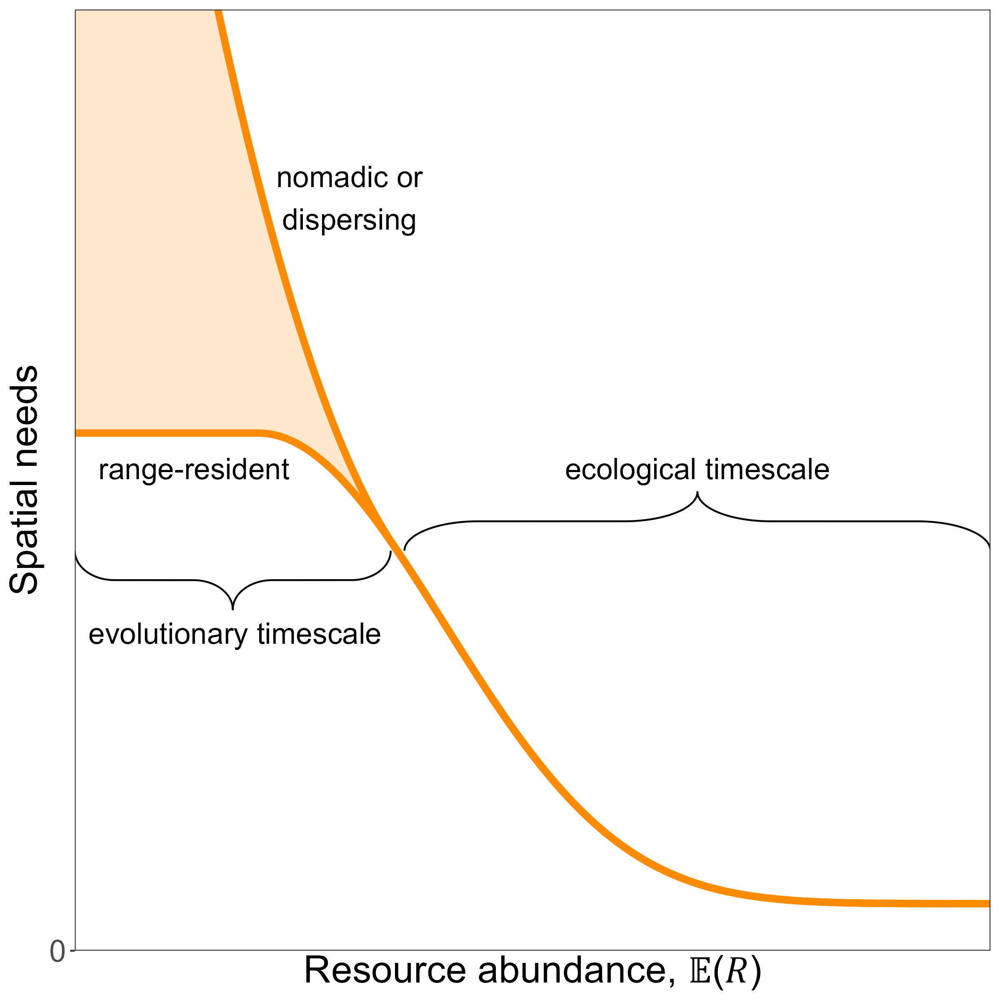
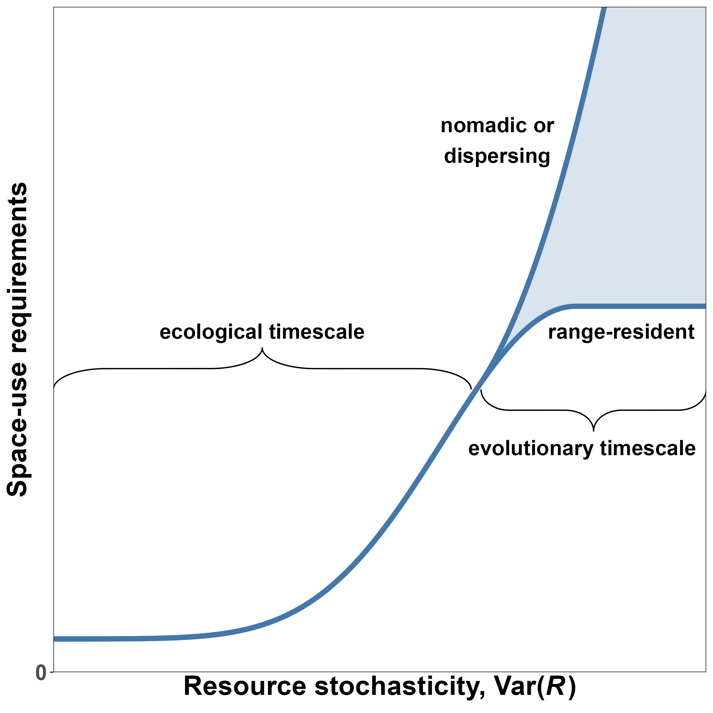

\bibliographystyle{amnatnat}

<!-- define custom math symbols -->
\newcommand*\e{\text{E}} <!-- expectation; non-italic E -->
\newcommand*\var{\text{Var}} <!-- variance; non-italic Var -->

```{r, echo=FALSE}
# needs to be <= 200 words for AmNat
abstract <- "The amount of space organisms use is thought to be tightly linked to the availability of resources within their habitats, such that organisms living in productive habitats generally require less space than those in resource-poor habitats. This hypothesis has widespread empirical support, but existing studies have focused primarily on responses to the mean amount of resources, while responses to the variance around the mean are still largely unknown. This is not a trivial oversight. Organisms adjust to variable environmental conditions, so failing to consider the effects of resource (un)predictability can result in a limited understanding of organisms' space-use requirements, challenging ecological theory and applied conservation alike. In this study, we leverage the available literature to provide a unifying framework and hypotheses for the effect of mean and variance in resources on organisms' space use. Next, we use simulated movement data to demonstrate how the combined effects of mean and variance in resource abundance interact to shape predictable patterns in space use. Finally, we use real-world tracking data on a lowland tapir (*Tapirus terrestris*) from the Brazilian Cerrado to show how this framework can be applied to better understand the movement ecology of free-ranging animals."
```

<!-- elements of the title page -->

\noindent \textbf{Article type}: Major article

\noindent \textbf{Words in abstract}: `r stringi::stri_count_words(abstract)`

\noindent \textbf{Words in main text}: `r suppressMessages(wordcountaddin::word_count())`

\noindent \textbf{Figures}: 6

\noindent \textbf{Tables}: 0

\noindent \textbf{References}: 102 (updated on 2024-04-12) <!-- counted by using nature csl -->

\noindent \textbf{Appendices}: 3

\noindent \textbf{Key words:} energetics, energetic landscape, environmental stochasticity, space use, spatial needs, `ctmm`

<!-- Authors' emails:
Stefano Mezzini: stefano.mezzini@ubc.ca
Chris H. Fleming: christen.fleming@ucf.edu
E. Patrícia Medici: medici@ipe.org.br
Michael J. Noonan: michael.noonan@ubc.ca
--> 

<!-- start main body on a new page -->

\newpage

\newpage

\doublespacing

```{r setup, include=FALSE}
# set chunk defaults: don't print code, images 75% of page width and centered
knitr::opts_chunk$set(echo = FALSE, out.width = '75%', fig.align = 'center')
```

```{r wrap-figure-function, include = FALSE}
# this chunk is needed to wrap text around or beside figures
# code modified from https://stackoverflow.com/questions/54100806/r-markdown-how-do-i-make-text-float-around-figures

defOut <- knitr::knit_hooks$get('plot')  # save the default plot hook

knitr::knit_hooks$set(plot = function(x, options) { # set the new plot hook...
  
  x <- defOut(x, options)  # first apply the default hook
  
  # if wrapfigure options are given, create the new opening string for the
  # wrapfigure environment using custom figure alignment and text width
  if(!is.null(options$wrapfigure)) {
    
    # options must be numeric, they cannot be characters
    wf <- sprintf('\\begin{wrapfigure}{%s}{%g\\textwidth}',
                  options$wrapfigure[[1]], # figure alignment
                  options$wrapfigure[[2]]) # caption width relative to text width
    x  <- gsub(pattern = '\\begin{figure}', # and replace the default one with it
               replacement = wf,
               x = x,
               fixed = TRUE) # pattern is a string, so evaluate as is
    x  <- gsub(pattern = '{figure}', # also replace the environment ending
               replacement = '{wrapfigure}',
               x = x,
               fixed = TRUE)
  }
  return(x)
}
)

# chuck options used to wrap figures:
## fig.align = "right":          align figures right
## out.width = "0.5\\textwidth": output width = 0.5 * the width of the text
## wrapfigure = list("R", 0.5)   wrap caption to right, caption width = 0.5 text width

#' place figures before the paragraph they are referred to so `wrapfigure`
#' (generally) places them beside the paragraph
```

\linenumbers

# Abstract

\noindent `r abstract`

\newpage

# Introduction

\noindent The amount of resources an organism is able to access is a strong determinant of its odds of survival and reproduction. Resource limitations can cause individuals to experience a negative energetic balance, which can then result in lower fitness [@hou_cold_2020; @le_bot_fishery_2019], altered physiology [@dai_pra_ground_2022; @rocha_life_2021; @le_bot_fishery_2019; @wessling_seasonal_2018], lower chance of reproduction [@stefanescu_timing_2021; @schmidt_interplay_2020; @le_bot_fishery_2019; @douglas_relative_2014], and even death [@foley_severe_2008; @berger_climate_2018], along with changes to community structure [@haney_tipping_2018; @burson_competition_2018; @riotte-lambert_environmental_2020; @ghislandi_resource_2018]. Thus, many organisms adapt their behaviors in response to changes in local resource abundance to ensure their needs are met.<!-- Some species may respond to fluctuations in resource abundance by, if possible, switching to other food sources [@steinmetz_effects_2021; @le_bot_fishery_2019], reducing energetic costs by lowering body heat [@schmidt_interplay_2020], or entering hibernation or torpor [@fjelldal_nightly_2021; @mohr_cellular_2020; @boyles_optimal_2020]. However, --> Movement represents one of the most readily available behaviors that species can adjust to optimize their resource use [<!--@krivan_ideal_2008; @brown_ecology_1999; -->@kacelnik_ideal_1992; @charnov_optimal_1976].<!-- whether this be by modifying their home range [@hirt_environmental_2021; @bista_effect_2022; @bradsworth_using_2022; @lucherini_habitat_1996; @relyea_home_2000; @yu_artificial_2022; @arechavala-lopez_common_2019], migrating [@middleton_green-wave_2018; @geremia_migrating_2019], moving nomadically [@teitelbaum_beyond_2019; @nandintsetseg_variability_2019], or dispersing [framework: @southwood_habitat_1977; amphibians: @cayuela_determinants_2020; birds: @pretorius_movement_2020; @wheat_migrate_2017; mammals: @singh_migration_2012].-->

The relationship between organisms' movement and resource abundance has been of interest to biologists for nearly a century. @burt_territoriality_1943 considered the search for food as the primary driver for movement within an organism's home range. Three decades after, @southwood_habitat_1977 suggested that change in resource abundance is a strong determinant of how organisms decide where to live and when to reproduce. Two years later, @harestad_home_1979 proposed that the simplest relationship between resource abundance and an organism's home-range size is

\begin{equation}
H = C / R,
(\#eq:harestad-eq)
\end{equation}

\noindent where $H$ is the organism's home-range size, $C$ is the organism's resource consumption (kcal day$^{-1}$), and $R$ is the resources the organism can access (kcal day$^{-1}$ unit area$^{-1}$). Harestad and Bunnel's model is simple to conceptualize and allows for testable predictions, but it fails to account for the nonlinear relationship required to avoid negative home range estimates [e.g., fig. 2 in the work of @bista_effect_2022].<!-- to an organism's values of $C$ and $R$ likely depend on numerous factors, such as competition, metabolic rate, diet, and body weight [@harvey_primate_1981; @lindstedt_home_1986; @reiss_scaling_1988; @harvey_primate_1981; @gittleman_carnivore_1982; @jetz_scaling_2004; @boratynski_energetic_2020; @noonan_effects_2020].--> Many researchers have since demonstrated that organisms adapt their home ranges in response to resources abundance, ***but, unlike other areas of ecological research, findings from these studies are not structured around a set of theoretical expectations.*** Instead, results are typically reported as independent, novel findings. Thus, there remains a need for a clear hypothesis for the effects of resource abundance on organisms' space-use requirements. Additionally, while much work has been done on estimating organisms' responses to average resource abundance, there is little information on how they respond to unpredictable changes in resources [but see: @stephens_optimal_1982; @rizzuto_forage_2021].

Here, we refer to a location's average amount of resources as "resource abundance", while we use the phrase "resource stochasticity" to indicate the variability in resources after accounting for changes in the mean. We argue that, on its own, a habitat's long-term resource abundance is not sufficient to assess the habitat's quality, nor make predictions about how much space an organism might use. For instance, herbivores in a grassland with relatively low but constant forage availability (low mean and variance) will adopt different behaviors and adaptations from herbivores in a desert with equally scarce forage but rare, sudden, and strong pulses of resources (low mean and high stochasticity). In the grassland, an animal may require a large but constant home range as it moves between patches in search of food [@teitelbaum_beyond_2019], while an animal in the desert may switch between dispersal in search for high-resource patches and short-term range residency ***within*** patches [@charnov_optimal_1976]. Although the two habitats may have the same long-term average resource abundance, the ephemerality of resource in the second environment would promote a different selection of movement and life history strategies. Overall, resource stochasticity may decrease organisms' fitness and landscapes' energetic balances [@chevin_adaptation_2010], but there is still limited empirical evidence to support this hypothesis [but see: @herfindal_prey_2005; @nilsen_can_2005; @rizzuto_forage_2021].

Here, we illustrate how organisms' space use ***should be expected to*** depend on both the abundance and unpredictability of resources. First, we set the theoretical background necessary for the successive sections by introducing key concepts and notation. Next, we provide a review of the effects of resource abundance on organisms' space use while suggesting a unifying hypothesis. Afterwards, we provide a review of the effects of resource stochasticity on organisms' space use while suggesting a second unifying hypothesis. Subsequently, we demonstrate the power of these two hypotheses using quantitative, simulated responses to changes in resource abundance and unpredictability. Finally, we demonstrate how this framework can be used in practice to describe the movement ecology of a lowland tapir (*Tapirus terrestris*) from the Brazilian Cerrado [@medici_movement_2022]. Results from the simulations and empirical example are presented using a fully transparent approach that allows researchers to replicate the work and apply the methods to their own tracking data.

# Resources as a random variable

\noindent Resources are often unpredictable (and difficult to quantify), since they depend on various factors which cannot be accounted for easily, including climate [@lindstedt_seasonality_1985; @schmidt_interplay_2020; @morellet_seasonality_2013], weather [@fjelldal_nightly_2021; @morellet_seasonality_2013], competitive pressure [@torrez-herrera_monkeys_2020; @rich_anthropogenic_2012], and differences in energetics at the individual [@schmidt_interplay_2020] and species level [@jetz_scaling_2004]. ***Thus, we can treat the amount of resources at a given point in space ($u$) and time ($t$) as a random variable, denoted $R(u, t)$. The benefit of treating*** resources as a numerical random variable, ***is that it*** provides us with the capacity to leverage techniques from probability theory and statistics. We assume readers are familiar with fundamental statistical concepts (e.g., random variables, probability distributions, expected value and variance of a random variable), but we define and explain the necessary concepts in Appendix A.

<!--
\noindent In statistics, random variables indicate random (i.e., unknown) quantities and are indicated with capital letters (e.g., $R$). Known values, such as realizations of random variables (i.e., known observations or instances), are indicated with lower-case letters (e.g., $r$). Using this notation, we can write the statement "the probability of random variable $R$ taking the value $r$" as $P(R = r)$. Resources are often unpredictable (and difficult to quantify), since they depend on various factors which cannot be accounted for easily, including climate [@lindstedt_seasonality_1985; @schmidt_interplay_2020; @morellet_seasonality_2013], weather [@fjelldal_nightly_2021; @morellet_seasonality_2013], competitive pressure [@torrez-herrera_monkeys_2020; @rich_anthropogenic_2012], and differences in energetics at the individual [@schmidt_interplay_2020] and species level [@jetz_scaling_2004]. Thus, we can let the random variable $R$ indicate the amount of resources at a given point in space and time. Quantifying resources as a numerical random variable, as opposed to using *ad hoc* qualitative descriptions, provides us with the capacity to leverage techniques from probability theory and statistics.

In this section, we simulate $R$ using a Gamma distribution with time-dependent (but spatially homogeneous) mean $\mu(t)$ and variance $\sigma^2(t)$, which we write as $R \sim \Gamma\big(\mu(t), \sigma^2(t)\big)$. Although Gamma distributions are more often parameterized using parameters shape and scale ($k > 0$ and $\theta > 0$) or shape and rate ($\alpha > 0$ and $\beta = 1/\theta > 0$), we use $\e(R) = k \theta$ and $\var(R) = k \theta^2$ to facilitate visualizing the simulations. However, note that $\e(R)$ and $\var(R)$ are not independent because the variance depends strongly on the mean (and vice-versa). As the mean approaches zero (from the positive side, which we write as $\e(R) \rightarrow0^+$) the variance also does: $\e(R) \rightarrow 0^+ \iff k \theta \rightarrow 0^+ \iff k \theta^2 = 0^+ \iff \var(R) = 0^+$. This assumption also holds biologically, since resources tend to be less variable when they are less abundant. We assume readers are familiar with the concepts of: random variables, probability distributions, expected value of a random variable, and variance of a random variable, but we define and explain each of the four concepts in Appendix A.
-->

## Effects of resource abundance, $\e(R)$

\noindent While organisms' needs vary greatly between taxonomic groups, some needs are essential for most species for survival and reproduction. All heterotrophic organisms require sources of chemical energy (i.e., food), water, and various limiting nutrients to survive, grow, and reproduce [@harvey_primate_1981; @baldwin_nutritional_1984; @reich_body_2001]. ***As the abundance of essential resources fluctuates,*** motile organisms can move to new locations ***or 'patches', to meet their requirements*** [@charnov_optimal_1976; @brown_ecology_1999], but they must also account for a higher metabolism and movement costs [@taylor_energetics_1982].

```{r mu-hyp, fig.cap="Hypothesized space-use requirements of an organism as a function of resource abundance ($\\e(R)$). We expect low values of $\\e(R)$ to result in high space-use requirements as organisms are forced to explore large areas to collect the resources they require to survive, whether they be range-resident or nomadic. As $\\e(R)$ increases, space-use requirements should decrease nonlinearly until they reach the minimum amount of space required by the organism to survive. Note that the relationship between $\\e(R)$ and space-use requirements cannot be linear because it would require space-use requirements to be negative for high values of $\\e(R)$.", out.width = '0.5\\textwidth'}

```

Fig. \@ref(fig:mu-hyp) illustrates our first of two hypotheses: When $\e(R)$ is high, we expect organisms' spatial requirements to be relatively small and near the smallest amount of space required to survive [e.g., @relyea_home_2000; @nilsen_can_2005; @herfindal_prey_2005]. At lower values of $\e(R)$, we expect organisms' spatial requirements to increase nonlinearly, since low values of $\e(R)$ force organisms to expand their home ranges [@lucherini_habitat_1996; @relyea_home_2000; @nilsen_can_2005; @herfindal_prey_2005; @bista_effect_2022], migrate to better locations [@samarra_movements_2017; @middleton_green-wave_2018; @geremia_migrating_2019], or move nomadically [@singh_migration_2012; @polansky_elucidating_2015; @teitelbaum_beyond_2019; @nandintsetseg_variability_2019]. It is unclear when organisms switch from range residency to migration or nomadism (or vice-versa), but understanding the connection between these types of movement is important for quantifying the effect of resource abundance on organisms' space-use requirements and when an organism may choose to migrate or disperse rather than remaining range-resident [mammals: @teitelbaum_how_2015; moose, *Alces alces*: @singh_migration_2012; eagles, *Haliaeetus leucocephalus*: @wheat_migrate_2017; @poessel_interpreting_2022; lesser flamingos, *Phoeniconaias minor*: @pretorius_movement_2020]. Still, species-level changes in movement behavior are more likely to occur over evolutionary timescales than over an organism's lifespan, since larger ranges require greater vagility, which, in turn, is facilitated by morphological features such as hinged joints and elongated limbs [@jetz_scaling_2004; @hirt_general_2017; @andersson_elbow-joint_2004; @samuels_postcranial_2013]. ***moved from above*** The hypothesis that space-use requirements decrease with resource abundance, $\e(R)$, is commonly accepted and well supported, but many studies assume a linear relationship [e.g., @harestad_home_1979; @relyea_home_2000; @rizzuto_forage_2021; @bista_effect_2022; @bradsworth_using_2022; @mcclintic_effects_2014]. This is problematic because, ***conceptually,*** the relationship between space-use requirements and $\e(R)$ must be nonlinear, since: (1) there ***is an upper limit*** to how much space an organism is able to explore in its lifetime and ***(2)*** the minimum amount of space it requires to survive ***is necessarily greater than zero*** [see: @lucherini_habitat_1996; @herfindal_prey_2005; @nilsen_can_2005; @simcharoen_female_2014; @watson_ferruginous_2020, and contrast them to the estimates based on linear models listed above].

Consider the scenario where $\e(R) = \mu(t)$ changes over time but $\var(R) = \sigma^2 > 0$ is constant over time and space (fig. A1). Since $R$ is random, an organism that moves in the landscape will not find the same $R$ at different time points or throughout the habitat. However, if $\mu(t)$ changes repetitively and regularly over time (e.g. peaks each spring and is lowest in winter), an organism may learn to predict times of high or low $\e(R)$ [e.g., @falcon-cortes_hierarchical_2021; @geremia_migrating_2019; @abrahms_memory_2019; @samarra_movements_2017] but will still not be able to predict $R$ exactly.

<!-- This model is somewhat simplistic, but its simplicity makes it easy to fit and conceptualize. Such a model may be appropriate in regions where variability does not change noticeably spatiotemporally, or when data availability is too low to produce appreciable measures of changes in variance. Examples of temporally homogeneous habitats include regions where productivity remains fairly predictable throughout the year (e.g., equatorial rain forests or highly homogeneous deserts). When productivity is approximately stable over long periods of time, it may be possible to further simplify the model by assuming a constant mean, but this is likely rarely the case. Most often, $\e(R)$ will vary over time, and organisms' behaviors will change in response. -->

## Effects of resource stochasticity, $\var(R)$

\noindent The example illustrated in the section above can occasionally be a useful simplification of relatively stable environments or when ***information on how $\e(R)$ changes is limited,*** but it likely not realistic, since ***the variance in $R$ around $\e(R)$, which we indicate as $\var(R)$, can also differ between locations or time periods***. Generally, periods of scarcity (e.g., winter, droughts) not only have lower $\e(R)$ but also have narrower ranges of $R$***, which implies a smaller $\var(R)$***. In contrast, periods of high $\e(R)$ (e.g., spring green-up) also often tend to have higher $\var(R)$, ***as*** $R$ tends to vary ***more (e.g., due differences in phenology, environmental conditions, and patch depletion by competitors). Recognizing differences in $\var(R)$ between locations or periods helps account for the small-scale stochasticity in $R$, after accounting for the large-scale average $R$ [@levin_problem_1992]. However,*** when both $\e(R)$ and $\var(R)$ change over time (fig. A2), predicting $R$ becomes more complex, since disentangling changes in $\e(R)$ and $\var(R)$ is not simple [@steixner-kumar_strategies_2020]. Statistically, this is because the more change one attributes to $\mu(t)$ (i.e., the wigglier it is), the smaller $\sigma^2(t)$ becomes. Conversely, the smoother $\mu(t)$ is, the larger $\sigma^2(t)$ becomes. Biologically, this is important because an organism's perception scale [@levin_problem_1992] determines whether it sees a change in $R$ as a trend in $\e(R)$ or as a stochastic event (i.e., due to $\var(R)$). An organism's perception of changes in $R$ will also depend strongly on the its cognitive capacities and memory [@mueller_social_2013; @abrahms_memory_2019; @foley_severe_2008; @falcon-cortes_hierarchical_2021; @fagan_spatial_2013]. Whether, an organism is able to predict trends in $\sigma^2(t)$ or not, environmental variability is thought to reduce a landscape's energetic balance [@chevin_adaptation_2010], which, in turn, decreases organisms' fitness [e.g., @berger_climate_2018] and increases their space-use requirements. While this is true for both predictable and unpredictable stochasticity, extreme and rare events are more likely to have a stronger effect due to their unpredictability and magnitude [@logares_black_2012; @anderson_black-swan_2017]. A few recent studies support these hypotheses [@chevin_adaptation_2010; @morellet_seasonality_2013; @nandintsetseg_variability_2019; @riotte-lambert_environmental_2020], but many of them are limited in geographic and taxonomic scales, so the extent to which these preliminary findings can be generalized is ***unknown***. Thus, there remains a need for developing a more complete understanding of how organisms' space-use requirements change with environmental stochasticity.

<!-- Although the effect of $R$ on organisms' space-use requirements is often recognized and accounted for in ecology [@stephens_optimal_1982; @williams-guillen_resource_2006; @rickbeil_plasticity_2019], most of the focus has been on the effects of $\e(R)$, while $\var(R)$ has received far less attention [but see @nilsen_can_2005; @di_stefano_resource_2011; @rizzuto_forage_2021; @seigle-ferrand_systematic_2021]. However, $\var(R)$ can fluctuate temporally (and spatially) due to many important drivers, including repetitive and predictable patterns. For example, since berries are scarce outside the growing season, the variance in berries will also be low. But during the growing season, both the average number of berries and the variance in berries are higher, since a bear may explore a location before fruiting time or after competitors ate all the berries. In contrast, other sources of stochasticity can be much less predictable, such as the arrival of new competitors [@alexander_novel_2015], the emergence of new diseases [@hollings_trophic_2014], droughts [@foley_severe_2008; @haig_assessment_2013], fires [@jolly_animal_2022], floods [@ramos_pereira_structure_2013], changes in climate and phenology [@berger_climate_2018; @grant_evolution_2017; @jonzen_rapid_2006; @inouye_climate_2000; @severson_spring_2021; @woolway_global_2020], and other extreme events [@logares_black_2012; @anderson_black-swan_2017]. -->

```{r, eval=FALSE, echo=FALSE}
# the median decreases as V(R) increases, even if E(R) is constant
source('functions/qgamma2.R')
plot(1:10, qgamma2(p = 0.5, mu = 1, sigma2 = 1:10))
```

Similarly to $\e(R)$, we hypothesize $\var(R)$ to have a nonlinear effect on organisms' space-use requirements. When $\var(R)$ is low enough that $R$ is relatively predictable, we do not expect changes in $\var(R)$ to have a noticeable effect. But as resources become increasingly unpredictable, we expect space-use requirements to increase progressively faster (fig. \@ref(fig:s2-hyp)) because: (1) as $\var(R)$ increases, the chances of finding low $R$ increase superlinearly, (2) stochastic environments tend to be less productive [@chevin_adaptation_2010], (3) stochasticity reduces an organism's ability to specialize and reduce competition for $R$ [@levins_evolution_1974], and (4) the added movement required to search for food increases organisms' energetic requirements. If resources remain highly unpredictable over long periods of time (e.g., multiple lifespans), organisms may evolve or develop new behaviors (such as nomadism, dispersal, and migration) or adaptations (such as increased fat storage or food caching). If changes in $\sigma^2(t)$ are sufficiently predictable, organisms may learn to anticipate and prepare for periods of greater stochasticity by pre-preemptively caching food, migrating, or relying on alternative food sources during stochastic events (e.g., the seasonal arrival of competitors).

```{r s2-hyp, fig.cap="Hypothesized space-use requirements of an organism as a function of resource stochasticity ($\\var(R)$). We expect low values of $\\var(R)$ to result in low space-use requirements as organisms are able to depend on relatively predictable resources. As $\\var(R)$ increases, space-use requirements should increase nonlinearly, whether this results in an expansion of the home range (in the case of range-resident organisms) or a switch to dispersal, nomadism, or migration. Note that the relationship between $\\var(R)$ and space-use requirements cannot be linear because it would require space-use requirements to be negative for low values of $\\var(R)$.", out.width = '0.5\\textwidth'}

```

## Interactive effects of $\e(R)$ and $\var(R)$

\noindent We have provided the case for why both $\e(R)$ and $\var(R)$ ***should be expected to*** affect organisms' space-use requirements, but we presented the two parameters as independent drivers of movement. However, organisms may respond to changes in $\var(R)$ more when resources are scarce than when they are abundant. Consequently, ***an organism’s movement behavior is likely to be a function of*** not only the marginal effects of $\e(R)$ and $\var(R)$ but also their interactive effects. A highly unpredictable habitat may be very inhospitable if resources are poor, but $\var(R)$ may have little effect if resources are stochastic but always abundant. Thus, we expect $\var(R)$ to have a stronger effect on space-use requirements when $\e(R)$ is low, and less of an effect when $\e(R)$ is high. We explore this more in the following section.

<!-- Most habitats with appreciable seasonal climatic changes will require models of $R$ to account for changes in both $\e(R)$ and $\var(R)$, as $\sigma^2(t)$ will often change within and between years, and periods of high $\mu(t)$ will often be more variable than times of lower productivity or dormancy. However, the effects of $\var(R)$ on organisms' space-use requirements likely vary between species, since movement capacity, and energetic and nutritional needs also vary between species [@boratynski_energetic_2020; @noonan_effects_2020]. Small-scale variations in $R$ may be sufficient to causes changes in behavior for some small organisms, while organisms with larger space-use requirements may not even notice a change. -->

## Simulating responses to $\e(R)$ and $\var(R)$ {#sims}

\noindent To support our hypotheses of how organisms' space use is affected by $\e(R)$, $\var(R)$, and the interaction effect of $\e(R)$ and $\var(R)$, we present the results from a series of quantitative simulations. To start, we used the `ctmm` package [@fleming_ctmm_2021] for `R` [@r_core_team_r_2023] to generate 200 tracks (see Appendix B for sensitivity analyses) from an Integrated Ornstein-Uhlenbeck movement model [IOU model, see @gurarie_correlated_2017]. The IOU model's correlated velocity produces realistic tracks with directional persistence, but, unlike Ornstein-Uhlenbeck (OU) and Ornstein-Uhlenbeck Foraging (OUF) models, IOU models do not produce spatially stationary movement, so the organism is not to range-resident. Consequently, each track is spatially unrestricted and can be interpreted as purely exploratory movement.

Each of the 200 tracks were placed on a raster ***(this was a raster. is ``grid" more understandable?)*** with common starting point $\langle 0, 0\rangle$ and sufficient time between tracks to be independent of one another (other than the starting point). Each time the track moved to a new cell, the organism collected resources $R$ sampled from a Gamma distribution. The mean and variance of the distribution were defined by deterministic functions $\mu(t)$ and $\sigma^2(t)$ (orange and blue lines in fig. \@ref(fig:5-5-sims)). The value of $t$ was constant within each set of 200 tracks, so the time spent moving by the organism in each track did not affect the distribution $R$ was sampled from. Tracks were truncated once the organism reached satiety, and the organism was given enough time to return to $\langle 0, 0\rangle$ independently from the following track. Finally, as each set of 200 truncated was now spatially restricted and centered around $\langle 0, 0\rangle$, the set of tracks was modeled to calculate the 95% utilization distribution from an OUF model and Autocorrelated Kernel Density Estimate. We designed the simulations presented here to estimate the effects of $\e(R)$ and $\var(R)$ in simplistic environments. Consequently, we made the following ***five*** assumptions: (1) $\e(R)$ and $\var(R)$ are constant over space and short periods of time (i.e., within each set of 200 tracks, but not over $t$). (2) Organisms move randomly in the environment with no energetic costs. (3) Organisms have no perceptive range or memory, so they are unable to detect, learn, or predict where resources are abundant (high $\e(R)$) or reliable (low $\var(R)$) over time. (4) Resources do not deplete, and there is no competition or predator avoidance. ***(5) Since $\mu(t)$ and $\sigma^2(t)$ are spatially homogeneous for a given $t$, organisms respond to $\e(R)$ and $\var(R)$ by adapting the extent of the spatial needs (i.e., their positional variance), rather than dispersing or abandoning a range (i.e., their mean location). Additional information is provided in Appendix B, including the directed acyclical graph [see figure B6 and @mcelreath_statistical_2016] we used to infer causal the mechanisms of changes in $H$ and estimate the direct, partial effects of $\e(R)$ and $\var(R)$ on $H$ (contrast this with figure C5 and the empirical case study below).***

```{r 5-5-sims, fig.cap="Simulated home range sizes, $H$, of an organism living in habitats where the mean and variance in resources are constant, linearly increasing, cyclical, drifting, or erratic over time (and homogenous over space). Note how $H$ decreases nonlinearly as $\\mu(t)$ increases and increases nonlinearly as $\\sigma^2(t)$ increases. Additionally, the variance in $H$ is higher when $\\mu(t)$ is lower or $\\sigma^2(t)$ is higher, and changes in $\\sigma^2(t)$ have greater impacts when $\\mu(t)$ is low.", out.width='100%'}
knitr::include_graphics('../figures/mean-variance-5-by-5-hr-sims.png')
```

Fig. \@ref(fig:5-5-sims) shows how simulated space-use requirements responded to changes in $\mu(t)$ and $\sigma^2(t)$ in scenarios where both functions can remain constant, increase linearly, oscillate cyclically, drift stochastically, or change erratically. The top row <!--(constant $\var(R)$) -->shows how space-use requirements vary for different trends in $\mu(t)$ while $\var(R)$ remains constant (like in fig. A1). As $\e(R)$ increases at a constant slope (linear $\mu(t)$) $H$ decreases nonlinearly, with larger changes when $\e(R)$ is low, until it approaches the minimum size required by the organism. Although less evident, note how the noise in the ***green*** lines also decreases as $\e(R)$ increases.<!-- As described in the section on the effects of resource abundance, the nonlinear decrease is because changes in $\mu(t)$ have a larger effect when $\e(R)$ is low [e.g., @lucherini_habitat_1996; @nilsen_can_2005; @herfindal_prey_2005].-->

<!-- In regions where the $\mu(t)$ changes over time [e.g., seasonal changes -- see cyclical $\e(R)$ and @lai_movement_2017], organisms should have access to sufficient space to fulfill their needs during periods of scarcity, whether the space available is sufficiently large year-round or it changes seasonally with the expected changes in $\mu(t)$ (e.g., winter park closures). However, estimates of spatial requirements based on estimated changes in $\mu(t)$ should be interpreted carefully, since model error and unforeseeable decreases in $\e(R)$ (such as following fires or floods) may increase organisms' space-use requirements suddenly and unpredictably. Thus, it is best to include a "buffer" area so the available space is larger than the estimated space-use requirements. This is particularly the case in environments where resource abundance changes unpredictably (drifting $\mu(t)$), since accurate long-term estimates and predictions of $\mu(t)$ may be hard to produce, if not impossible. In cases where $\mu(t)$ is highly unpredictable, organisms should have enough space to collect resources during times of greatest predicted scarcity, particularly if the changes in resource abundance occur rapidly, often, or for long periods of time (erratic $\mu(t)$). -->

The leftmost column of fig. \@ref(fig:5-5-sims) <!--(constant $\e(R)$) -->illustrates the effects of $\var(R)$ on the simulated space-use requirements while $\e(R)$ remains constant. Overall, both mean $H$ and the variance around it increase with $\sigma^2(t)$ (most visible with constant $\e(R)$ and linear $\var(R)$). This is because, similarly to resource-poor periods, times of greater stochasticity require the organism to move over larger areas for longer periods of time. This results in a greater uncertainty in how much time and space the organism will require to reach satiety, or indeed whether an organism living in highly stochastic environments can even reach satiety within a finite amount of time.

The remaining panels in fig. \@ref(fig:5-5-sims) illustrate $\e(R)$ and $\var(R)$ jointly affect $H$ and how complex the effects can be. Since $\e(R)$ and $\var(R)$ have opposite effects on $H$, disentangling the effects can be particularly difficult when both parameters change in a correlated manner (e.g., linear $\e(R)$ and $\var(R)$). When both $\e(R)$ and $\var(R)$ increase linearly, $H$ initially increases since the effect of $\var(R)$ is stronger, but then decreases as the effect of $\e(R)$ begins to dominate. Difficulties in disentangling the two effects are explored in greater depth in the case study in the following section.

<!-- Not all 25 scenarios depicted in fig. \@ref(fig:5-5-sims) may be realistic, but the trends in $\e(R)$ and $\var(R)$, and their impacts on space use are useful examples that can be thought of as simplified scenarios. $\e(R)$ and $\var(R)$ may be assumed to be (approximately) constant in highly homogeneous environments. Although it is impossible for $\mu(t)$ and $\sigma^2(t)$ to increase linearly forever, these examples are useful to demonstrate that linear changes in $\mu(t)$ and $\sigma^2(t)$ affect $H$ nonlinearly. Cyclical oscillations in $\e(R)$ and $\var(R)$ may occur in urban environments as human activity changes within and between days [@peron_periodic_2017; @ikeda_home_2022] and as temperatures fluctuate daily and seasonally [@geremia_migrating_2019; @alston_temperature_2020], while $\e(R)$ and $\var(R)$ may drift randomly in highly complex environments which are too hard to predict. Finally, erratic changes in $\e(R)$ and $\var(R)$ may occur in environments where changes are very sudden, such as areas prone to fires or floods, as well as habitats with drastic human alteration (e.g., a forest which is clear-cut with a subsequent artificial re-forestation). However, if stochastic changes are sufficiently small and frequent, organisms may perceive them as continuous and smooth changes rather a series of small and sudden changes. -->

***changed the paragraph below***

Although the temporal trends in fig. \@ref(fig:5-5-sims) are complex and the effects of $\e(R)$ and $\var(R)$ can be hard to disentangle, two ***surprisingly (I don't think they're surprising, especially after our rationale)*** simple relationships emerge when $H$ is shown as a function of either $\e(R)$ or $\var(R)$, rather than time (panels A and B of fig. \@ref(fig:5-5-reg)A-C). The estimated relationships follow the hypotheses we presented in figs. \@ref(fig:mu-hyp) and \@ref(fig:s2-hyp), although we found that the effect of $\var(R)$ at average $\e(R)$ was linear with a slight sublinear saturation as $\var(R)$ increased. However, notice that the effect of $\var(R)$ on $E(H)$ depends strongly on $\e(R)$ (panel C). The increase in $\e(H)$ over $\var(R)$ is strongly nonlinear at low values of $\e(R)$, but it is not affected by $\var(R)$ much when $\e(R)$ is very low (and $\e(H)$ is consequently very high). As expected by the changes in the spread of the points in panels A and B of figure \@ref(fig:5-5-reg), the variance in $H$ also depends on $\e(R)$ and $\var(R)$ (figure \@ref(fig:5-5-reg)D-F). Since we modeled $H$ using a Gamma family of distributions, we expected $\var(H)$ to increase with $\e(H)$, but the location-scale model removes the assumption of a constant mean-variance relationship. Flexibility in the mean-variance relationship to change over $\e(R)$ and $\var(R)$, allowed us to show the strong exponential effect of $\e(R)$ and $\var(R)$ on $\var(H)$. Consequences of these effects are explored in the discussion section.

<!-- While we modeled the effects of $\e(R)$ and $\var(R)$ on both the 95% and the 50% space-use requirements, we only show results for the 95^th^ percentile because the results the 50^th^ quantile followed the same trends, other than the multiplicative rescaling required to account for the difference in magnitude between the two quantiles.  -->

```{r 5-5-reg, eval=TRUE, echo=FALSE, fig.cap="Effects of $\\e(R)$ and $\\var(R)$ on simulated spatial requirements with 95\\% Bayesian credible intervals for the mean. While the effect of $\\var(R)$ is sublinear in panel B, the effect of $\\var(R)$ depends strongly on $\\e(R)$ (see panel C).\nCredible intervals were calculated using 10,000 samples from the posterior distribution. The relationships were estimated using a Generalized Additive Model for Location and Scale with a Gamma location-scale family of distributions ($\\tt{mgcv\\!::\\!gammals})$. Details on the model structure are provided in Appendix B.", out.width='100%'}
knitr::include_graphics('../figures/simulation-regression-mean-and-var.png')
```

# A case study on a lowland tapir in the Brazilian Cerrado

\noindent The simulations in the section above mostly follow the hypotheses we presented in the introduction, but they are based on assumptions that are often not met in real natural enviroments. Organisms live in spatiotemporally heterogeneous and dynamic environments, which the development of perceptual ranges, navigation, and memory. Together, these abilities result in selective space use that depends on resource availability [@kacelnik_ideal_1992] and resource depletion [@charnov_optimal_1976].

In this section, we test the hypotheses illustrated in the introduction using empirical tracking data on a lowland tapir from the Brazilian Cerrado along with estimates of $\e(R)$ and $\var(R)$ using the Normalized Difference Vegetation Index [NDVI, see @pettorelli_normalized_2011], a remote-sensed measure of lanscape greeness, as a proxy of forage abundance. Appendix C contains additional information on how NDVI was modeled along with details on the continuous-time movement models [@fleming_ctmm_2021; @noonan_scale-insensitive_2019] and autocorrelated kernel density estimation [@noonan_comprehensive_2019; @alston_mitigating_2022; @silva_autocorrelationinformed_2022] used to quantify the tapir's space-use requirements. Through this example, we aim to provide support for the two hypotheses using empirical data that do not depend on as strong assumptions as those required by the simulations in the section above. Concurrently, we also hope to show the potential complications that arise with empirical data.

<!-- The hypotheses we present here allow researchers to combine otherwise complicated findings (e.g., fig. \@ref(fig:5-5-sims)) and generalize results to a single, common set of functions. We expect the two hypotheses we present here (figs. \@ref(fig:mu-hyp) and \@ref(fig:s2-hyp)) to be applicable to all motile organisms, once differences in size, metabolic needs, and diet are accounted for. In this subsection, we illustrate how researchers can leverage these hypotheses using their own data to build on previous work rather than listing the results as new findings. Additionally, the analyses can be expanded to the population or species level with the use of Hierarchical Generalized Additive Models (HGAMs) with individual-level intercepts and smooth terms [see models "GS" and "GI" in @pedersen_hierarchical_2019]. Such models would allow one to test whether members of the same population or species respond similarly to $\e(R)$ and $\var(R)$ while also quantifying any deviation from the hypothesized behavior. Individuals and populations that were once thought to have different space-use requirements due to differences in behavior may instead be simply responding to different local conditions along the functions in figs. \@ref(fig:mu-hyp) and \@ref(fig:s2-hyp) [e.g., @singh_migration_2012]. In the following sections, we illustrate how one can apply this framework to empirical data. -->

Fig. \@ref(fig:tapir-mw) illustrates how a tapir in the Brazilian Cerrado [data from the individual labelled as "Anna" in the dataset from @medici_movement_2022] adapts its spatial needs to changes in $\e(R)$ and $\var(R)$. Panels A and B show the changes in seven-day average mean and variance in NDVI, respectively, experienced by the tapir during the tracking period. The mean and variance in NDVI were estimated using a Generalized Additive Model for Location and Scale [GAMLS, theory: @rigby_generalized_2005; @stasinopoulos_generalized_2007; examples: @bjorndahl_abrupt_2022; @marien_timing_2022; @gushulak_impacts_2024] with a Beta family of distributions (NDVI values ranged from 0.3534 to 0.9475). Panel C shows the changes in the tapir's 7-day home range over time. Note how the tapir uses more space during periods of lower NDVI (e.g., August 2017) and less space during periods with high NDVI (January 2018). Additionally, when resources are scarce and highly unpredictable (August 2018), the tapir uses up to 5 times more space than when resources are abundant and predictable (e.g., January 2018). Finally, panels D and E show the estimated (marginal) effects of $\mu(t)$ and $\sigma^2(t)$ on the tapir's space use. Since $\mu(t)$ and $\sigma^2(t)$ are strongly correlated (panel F) and (spatio)temporally autocorrelated (panels A and B), the effects of $R$ on $H$ should be modeled carefully. To avoid over-fitting the model, we constrained the smooth effects of $\mu(t)$ and $\sigma^2(t)$ using low number of knots ($\tt{k = 3}$). Additional information is provided in appendix C. Overall, the results presented in fig. \@ref(fig:tapir-mw) support our hypotheses, as the taprir's 7-day home range decreases nonlinearly with $\mu(t)$ and increases nonlinearly with $\sigma^2(t)$. However, due to the strong nonlinear correlation between the two predictors, the marginal effects do not follow the data closely, particularly in the case of $\mu(t)$. We provide comments about these results in the related section in the discussion below.

```{r tapir-mw, fig.cap="Seven-day home-range size of a lowland tapir (\\emph{Tapirus terrestris}) in response to changes in mean and variance in resources. (A) Trends in resource abundance over time, $\\mu(t)$, esimated as the average mean NDVI at the locations visited by the tapir during a seven-day period. (B) Varince in resources over time, $\\sigma^2(t)$, esimated as the average variance in NDVI at the locations visited by the tapir during a seven-day period. (C) Estimated seven-day home range based on the 95\\% utilization quantiles. (D, E) Estimated marginal effects of $\\mu(t)$ and $\\sigma^2(t)$ on home-range size. The model accounted for the marginal effects of $\\mu(t)$ and $\\sigma^2(t)$ and their interaction on mean space-use requirements and the variance around them. (F) The effect of $\\mu(t)$ does not follow the data closely because $\\e(R)$ and $\\var(R)$ are highly correlated. Consequently, while estimating the effects of $\\e(R)$ and $\\var(R)$ via separate models would allow result in a closer fit, the estimated effects would be inappropriate because they do not disentangle the effects of $\\e(R)$ and $\\var(R)$. See Appendix C for additional information. The tapir movement data corresponds to the individual named ``Anna\" from the Cerrado sample of Medici $et~al.$ (2022).", out.width='100%'}
knitr::include_graphics('../figures/tapir-example.png')
```

# Discussion

\noindent This paper presents two hypotheses ***that describe*** the effects of resource abundance and stochasticity on organisms' space-use requirements. ***We show that, together, these hypotheses provide a framework for understanding how organisms adapt their spatial needs to both average conditions and the variance around the average conditions. By moving beyond considering only average conditions, we are able to create a more realistic view of how animals respond to changes in both predictable and unpredictable environmental conditions. We support the hypotheses using quantitative simulations and test it using a simple case study with methods that can implemented easily by animal movement ecologists (see Appendix C). In this section, we discuss the strengths and limitations of both the simulation-based and empirically driven approaches along with comments on the consequences for free-moving animals in a changing world.***

## Strengths and limitations of the simulation-based approach

\noindent The simulations we present here provide a simple and direct estimate of the effects of resource abundance and stochasticity on organisms' space-use requirements. The combination of simplicity (few drivers of movement) and realism (continuous-time movement models) allowed us to estimate the effects of $\e(R)$ and $\var(R)$ on organisms' space-use requirements using simple causal models of inference without the confounding variables that are often present in empirical data (e.g., predator avoidance, territoriality, competition, landscape connectivity). Additionally, since our sample size was virtually unlimited, we were able to simulate sufficient data to ensure the simulations were stable and the resulting estimated coefficients were well estimated (see Appendix B).

Avoiding confounding variables rather than attempting to account for them (as is ***often*** required with empirical data) allowed us to develop theory easily while providing a baseline model against which one can contrast empirical examples.

By quantifying the deviations from the simple theoretical models, one can then assess the importance of other drivers movement and behavior. Still, the simplicity of the underlying model and its (often invalid) assumptions often limit the applicability of simulated models in realistic scenarios. Responses to $\e(R)$ and $\var(R)$ in real ecosystems likely depend on many other drivers of movement, including competition, movement costs, and predation, which may affect the effects of $\e(R)$ and $\var(R)$ on both $\e(H)$ and $\var(H)$ [@jetz_scaling_2004; @noonan_search_2023]. And while it is possible to account for all of these factors through simulations, empirical data often can provide evidence for these effects without the need for complex model structures.

## Strengths and limitations of the empirical approach

\noindent In the absence of direct measurements of $R$, empirical models estimating the effects of $R$ on $H$ must depend on proxies of $R$, such as NDVI. However, using proxies of $R$ rather than direct measurements introduces sources of bias. While $R$ and NDVI are correlated [e.g., @phillips_evaluating_2008; @middleton_green-wave_2018; @seigle-ferrand_systematic_2021; @merkle_large_2016; @geremia_migrating_2019; @merkle_spatial_2019], the relationship between the two can be weak [@gautam_ndvi_2019], satellite-dependent, and nonlinear [@huang_commentary_2021; @fan_global_2016]. This is because remote-sensed proxies of $R$ and they do not measure resource availability directly, so they introduce two sources of bias: ecosystem-level biases (indicated as $Z$ in the directed acyclical graph in figure C5) and satellite-level confounding variables ($S$ in figure C5).

Examples of ecosystem-level biases are the effects of competition, predation, habitat connectivity, and movement costs, all of which can depend on habitat quality, and, consequently, be correlated nonlinearly to $R$ and NDVI [@jetz_scaling_2004; @prox_framework_2020]. Resource-rich patches can attract larger amounts of competitors [@kacelnik_ideal_1992] and predators, which may increase pressures from competition and predation [@charnov_optimal_1976; @brown_ecology_1999]. While such pressures may increase avoidance behaviors, avoidance may have a cmplex effect on $H$, since it can result in both an expansion of the home range [@jetz_scaling_2004; @prox_framework_2020] or a contaction of an animal's movement, since larger home ranges can be harder to defend and also result in higher movement costs [@grant_whether_1993; @jetz_scaling_2004]. Additionally, persistent territorial defense from competitors may prevent organisms from using space freely and as necessary ***under the Ideal Free Distribution*** [theoretical framework: @fretwell_territorial_1969; examples: @rich_anthropogenic_2012; @bengsen_feral_2016; @torrez-herrera_monkeys_2020].

Satellite-level confounds include information loss due to coarse spatiotemporal resolution [@huang_commentary_2021; @fan_global_2016], satellite-level error [@huang_commentary_2021; @tian_evaluating_2015; @huang_commentary_2021; @fan_global_2016], and other limitations of remote sensing (e.g., inability to quantify specific resources, competitive pressure, and predator avoidance). However, nonlinear models such as Generalized Additive Models [@wood_generalized_2017] can help account for preferences for intermediate values of NDVI [e.g., young grass rather than mature grasslands, see @huang_commentary_2021]. In the case study we present here, sampling limitations resulted in a strong nonlinear correlation between $\e(R)$ and $\var(R)$ that prevented us from estimating nonlinear preferences in mean NDVI (i.e., the proxy for $\e(R)$), since estimating the divers of movement and disentangling them from potential confounds in a stochastic environemtn is often complex or impossible [e.g., @wang_stochastic_2019]. A tracking time series of two or more years or additional individuals would have provided better estimates, but that was beyond the scope of this empirical example. 

<!-- Feel free to delete this: -->
<!-- While the tracking period may be too short to see the effects of $\e(R)$ clearly, it should also be noted that the Cerrado is relatively rich in vegetation throughout the entire year (fig. \@ref(fig:tapir-mw)A), and thus the tapir does not experience resource scarcity during the tracking period. Consequently, this example demonstrates two points central to this paper. Firstly, even animals in resource-rich regions such as the Brazilian Cerrado adapt their behavior in response to reosurce stochasticity. Secondly, trends in mean resources alone are not sufficient to explain the tapir's space use, and the stochasticity in $R$ is an important driver of the tapir's movement. -->

<!-- 
## Adaptations to changes in $\e(R)$ and $\var(R)$

Paragraphs to tie in:

* @rizzuto_forage_2021 found that the space-use requirements of snowshoe hares (*Lepus americanus*) increased with average carbon to nitrogen ratio (C:N, a measure of N scarcity) in lowbush blueberry as well as the coefficient of variation (the standard deviation divided by the mean, $\frac{\sqrt{\sigma^2(t)}}{\mu(t)}$) in C:N. However, it is hard to determine how $\sigma^2(t)$ affected the hares' space-use requirements since the coefficient of variation is a function of both $\mu(t)$ and $\sigma^2(t)$, so the effects of the two variables are confounded. Similarly, @mueller_how_2011 suggested that ecosystem variability (measured as spatial semivariance in NDVI) causes ungulates to move more and adopt more nomadic behaviors, but it is hard to determine whether the higher semivariances in NDVI are due to an increase in $\var(R)$ or simply spatial changes in $\e(R)$ (e.g., increased seasonality or continentality). Likewise, @herfindal_prey_2005 found that the home ranges of Canadian lynx (*Lynx canadensis*) decreased with seasonality, but this may be an artifact of a lower $\mu(t)$ in highly seasonal environments, rather than stochasticity in $R$. A subsequent analysis by @nilsen_can_2005 of the lynx data of @herfindal_prey_2005 along with data on wolverines (*Gulo gulo*), bobcats (*Lynx rufus*), and coyotes (*Canis latrans*) found that carnivores respond differently to seasonality, which suggests that different species may have different perceptions of the changes in $R$ over the seasons. Collectively, these studies provide support towards the effects of both $\e(R)$ and $\var(R)$ on organisms' space-use requirements, but the lack of a unifying framework across these studies makes it challenging to synthesize their findings. Thus, it is important to disentangle the effects of changes in $\e(R)$, such as seasonal trends in $\mu(t)$, and stochasticity ($\var(R)$). The need to account for changes in both $\e(R)$ and $\var(R)$ is compounded by recent changes in climate, which expose species to novel situations and increasingly common and extreme stochastic events [@intergovernmental_panel_on_climate_change_climate_2023; @noonan_situ_2018; @yao_emergence_2022].
* @nilsen_can_2005 also show that the effect of $\e(R)$ on the home-range size of wolves and fishers (*Martes pennanti*) depends on seasonality (and vice-versa), since organisms in habitats with high and low seasonality had opposite responses to $\e(R)$. Therefore, it may not be sufficient to account for the effects of $\e(R)$ and $\var(R)$; models may also need a term for interaction between the two. This may be because organisms respond strongly to $\sigma^2(t)$ when $\mu(t)$ is low, but they may not respond if $\mu(t)$ is sufficiently high. However, it does not explain why organisms may respond to $\e(R)$ in opposite ways in different habitats. Instead, we suspect this inconsistency is because @nilsen_can_2005 do not distinguish between changes in $\mu(t)$ and $\sigma^2(t)$ between seasons, so the effects of the two are confounded in the seasonality term. Distinguishing between changes in $\e(R)$ and $\var(R)$ allows one to separate the two seasonal cycles and produce more consistent results.

The spatiotemporal scale over which an event occurs is a main determinant of whether an organism will be able to predict the event and how it will respond to it (or fail to do so). Events that occur at the scale of the organism [i.e. approximately one or more times per generation and on the spatial scale of the organism's spatial range, see @frankham_importance_2004] are more likely to be perceived as a threat or boon worth preparing for [@foley_severe_2008; @berger_climate_2018; @geremia_migrating_2019]. Consequently, organisms with long generations (e.g., elephants, *Loxodonta sp.*) or large spatial ranges (e.g., migratory birds) are more likely to experience stochastic events and thus are also more likely to respond to and prepare for them. Animals may adapt by adjusting the timing of reproduction [@southwood_habitat_1977; @boersma_wildfire_2021] and torpor or hibernation [@inouye_climate_2000; @goldberg_hibernation_2021], or storing large amounts of energy [@lindstedt_seasonality_1985] through fat storage [@armitage_energetics_2003; @nespolo_why_2022] or resource caching [@post_caching_2006]. Alternatively, animals may alter their movement and travel long distances over short periods of time [@jetz_scaling_2004; @hirt_general_2017], whether this be for migration [@geremia_migrating_2019; @mueller_social_2013] or nomadism [@teitelbaum_how_2015; @teitelbaum_beyond_2019; @nandintsetseg_variability_2019]. Over the years, animals may also develop more complex cognitive abilities [@brown_toward_2004], including the development of memory [@fagan_spatial_2013; @riotte-lambert_environmental_2020; @steixner-kumar_strategies_2020; @geremia_migrating_2019; @abrahms_memory_2019; @cavedon_genomic_2022; @foley_severe_2008; @polansky_elucidating_2015; @falcon-cortes_hierarchical_2021; @rickbeil_plasticity_2019; @ranc_memory_2022], which is required for migration [@mueller_social_2013; @geremia_migrating_2019; @merkle_spatial_2019; @abrahms_memory_2019; @rickbeil_plasticity_2019; @middleton_green-wave_2018; but see: @cuadrado_assessing_2021; @stefanescu_timing_2021].
-->

<!-- 
with species names:
Organisms may adapt by adjusting the timing of reproduction [framework: @southwood_habitat_1977; red-backed fairywren, *Malurus melanocephalus*: @boersma_wildfire_2021] and torpor or hibernation [marmots, *Marmota flaviventris*: @inouye_climate_2000; ground squirrels, *Urocitellus brunneus*: @goldberg_hibernation_2021], storing large amounts of energy [@lindstedt_seasonality_1985] through fat storage [marmots: @armitage_energetics_2003; bears, *Ursus sp.*: @nespolo_why_2022] or resource caching [@post_caching_2006]. Alternatively, animals may alter their movement and travel long distances over short periods of time [@jetz_scaling_2004; @hirt_general_2017], whether this be for migration [@geremia_migrating_2019; @mueller_social_2013] or nomadism [@teitelbaum_how_2015; @teitelbaum_beyond_2019; @nandintsetseg_variability_2019]. Over the years, animals may also develop more complex cognitive abilities [@brown_toward_2004], including the development of memory of events [framework: @fagan_spatial_2013; @riotte-lambert_environmental_2020; @steixner-kumar_strategies_2020; bison and mule deer: @geremia_migrating_2019; blue whales, *Balaenoptera musculus*: @abrahms_memory_2019; caribou, *Rangifer tarandus*: @cavedon_genomic_2022; elephants: @foley_severe_2008; @polansky_elucidating_2015; elk, *Cervus canadensis*: @falcon-cortes_hierarchical_2021; @rickbeil_plasticity_2019; roe deer, *Capreolus capreolus*: @ranc_memory_2022], which is required for migration [whooping cranes, *Grus americana*: @mueller_social_2013; bison and mule deer: @geremia_migrating_2019; mule deer: @merkle_spatial_2019; blue whales: @abrahms_memory_2019; elk: @rickbeil_plasticity_2019; @middleton_green-wave_2018; but see: @cuadrado_assessing_2021; @stefanescu_timing_2021].-->
<!-- However, adapting to changes in environmental cues rather than relying on memory alone [@severson_spring_2021; @rickbeil_plasticity_2019; @buntgen_elevational_2017; @jonzen_rapid_2006], can prevent animals from becoming trapped in sub-optimal conditions [@abrahms_memory_2019].

In contrast, individuals with short lifespans are less likely to experience stochastic events and develop memory about them. However, the short generation time and high reproductive rate of r-selected species [as opposed to k-selected species, see @pianka_r-_1970; @brown_toward_2004] may promote other traits that increase survival following extreme events. Examples include higher population size, dispersal, higher genetic diversity, and complex group dynamics [e.g., @cuadrado_assessing_2021; @stefanescu_timing_2021]. Events that occur over large spatiotemporal scales can thus promote slow, large-scale changes through the adaptation, natural selection, and evolution of the species [@grant_evolution_2017; @logares_black_2012; @anderson_black-swan_2017; @gienapp_climate_2008], which is more likely to adapt if starting populations are large with high genetic diversity and short generations, as in the case of r-selected species [but see @leung_smaller_2022]. Of course, an organism with a lifespan shorter than a year will be unable to experience the cyclical nature of the seasons, and an organism with a lifespan of a few weeks or days may not even experience substantial changes in weather other than daily cycles and some weather stochasticity. Still, a population may respond to spatiotemporal cycles in $\e(R)$ and $\var(R)$ by adapting the group's reproduction timing and migration [e.g., painted lady butterflies: @cuadrado_assessing_2021; @stefanescu_timing_2021].

A population's fitness and chances of survival in a changing environment depend strongly on its adaptability and responsiveness to change [@riotte-lambert_environmental_2020], and its ability to recognize cues that precede extreme events or periods of scarcity or abundance can have appreciable effects on its members' chances of survival and reproduction. For example, ungulates' ability to time their yearly migrations on available forage biomass, snow fall, snow melt, and hunting pressure allow them to adapt to changes in both $\e(R)$ and $\var(R)$, while their spatial memory [@falcon-cortes_hierarchical_2021; @ranc_memory_2022] allows them to optimize their large-scale movement by reducing the amount of time and energy spent exploring. Similarly, the ability of trans-Saharan migrant birds to adapt their migration timing based on environmental cues allows them to account for differences in $\mu(t)$ between years [@jonzen_rapid_2006]. However, relying too strongly on short-term changes rather than depending on long-term memory can also cause animals to fail to find crucial resources during unpredictable times [whooping cranes: @mueller_social_2013; elephants: @polansky_elucidating_2015; @foley_severe_2008; whales: @abrahms_memory_2019]. Instead, if anomalies occur repeatedly over time, organisms may adapt to a higher $\sigma^2(t)$ or shift their ranges altogether [terrestrial animals: @chen_rapid_2011; ungulates: @severson_spring_2021; @buntgen_elevational_2017], including migratory animals [@jonzen_rapid_2006]. Still, while range shifts can help species overcome changes in the long-term trends in $\mu(t)$ and $\sigma^2(t)$, including changes in phenology [@severson_spring_2021], they can also result in phenological mismatches [@lameris_arctic_2018] and add pressure to the species that already live in the habitat [e.g., @wallingford_adjusting_2020; but see @shepard_predators_2022], including specialists and obligate symbionts that may be unable to shift their range, since it is determined by their food sources' and associates' ability to move and adapt, too.

<!-- ## Applications for conservation -->

<!-- \noindent Technical advancements from the last few decades have allowed scientists to collect increasingly larger amounts of data at finer and finer scales [@nathan_big-data_2022], but little attention has been paid to estimating the effects of environmental stochasticity on organisms' behaviors. In these times of great change and uncertainty [@intergovernmental_panel_on_climate_change_climate_2023; @abrahms_human-wildlife_2021; @sih_evolution_2011], it is increasingly important to recognize how environmental stochasticity affects organisms' behaviors and shapes ecosystems, particularly when assessing whether the quality of protected areas is sufficiently high to sustain biodiversity long term. Protecting areas with high resource abundance and low resource stochasticity is an important first step towards reducing animals' physiological stress, inter- and intra-specific competition, community instability, and human-wildlife conflict. -->

<!-- The designation of high-quality habitats is a central concern of many conservation initiatives. This framework allows consultants and conservation managers to quantify the quality of a habitat based on its resource abundance and stochasticity as well as the amount of space animals would need in the habitat. With the methods presented in this paper, one can (1) assess the quality of current protected areas, (2) predict whether or not the areas will be able to sustain current populations in future decades, and (3) evaluate the quality of new potential conservation areas. In light of the UN's objective to conserve 30% of global landmasses and waters by 2030 [@ipbes_global_2019], the framework and methods presented here provide useful metrics for evaluating whether protected areas will have sufficient quality and long-term stability to support species under various possible climate change scenarios [@intergovernmental_panel_on_climate_change_climate_2023]. -->

<!-- Ignoring the effects of recent and predicted increases in $\var(R)$, including an increase in the intensity and frequency of extreme events [@yao_emergence_2022; @intergovernmental_panel_on_climate_change_climate_2023], has the potential to greatly hinder future conservation efforts. Since not accounting for an increase in $\sigma^2(t)$ will result in an under-estimation of animals' space-use requirements, protected areas which were designated based on the area's $\mu(t)$ but not $\sigma^2(t)$ will likely be insufficient in both size and resources in the future, which may lead to decreases in the fitness and size of a population while also increasing the risk of population collapse and human-wildlife conflict [@mukeka_human-wildlife_2019]. This is particularly the case in resource-poor, stochastic regions, where animals are forced to endure longer and more unpredictable searches, which results in a larger variance in space-use requirements. -->

<!-- It is also worth noting that carnivores may be more susceptible to changes in $\e(R)$ and $\var(R)$, and that this susceptibility is likely amplified further at higher trophic levels. While primary consumers can rely on relatively predictable and static resources that can be estimated easily via remote sensing measures such as NDVI, the  fine-scale location of secondary consumers' resources may not correlate as strongly with measures of habitat productivity. In fact, primary consumers' ability to move makes their location and abundance more stochastic than those of plants. Consequently, the abundance of primary consumers may correlate with productivity weakly or at a temporal lag [e.g., @geremia_migrating_2019]. Thus, primary consumers' delayed responses to fluctuations in $\e(R)$ and $\var(R)$ may result in an increase in secondary consumers' resource stochasticity, which would also be perceived with a delay. Similar hypotheses can be formulated for higher trophic levels but with amplified temporal lags, since each trophic level adds another layer of uncertainty and delayed response, which together increase the unpredictability on how carnivores indirectly respond to changes in primary productivity. However, the effect is likely less pronounced for omnivores and other diet generalists, as they may have the ability to switch to more abundant and less stochastic resources. -->

# Conclusion


\noindent The work presented here provides a unifying framework for viewing movement as a response to resource abundance and stochasticity. We provide realistic and flexible hypotheses of the effects of $\e(R)$ and $\var(R)$ on organisms' space-use requirements and movement behavior. We demonstrate that organisms' space-use requirements respond ***(nonlinearly)*** to both resource abundance and stochasticity, and we demonstrate the importance of accounting for $\var(R)$ besides $\e(R)$.<!-- We also provide a moving-window approach that allows one to model movement continuously rather than imposing arbitrary thresholds between different periods or types of behaviors, including temporal changes in space-use requirements and shifts between range-residency and nomadism.-->

***The hypotheses we presented here provide a framework of how one should expect organisms to adapt their space use in response to changes in $\e(R)$ and $\var(R)$. Similarly to the introduction of the Ideal Free Distribution by @fretwell_territorial_1969, the framework we present here allows one to detect substantial deviations from the expected behavior and study the causes of such deviations [e.g., @fretwell_populations_2020]. Recent advances in computation power have greatly increased analysts' ability to fit computationally demanding models [@nathan_big-data_2022; @wood_generalized_2017-1], which allows (need a different verb) biologists to move beyond only considering changes in mean conitions and instead start thinking more about changes in the stochasticity of environments organisms live in, which is crucial in ecosystems of high and changing stochsticity [@rypkema_modeling_2021; @yao_emergence_2022; @grant_evolution_2017; @berger_climate_2018; @schmidt_interplay_2020; @intergovernmental_panel_on_climate_change_climate_2023].***

<!--
# Acknowledgements

\noindent We would like to thank Dr. Simon Wood for providing code to fit a Beta location-scale GAM despite not being involved directly with the project. Additionally, we thank all those who provided feedback on all posters, presentation, and writings related to this project. In particular, we thank all those who provided feedback on the manuscript and appendices despite not being authors, namely: Aimee Chhen, Kim Hinz, Lauren Mills, Sarah Wyse, and Dr. Simon Wood. This work was supported by the NSERC Discovery Grant RGPIN-2021-02758 to MJN and funds from the University of British Columbia Okanagan, the Canadian Foundation for Innovation, Mitacs, and BC Parks.

# Code and data availability

All code and data used for this manuscript is available on GitHub at [https://github.com/QuantitativeEcologyLab/hr-resource-stoch](https://github.com/QuantitativeEcologyLab/hr-resource-stoch), with the exception of the tapir data, which is available at [https://github.com/StefanoMezzini/tapirs](https://github.com/StefanoMezzini/tapirs).

# Author contribution statement
After acceptance, all multi-author papers must provide an Author Contribution Statement in the final files. It appears after the Acknowledgments. The goal of the Author Contribution statement is to clearly assign responsibility for parts of the paper. This statement should be carefully written to indicate the role that every author played in generating the paper. However, it is essential that authors do not get credited for steps in which they were not deeply involved. Sample roles are provided below but be sure to assemble a Contribution Statement that fits the specifics of your paper:

* Conceptualization
* Funding acquisition
* Methods development/experimental design
* Data collection  
* Data analysis
* Data validation
* Data visualization
* Provided resources [including specimens, reagents, equipment]
* Software development
* Model analysis
* Coding simulation
* Supervision
* Writing - original draft
* Writing - review & editing


-->

# Conflict of interest

\noindent The authors declare there are no conflicts of interest.

\newpage

\clearpage <!-- to prevent figures from floating to the references -->

\newpage <!-- place references on a separate page -->

# References

\hangparas{1em}{1} <!-- indent all lines but the first -->
