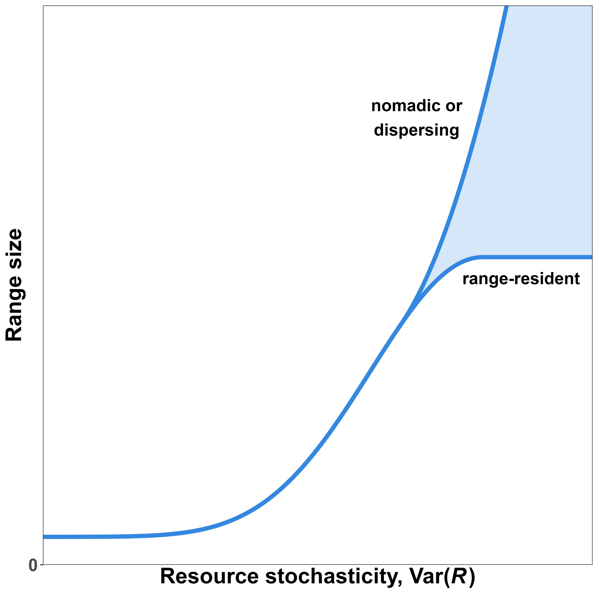

<!-- define custom math symbols -->

\newcommand*\e{\mathbb E} <!-- expectation (blackboard bold) E -->

\newcommand*\var{\mathbb V} <!-- variance (blackboard bold) V -->

\newcommand*\vpos{\var (\text{position})} <!-- positional variance -->

<!-- place table of contents on a new page -->
\newpage

\tableofcontents

<!-- start main body on a new page -->
\newpage

```{r setup, include=FALSE}
# set chunk defaults: don't print code, images 75% of page width and centered
knitr::opts_chunk$set(echo = FALSE, out.width = '75%', fig.align = 'center')
```

```{r wrap-figure-function, include = FALSE}
# this chunk is needed to wrap text around or beside figures
# code modified from https://stackoverflow.com/questions/54100806/r-markdown-how-do-i-make-text-float-around-figures

defOut <- knitr::knit_hooks$get('plot')  # save the default plot hook

knitr::knit_hooks$set(plot = function(x, options) {  # set the new plot hook ...
  
  x <- defOut(x, options)  # first apply the default hook
  
  # if wrapfigure options are given, create the new opening string for the wrapfigure
  # environment using custom figure alignment and text width
  if(!is.null(options$wrapfigure)) {
    
    # options must be numeric, they cannot be characters
    wf <- sprintf('\\begin{wrapfigure}{%s}{%g\\textwidth}',
                  options$wrapfigure[[1]], # figure alignment
                  options$wrapfigure[[2]]) # caption width relative to text width
    x  <- gsub(pattern = '\\begin{figure}', # and replace the default one with it
               replacement = wf,
               x = x,
               fixed = TRUE) # pattern is a string, so evaluate as is
    x  <- gsub(pattern = '{figure}', # also replace the environment ending
               replacement = '{wrapfigure}',
               x = x,
               fixed = TRUE)
  }
  return(x)
}
)

# chuck options used to wrap figures:
## fig.align = "right":          align figures right
## out.width = "0.5\\textwidth": output width = 0.5 * the width of the text
## wrapfigure = list("R", 0.5)   wrap caption to right, caption width = 0.5 text width

#' place figures before the paragraph they are referred to so `wrapfigure` places them
#' beside the paragraph
```

<!--
@ciuti and @berger-tal: human presence in nature for reasons other than hunting
"When habitats ensuring different functions (Dunning et al., 1992; Camp et al., 2013) are far from each other..."
habitat productivity hypothesis: Harestad and Bunnel, 1979 [@harestad_home_1979]
-->

# Abstract

\noindent Since animals need to maintain a positive energetic balance to grow and reproduce, their spatial needs are thought to be tightly linked to the amount of resources within their habitats, such that animals living in productive habitats generally require less space than those in resource-poor habitats. Although this hypothesis has widespread empirical support, existing studies have focused primarily on responses to the mean amount of resources, while responses to the variance in around the mean are still largely unknown. This is not a trivial oversight. Animals adjust to variable environmental conditions, so failing to account for the effect of resource unpredictability can result in a limited understanding of animals' spatial needs. In this study, we first review the literature of studies that estimate animals' spatial needs as a function of resource abundance. We then leverage this information to provide a unifying framework and hypotheses for the effect of mean *and* variance in resource abundance on animals' space use. Next, we use simulated movement data to demonstrate how the combined effects of mean and variance in resource abundance interact to shape predictable patterns in animal space use. Finally, we use real-world tracking data on a lowland tapir (\textit{Tapirus terrestris}) from the Brazilian Cerrado to show how this framework can be applied to better understand the movement ecology of free-ranging animals. Results from the simulations and empirical examples are presented using a fully transparent approach that allows researchers to apply the framework to their own data and inform area-based conservation efforts.

\newpage

# Introduction

\noindent The amount of resources an organism is able to access is a strong determinant of its probability to survive and reproduce. Resource limitations can cause individuals to experience a negative energetic balance, which can then result in lower fitness [@hou_cold_2020; @le_bot_fishery_2019], changes to community structure [@haney_tipping_2018; @burson_competition_2018; @riotte-lambert_environmental_2020; @ghislandi_resource_2018], altered physiology [@dai_pra_ground_2022; @rocha_life_2021; @le_bot_fishery_2019; @wessling_seasonal_2018], lower chance of reproduction [@stefanescu_timing_2021; @schmidt_interplay_2020; @le_bot_fishery_2019; @douglas_relative_2014], or even death [@foley_severe_2008; @berger_climate_2018]. Thus, many organisms will change their behaviors in response to changes in local resource abundance. Some species may respond to fluctuations in resource abundance by, if possible, switching to other food sources [@steinmetz_effects_2021; @le_bot_fishery_2019], reducing energetic costs by reducing body heat [@schmidt_interplay_2020] or entering hibernation or torpor [@fjelldal_nightly_2021; @mohr_cellular_2020; @boyles_optimal_2020], but movement represents one of the most readily available traits that species can adjust, whether this be by modifying their home range [@bista_effect_2022; @bradsworth_using_2022; @lucherini_habitat_1996; @relyea_home_2000; @yu_artificial_2022; @arechavala-lopez_common_2019], migrating [@middleton_green-wave_2018; @geremia_migrating_2019], dispersing [@refs], or moving nomadically [@teitelbaum_beyond_2019; @nandintsetseg_variability_2019].

While there are many other causes of animal movement, the relationship between animal movement and resource abundance has been of interest to biologists for over half a century. @burt_territoriality_1943 considered the search for food as the primary driver for animal movement within an animal's home range. Three decades after, @southwood_habitat_1977 suggested change in resource abundance is a strong determinant of how animals decide when and where to live and reproduce. Two years later, @harestad_home_1979 proposed that the simplest hypothesis for the relationship between an animal's home range size is inversely proportional to resource abundance. More recently, various researches reported that home range size decreases linearly with resource abundance [desert mule deer: @relyea_home_2000; red panda: @bista_effect_2022]. Others demonstrated that spatial needs decrease nonlinearly as habitat productivity increases, with stronger decreases when resources are scarce [e.g., Canadian lynx: @herfindal_prey_2005; carnivores: @nilsen_can_2005; tigers: @simcharoen_female_2014; ferruginous hawks: @watson_ferruginous_2020]. Additionally, an animal's spatial requirements depend strongly on its metabolic rate and diet, as demonstrated over three decades ago by various scientists, including @lindstedt_home_1986 and @reiss_scaling_1988. Thus, there are many drivers of animal movement and many causes of variety between behaviors, and we currently lack a unifying framework for quantifying the effects of resource abundance and unpredictability on animals' spatial needs. **but animals don't only respond to changes in mean**

**paragraph detailing effects of variance on movement and how little work has been done**

In this study, we illustrate how animals' spatial needs depend on the abundance and unpredictability of resources. First, we set the theoretical background necessary for the successive chapters. Concepts and notation are introduced without assuming any previous knowledge of statistical notation or movement ecology. Next, we provide a review of the effects of resource abundance on animals spatial needs while suggesting a unifying hypothesis of how animals respond to changes in resource abundance. Afterwards, we present a hypothesis for how animals respond to resource unpredictability. Subsequently, we test the two hypotheses using quantitative simulated animal responses to changes in resource abundance and unpredictability. Finally, we demonstrate how this framework can be used in practice to describe the movement ecology of a lowland tapir living in the Brazilian Cerrado. Results from the simulations and empirical example are presented using a fully transparent approach that allows researchers to replicate the work and apply the methods to their own tracking data.

\newpage

# Concepts and definitions

## Resources as a random variable

In statistics, random variables indicate random (i.e., unknown) quantities and are indicated with capital letters (e.g., $R$). Known values, such as realizations (i.e., known observations or instances) of random variables, are indicated with lower-case letters (e.g., $r$). Using this notation, we can write the statement "the probability of random variable $R$ taking the value $r$" as $P(R = r)$. Since resource abundance depends on a variety of factors, including climate, weather, competitive pressure, and individual- and species-specific energetics, it is often unpredictable (and hard to quantify). Thus, we can let the random variable $R$ indicate the *resource* abundance at a given point in space and time.

### Probability distributions

In probability and statistics, random variables are defined by specifying the distribution the variable follows. Since the variable is random, it can take multiple values (minimum 2), each with different probabilities. Commonly known distributions include the normal (i.e., Gaussian) distribution, the Student's T distribution, and the Bernoulli distribution. The set or range of values which have non-zero probabilities in a distribution are referred to as the distribution's **support**. The support of the normal and T distributions are all real numbers, while the Bernoulli distribution only has support over values 0 and 1. 

There are many distributions we can assign to $R$, depending on how we quantify it. If $R$ is the number of calories an animal is able to access from food in a given location, we can let $R$ follow any distribution with support over all real numbers between 0 and infinity, which we can indicate with $r \in (0, \infty)$. (We use round parentheses rather than square brackets (i.e., $[0, \infty]$) because both 0 and infinity are not included in the support set.) In this case, we can let $R$ follow a Gamma distribution. If $R$ was a discrete variable, such as the number of prey in a location during a period of time, we can use a Poisson or negative binomial distribution for $R$. Alternatively, if we measure $R$ using the Normalized Difference Vegetation Index [**NDVI**, see @pettorelli_normalized_2011], we should use a distribution with support over the interval $[-1, 1]$, since NDVI can only take on values between -1 and 1 (extremes included). The next two sections introduce two parameters that are often used to visualize and define distributions: the expectation and the variance of a random variable.

### Expected resource abundance, $\e(R)$

The expectation of a random variable (i.e. its mean or average, indicated here as ) is the value one can *expect* the random variable to take. $\e(R) = \mu$ to indicate the expectation of the random variable $R$. The mean may not be within the distribution's support (e.g., a non-integer number of prey per day), but $\e(R)$ is still useful for estimating the average long-term resource abundance. When the mean changes over time, as in the case changes in $R$ in highly seasonal regions, we explicitly indicate that $\e(R) = \mu$ changes over time by writing the expectation of $R$ as a function of time, $t$: $\e(R) = \mu(t)$.

The hypothesis that spatial needs decrease with resource abundance is common and well supported, but many studies assume a linear relationship [e.g., @harestad_home_1979; @relyea_home_2000; @bista_effect_2022; @bradsworth_using_2022]. This is problematic because it can lead to questionable estimates and problematic biases, such as negative or excessively small home ranges [e.g., figure 2 in the work of @bista_effect_2022]. Conceptually, the relationship between spatial needs and resource abundance must be nonlinear, since there are limits to how much space an animal is able to explore in its lifetime and the minimum amount of space it requires to survive (which is necessarily greater than zero). The relationship between resource abundance and animals' spatial needs is explored in more depth in a following section.

### Variance in resource abundance, $\var(R)$

A random variable's variance is a measure of its unpredictability or variability. We use  $\var(R) = \sigma^2$ to indicate the variance in $R$, after accounting for changes in $\mu(t)$. For instance, while one may consider $R$ to vary within years, we define $\var(R)$ as the variation in $R$ after accounting for the fact that $R$ is lower during some seasons and higher in others. Additionally, we distinguish between two different sources of variation. We refer to known differences or expected spatiotemporal changes as **heterogeneity**, while we use the term **stochasticity** for unpredictable and unexpected variation. For example, the location of (high-yield) berry bushes in a valley and the time at which they produce fruit may be heterogeneous, but predictable once an animal visits the valley. In contrast, whether next year will be a good or bad year for berries is stochastic.

### Simulating resource abundance

In this paper, we can simulate $R$ using a Gamma distribution with time-dependent mean $\mu(t)$ and time-dependent variance $\sigma^2(t)$ (which we write as $R \sim \Gamma(\mu(t), \sigma^2(t))$). Although Gamma distributions are more often parameterized using parameters shape and scale ($k, \theta$) or shape and rate ($\alpha, \beta = 1/\theta$), we use $\mu = k \theta$ and $\sigma^2 = k \theta^2$ to facilitate visualizing the examples. However, note that $\mu$ and $\sigma^2$ are not independent because the variance depends strongly on the mean. As the mean approaches zero (from the positive side, which we write as $\mu \rightarrow0^+$) the variance also does: $\mu \rightarrow 0^+ \iff k \theta \rightarrow 0^+ \iff k \theta^2 = 0^+ \iff \sigma^2 = 0^+$.

### Estimating resource abundance using NDVI

In this paper's empirical example, we estimate resource abundance using NDVI [for more information, see the relevant section later in the paper and @pettorelli_normalized_2011]. However, since there is no commonly used distribution with a support over the interval $[-1, 1]$ we scale NDVI to the interval $[0, 1]$ to use a Beta distribution by applying the linear transformation

\begin{equation} \label{ndvi-to-r}
R = \frac{\nu + 1}{2},
\end{equation}

where $\nu$ indicates the NDVI value. Note that only **linear transformations** (i.e. only addition, subtraction, multiplication, and division) should be applied to random variables to avoid biases while estimating the distribution's parameters [@denny_fallacy_2017; @jensen_sur_1906]. In this case, we can define $R$ as following a Beta distribution with mean and variance that depend on time using the notation $B (\mu(t), \sigma^2(t))$ (We use this parameterization here for ease of explanation, but note that Beta distributions are generally parameterized using the shape parameters $\alpha$ and $\beta$ such that the mean is $\mu = \frac{\alpha}{\alpha+\beta}$ while the variance is $\sigma^2 = \frac{\alpha\beta}{(\alpha+\beta)^2(\alpha+\beta+1)}$). Failing to model or simulate resource abundance appropriately can fail to produce robust, sensible, and accurate results.

## Animal movement as a stochastic process

### Drivers of animal movement

@nathan_movement_2008 generalized animal movement from location $\vec u_t$ to location $\vec u_{t+1}$ using the model

\begin{equation} \label{nathan-movement}
\vec u_{t+1} = F(\Omega, \Phi, \vec r_t, \vec w_t, \vec u_t),
\end{equation}

such that an animal's position as time $t+1$ depends on its motion capacity ($\Omega$), navigation capacity ($\Phi$), internal state ($\vec w_t$) and current location ($\vec u_t$), as well as how each of the parameters may change with the current environmental factors ($\vec r_t$). This model is conceptually useful, as it can form the basis for many models, experiments, and hypotheses, but fitting such a model would be very difficult in practice (if not impossible). The parameters $\Omega, \Phi, \vec r_t,$ and $\vec w_t$ cannot be quantified directly, and although it may be possible to monitor proxies for the parameters (e.g., body size, memory, cortisol levels), doing so with sufficient frequency and accuracy would not be simple. However, we can focus on animals' behavior and spatial needs as a response to resource abundance and unpredictability alone (rather than measuring changes in each of an animal's resources, needs, and behavioral states directly).

### Visualizing movement as a stochastic process

To understand how movement can be viewed as a stochastic process, imagine an animal that starts at its den and moves to collect food and other resources, and it returns to its den once it has collected enough resources for the day. If we do not know why the animal is choosing to move in one direction or another, nor do we know what the environment is like, we cannot predict where the animal may move from one time point to another. However, we can use the animal's positional data to estimate the amount of time it spends exploring before returning "home" (or the time required for the position to "decay" back to the average position), which is often referred to as the **range crossing time** or the positional autocorrelation parameter, $\tau_p$. Similarly, we can define $\tau_v$ to be amount of time the animal moves with the same direction and speed, or the time required for an animal's velocity to "decay" back to the average velocity. $\tau_v$ is referred to the animal's **directional persistence** or the velocity autocorrelation parameter. Thus, by modeling movement via stochastic models which account for autocorrelation in position [e.g., Ornstein–Uhlenbeck or OU models, see @uhlenbeck_theory_1930] and autocorrelation in velocity [Ornstein–Uhlenbeck Foraging or OUF models, see @fleming_fine-scale_2014], one is able to account for a variety properties of tracking data which are problematic for models that assume errors to be independent while also leveraging such properties to estimate important movement parameters. Accounting for autocorrelation in movement data (which is present in most modern datasets) avoids systematic biases in the estimation of home ranges [@noonan_comprehensive_2019] as well as path length and average (or instantaneous) speed [@noonan_scale-insensitive_2019].

If sampling frequency is too low to provide precise measures of autocorrelation, it will be inappropriate to estimate an animal's average speed, directional persistence, and range crossing time, but the data can still provide reasonable estimates of the animal's spatial needs and usage, and model selection procedures with criteria such as AIC can help the analyst choose the most appropriate model for the available data [@silva_autocorrelationinformed_2022]. Estimates of average or instantaneous speed require the highest sampling frequency [$\Delta t \lessapprox \tau_v$, see @noonan_scale-insensitive_2019], since the dataset must contain multiple consecutive samples where the animal is moving with a similar speed and direction. However, since the time required for an animal to cross the area it uses is orders of magnitude larger than the time it moves with a consistent behavior, it is still possible to produce good estimates of range crossing time even if there is no information on the animal's speed. Similarly, if the data is too sparse to estimate $\tau_p$, one can still obtain good estimates of the animal's spatial needs and home range size, provided that the sampling duration is sufficiently long.

### Quantifying spatial needs

The concept of a home range has a long history in ecological research as an indicator of the space an animal requires to satisfy its essential requirements during a period of time [@burt_territoriality_1943], but home range analysis is not appropriate for animals which are not range-resident, such as migrating animals [e.g., @jonzen_rapid_2006; @geremia_migrating_2019; @abrahms_memory_2019] and nomadic animals [e.g., @morato_space_2016; @nandintsetseg_variability_2019]. Although here we quantify animal's spatial needs using 50% and 95% home range estimates, we expect that similar conclusions can be drawn about the positional variance of animals that are not range-resident.

Although range-resident animals will generally have smaller $\vpos$ than migratory and nomadic animals, $\vpos$ is not sufficient to distinguish between range residency, migration, and nomadism, since $\vpos$ determines the scale and size of an animal's spatial needs but not its behavior. Instead, the animal's $\tau_p$, $\tau_v$, and $\bar v$ can help discriminate between different kinds of movement. Animals with a $\tau_p$ shorter than a year are likely range-resident, while animals with a $\tau_p$ on the order of a year are likely to be migratory (as long as their life expectancy is greater than a year). In contrast, when an animal's $\tau_p$ is on the order of its expected lifespan, it is most often nomadic, since it is unlikely to return to locations it visited in the past.

***Not sure if we need this or if we can tie it in somewhere:***

Recent improvements in animal tracking technologies (e.g., increasing sampling duration and frequency of GPS units) have allowed scientists to demonstrate that changes in animals movement and behavior may be more common than previously thought [leatherback turtles: @hays_flexible_2006; bald eagles: @wheat_migrate_2017]. However, the models we use in this paper assume an animal's large-scale behavior and movement to remain consistent over time...

### Advantages of modeling animal movement as a stochastic process

Predicting animal movement using stochastic models may seem less straightforward and more complex than using deterministic models, but ignoring the causes and decisions that determine the movement allows us to focus more on the animal's movement and behavior and less on recognizing each cause of movement. Animals may temporarily change their behavior in response to many causes, including predators [@ref], competitors [@ref], weather [@ref], and mates or mating periods [feral cats: @zhang_home_2022; yellow mongoose: @cronk_home_2021].

Depending on sampling frequency, statistical methods that rely on straight-line displacement are prone to under-estimating the distance traveled by an animal and its speed at coarse sampling frequencies, while they over-estimate them at fine frequencies [@noonan_scale-insensitive_2019]. In addition, most commonly-used methods for home range estimation assume tracking data to be independent of one another and sampled at consistent and discrete intervals, which is most often not the case. Consequently, animals' spatial needs are often under-estimated [@noonan_comprehensive_2019].

### Unassigned

@boratynski_energetic_2020: animals' hr is limited by BMI and maximum metabolic rate, which can be accounted for by accounting for body mass [@noonan_effects_2020]

@arechavala-lopez_common_2019: octopuses (*Octopus vulgaris*) congregate in human-altered coastal habitats

@mitsuhashi_home_2018: urban raccoon dogs (*Nyctereutes procyonoides*) have a smaller HR than rural ones

@cronk_home_2021: yellow mongoose (*Cynictis penicillata*) in urban regions have smaller HRs

@yu_artificial_2022: rat snakes move to artificial structures for better prey availability and better thermoregulation

Although it is generally acknowledged that animals will modify their behavior in response to human activity [@rogala_human_2011] as well as changing conditions [@walther_ecological_2002; @chevin_adaptation_2010; @sih_evolution_2011], a fine-scale understanding of behavioral responses is lacking [@sih_evolution_2011; @beever_behavioral_2017].

@teitelbaum_beyond_2019:

- **Nomadic movement**: movement with irregular timing and/or direction that produces both within- and between-year variability in location and movement patterns
- "Data from recent developments in animal tracking technology (e.g., longer-lasting and lighter GPS devices) show that species previously considered migrants or range residents can show irregular, often long-distance, movement patterns (flexible foraging movements of leatherback turtles across the north Atlantic ocean, To migrate, stay put, or wander Varied movement strategies in bald eagles, Big data analyses reveal patterns and drivers of the movements of southern elephant seals)"

\newpage

# Effects of $\e(R)$

```{r mu-hyp, fig.cap="Hypothesized spatial needs (indicated as positional variance, $\\vpos$) of an animal as a function of mean resource abundance ($\\e(R)$). We expect low values of $\\e(R)$ to result in high $\\vpos$ as animals are forced to explore greater areas to collect the resources they require to survive, whether they be range-resident or nomadic. As $\\e(R)$ increases, spatial needs should decrease nonlinearly until they reach the minimum amount of space required by the animal to survive. Note that the relationship between $\\e(R)$ and $\\vpos$ cannot be linear because it would require $\\vpos$ to be negative for high values of $\\e(R)$.", out.width = '0.5\\textwidth', fig.align = 'right', wrapfigure = list('R', 0.5)}
knitr::include_graphics('../figures/mean-abundance-hr-hypotheses.png')
```

<!-- You need to open with some background on metabolic requirements. Individuals have fixed needs that they must meet in order to survive, grow, and reproduce. If these are not met, they will die. Then transition to the idea that, because of that, they move around in order to secure resources. Therefore, when environments are productive, they don't have to move as far to meet their energetic requirements. -->

* add refs to generalize beyond terrestrial mammals

\noindent While animals' needs vary greatly between taxonomic groups, some needs are essential for most species for survival and reproduction. All heterotrophic organisms require sources of chemical energy (i.e., food), water, and various limiting nutrients to survive, grow, and reproduce [@baldwin_nutritional_1984; @reich_body_2001; @ref]. Failing to acquire sufficient resources is likely to result in lower fitness, changes in physiology or behavior, physiological damage, inability to reproduce, and death. Motile organisms can move to new locations in search of resources, but they must also account for a higher metabolism [@ref] and movement costs [@ref]. The size of an animal's spatial needs is often hypothesized to be depend on resource abundance [@burt_territoriality_1943], such that spatial needs increase when resources are low, but the relationship is likely not linear [see figure \@ref(fig:mu-hyp) and @nilsen_can_2005; @ex]. Low values of $\e(R)$ force animals to have larger home ranges [@relyea_home_2000; @nilsen_can_2005; @herfindal_prey_2005; @bista_effect_2022], migrate to better locations [@samarra_movements_2017; @middleton_green-wave_2018; @geremia_migrating_2019], or move nomadically [@teitelbaum_beyond_2019; @nandintsetseg_variability_2019], although large-scale changes in behavior (such as shifts to dispersal, migration, and nomadism) are more likely to occur over evolutionary timescales rather than an animal's lifespan \@ref(fig:mu-hyp). As $\e(R)$ increases, we expect animals' spatial requirements to decrease nonlinearly until they reach the smallest amount of space required to survive [see @relyea_home_2000; @bista_effect_2022, although the latter uses models which assumes the effect to be linear].

Animals living in large groups will often require larger home ranges because they will have to share resources with conspecifics [@prox_framework_2020], but larger home ranges can be harder to defend and also result in higher rates of competition and movement costs [@grant_whether_1993; @jetz_scaling_2004; but also see @dickie_resource_2022]. It is unclear when animals switch from range residency to migration or nomadism (or vice-versa), but understanding the connection between the types of movement is important for quantifying the effect of resource abundance on animal's spatial needs. From a quantitative perspective, the switch is related to an animal's home range crossing time (or positional autocorrelation, $\tau_p$). As the amount of space an animal uses over its lifespan, the amount of time required to cross the area ($\tau_p$) will also increase, so animals with $\tau_p$ on the order of their expected lifespan will necessarily be nomadic.

# Effects of $\var(R)$

```{r s2-hyp, fig.cap="Hypothesized spatial needs (indicated as positional variance, $\\vpos$) of an animal as a function of resource unpredictability ($\\var(R)$). We expect low values of $\\var(R)$ to result in low $\\vpos$ as animals are able to depend on somewhat predictable resources. As $\\var(R)$ increases, spatial needs should increase nonlinearly, whether this results in an expansion of the home range (in the case of range-resident animals) or a switch to dispersal, nomadism, or migration. Note that the relationship between $\\var(R)$ and $\\vpos$ cannot be linear because it would require $\\vpos$ to be negative for low values of $\\var(R)$.", out.width = '0.5\\textwidth', fig.align = 'right', wrapfigure = list('R', 0.5)}

```

Although it is generally acknowledged that animals will modify their behavior in response to human activity [@rogala_human_2011] as well as changing conditions [@walther_ecological_2002; @chevin_adaptation_2010; @sih_evolution_2011], a fine-scale understanding of behavioral responses is lacking [@sih_evolution_2011; @beever_behavioral_2017].

\noindent Although the effect of $R$ on animals' spatial needs is often recognized and accounted for in ecology [@burt_territoriality_1943; @southwood_habitat_1977; @relyea_home_2000; @nilsen_can_2005; @williams-guillen_resource_2006; @rickbeil_plasticity_2019], $\var(R)$ has received far less attention [but see @lucherini_habitat_1996; @di_stefano_resource_2011; @rizzuto_forage_2021; @seigle-ferrand_systematic_2021]. However, $\var(R)$ can change strongly due to many important causes, including repetitive and predictable patterns (such as daily or seasonal changes in temperature and precipitation, or the location of different patches) as well as infrequent and unpredictable events [such as forest fires, the arrival of new competitors, human activity, fires, floods, droughts, and other consequences of climate change, see @ipcc_global_2018; @noonan_situ_2018]. Environmental variability, including extreme events [@logares_black_2012], can reduce a landscape's energetic balance [@chevin_adaptation_2010], which, in turn, decreases animals' fitness and increases their spatial needs. A few recent studies support this hypothesis [@morellet_seasonality_2013; @nandintsetseg_variability_2019; @riotte-lambert_environmental_2020], but many of them are limited in geographic and taxonomic scales, so the extent to which these preliminary findings can be generalized is still very limited. There thus remains a need for developing a more complete understanding of how animals' spatial needs change with environmental stochasticity.

Simlarly to the effect of $\e(R)$, we expect $\var(R)$ to have a nonlinear effect on $\vpos$. When $\var(R)$ is low enough that $R$ is relatively predictable, we do not expect changes in $\var(R)$ to have a noticeable effect on $\vpos$. However, as resources become additionally unpredictable, we expect spatial needs to increase superlinearly. If resources remain highly unpredictable over long periods of time (e.g., multiple lifespans), animals may evolve or develop new behaviors, including nomadism, dispersal, and migration (figure \@ref(fig:s2-hyp)).

The effects of $\var(R)$ on animals' spatial requirements most likely vary between species, since different species have different energetic and nutritional needs, so the degree to which $R$ varies will likely affects each species differently. Small-scale variations may be sufficient to causes changes in behavior for some small animals, while animals with a larger $\vpos$ may not detect such differences. @rizzuto_forage_2021 found that the 50%, 75%, and 90% utilization distributions (UDs) of snowshoe hares (*Lepus americanus*) increased with average C:N in lowbush blueberry as well as the coefficient of variation for C:N, which suggests that the hares expanded their home range in response to both resource scarcity and the variance in resource scarcity. Similarly, @mueller_how_2011 demonstrated that ungulate species in more variable ecosystems move more than species in more stable landscapes and that they are more likely to be nomadic. In contrast, @lucherini_habitat_1996 found that red foxes (*Vulpes vulpes*) living in areas with more habitats per hectare (i.e., more heterogeneous habitats) required exponentially less space than foxes that lived in more homogeneous regions. Similarly, @nilsen_can_2005 found that the home ranges of wolverines (*Gulo gulo*) and Canadian lynx (*Lynx canadensis*) decreased with seasonality, while the home ranges of bobcats (*Lynx rufus*) and coyotes (*Canis latrans*) increased with seasonality. The work by @nilsen_can_2005 also demonstrates that the effect of $\e(R)$ on the home range size of wolves (*Canis lupus*) and fishers (*Martes pennanti*) depends on $\var(R)$, so it is important to account for interaction effects between the two.

* predation is more stochastic than herbibory; predators need to match more cycles, depend on fewer food sources that are able to move $\rightarrow$ higher effect of $\var(R)$

# Interactive effects of $\e(R)$ and $\var(R)$

```{r multipanel-constant-var, fig.cap="Fictitious example of variation in resource abundance in a heterogeneous environment with constant variance (after accounting for changes in mean abundance). (a.) Although resource abundance ($R$, raster fill) varies over time and space, the overall amount of variance (dot color) remains constant. (b.) Arbitrary definition of $R$ as following a Gamma distribution with mean $\\mu$ and variance $\\sigma^2$. (c.) Simulated animal movement at a time of lowest $\\e(R)$ and average $\\var(R)$. (d.) Simulated animal movement at a time of peak $\\e(R)$ and average $\\var(R)$.", out.width = '0.5\\textwidth', fig.align = 'right', wrapfigure = list('R', 0.5)}
knitr::include_graphics('../figures/habitat-examples-constant-variance.png')
```

\noindent Consider the simplistic scenario where $\e(R) = \mu$ changes over time but $\var(R) = \sigma^2$ is constant over time and space (and non-zero, see figure \@ref(fig:multipanel-constant-var)a). We can use the notation $R \sim \Gamma\big(\mu(t), \sigma^2\big)$ to indicate that the resource abundance follows a Gamma distribution with a mean that changes over time (i.e., the expected value is a function of time) while the variance is constant (figure \@ref(fig:multipanel-constant-var)b). Since $R$ is spatiotemporally random, an animal that moves in the landscape will not find the same $R$ at different time points or throughout the habitat (figures \@ref(fig:multipanel-constant-var)c-d). However, if $\e(R) = \mu(t)$ changes repetitively and regularly over time (e.g. peaks each spring), an animal may learn to predict times of high or low $R$ [e.g., @falcon-cortes_hierarchical_2021; @geremia_migrating_2019; @abrahms_memory_2019]. However, since $\e(R)$ does not vary predictably over space, it will not be possible to predict the location of locations with high or low $R$.

This model is somewhat simplistic, but its simplicity makes it easy to fit and conceptualize. Such a model may be appropriate in regions with little to no changes in variability and where unpredictable events occur at a similar frequency over time, or when data availability is too low to produce appreciable measures of variance. Examples of temporally homogeneous habitats include regions where productivity remains fairly predictable throughout the year (e.g., equatorial rain forests or highly homogeneous deserts). When productivity is approximately stable over long periods of time, it may be possible to further simplify the model by assuming a constant mean, but this is rarely the case. Most often, $\e(R)$ will vary over time, and animals' behaviors will change in response. Additionally, when data availability is sufficiently high to produce precise estimates of $\var(R)$, the effect of $\var(R)$ on animals' $\vpos$ should be estimated before assuming the effect is negligible. The need to account for $\var(R)$ is compounded by recent changes in climate, which exposes species to novel situations and increasingly common stochastic events [@ipcc_global_2018; @noonan_situ_2018]. Additionally, anthropogenic structures and urban areas reduce the habitat available to many terrestrial species [@wilson_habitat_2016], who struggle to move in fragmented [@fahrig_non-optimal_2007], human-dominated landscapes [@tucker_moving_2018]. Although some species rely on anthropogenic areas and structures for predicable and dependable sources of resources [steppe rat snake: @yu_artificial_2022; yellow mongoose: @cronk_home_2021; common octopus: @arechavala-lopez_common_2019; raccoon dog: @mitsuhashi_home_2018; coyote: @peron_periodic_2017], anthropogenic environments can be highly unpredictable [@ref] and pose high mortality risks [@noonan_roads_2021; @refs].

```{r multipanel-changing-var, fig.cap="Fictitious example of variation in resource abundance in a heterogeneous environment with changing variance (even after accounting for changes in mean abundance). (a.) Although resource abundance ($R$, brown-green fill) varies over time and space, variance (dot color) is lowest at the beginning and end of the observational period and highest when $R$ peaks. (b.) Arbitrary definition of $R$ as following a Gamma distribution with mean $\\mu$ and variance $\\sigma^2$. (c.) Simulated animal movement at a time of lowest $\\e(R)$ and $\\var(R)$. (d.) Simulated animal movement at a time of peak $\\e(R)$ and $\\var(R)$.", out.width = '0.5\\textwidth', fig.align = 'right', wrapfigure = list('R', 0.5)}
knitr::include_graphics('../figures/habitat-examples-changing-variance.png')
```

When animals are not guaranteed that the resources they find during one visit will be there next time (figure \@ref(fig:multipanel-changing-var)a), $\var(R)$ will have an appreciable effect on the location's favourableness. Since $\var(R)$ is not constant over time, we can now define it as a function of time using the notation $\var(R) = \sigma^2(t)$ (figure \@ref(fig:multipanel-changing-var)b). In this scenario, both the expected $R$ and its predictability change over time, so accurately and precisely predicting $R$ becomes more complex (figure \@ref(fig:multipanel-changing-var)c-d).

Most habitats with seasonal changes in climate will require models to account for changes in both $\e(R)$ and $\var(R)$, since periods of high productivity can often be more variable than times of dormancy or lower productivity, and the variability in $R$ often changes both within and between years. In such cases, failing to account for $\var(R)$ can result in serious biases in the estimation of animals' spatial needs [@examples]. In highly variable and stochastic environments, animals will likely have higher spatial needs, particularly if they are required to collect and store resources for periods of scarcity or in periods of increased energetic needs, such as reproductive periods, whether this be due to pregnancy [@ref], to feed offspring [@ref], or because the animal's needs change over time [@male_deer_growing_antlers]. In heterogeneous environments, such as habitats with a high diversity of clustered resources, animals may have to move between locations if they cannot depend on a single one.

# Interactive effects of mean and variance in resource abundance

Figure \@ref(fig:5-5-sims) illustrates the simulated average spatial requirements of an animal as a function of $\e(R)$ and $\var(R)$. The top row (constant $\var(R)$) shows how $\vpos$ changes as a function of $\e(R)$ while $\var(R)$ remains constant. (Some noise in $H$ is still present since $\var(R) \ne 0$ and thus $R$ is not constant). Note the nonlinear decrease in $H$ as $\e(R)$ increases at a constant slope (linear $\e(R)$), with larger changes when $\e(H)$ is low. This is because when $\e(R)$ is low, small additive changes in $\e(R)$ (e.g. from 1 to 2) can correspond to large multiplicative changes (i.e., 2 is twice as big as 1). Additionally, the 95% home range is more sensitive to changes in $\e(R)$ than the core home range $H_{50\%}$, since (not sure about this) larger quantiles (e.g., 95% > 50%) are more sensitive to changes in a distribution's variance (in this case $\propto \vpos$).

Most habitats with seasonal changes in climate will require models to account for changes in both $\e(R)$ and $\var(R)$, since periods of high productivity can often be more variable than times of "dormancy" or lower productivity, and the variability in $R$ often changes both within and between years. In such cases, failing to account for $\var(R)$ can result in serious biases in the estimation of animals' spatial needs.

\noindent Figure \@ref(fig:5-5-sims) illustrates the simulated average spatial requirements of an animal as a function of $\e(R)$ and $\var(R)$. The top row (constant $\var(R)$) shows how $\vpos$ remains constant. Some noise in $H$ is still present since $\var(R) \ne 0$ and thus $R$ is not constant). Note the nonlinear decrease in $H$ when $\e(R)$ increases at a constant slope (linear $\e(R)$), with larger changes when $\e(R)$ is low. This is because when $\e(R)$ is low, small additive changes in $\e(R)$ (e.g. from 1 to 2) can correspond to large multiplicative changes (i.e., 2 is twice as big as 1). Additionally, the 95% home range is more sensitive to changes in $\e(R)$ than the core home range $H_{50\%}$ since larger quantiles (e.g., 95% > 50%) are more sensitive to changes in the $\vpos$. In regions where the average resource abundance changes over time (cyclical $\e(R)$; e.g., seasonal changes), animals should have access to sufficient space to fulfill their needs during periods of scarcity, whether the space available is sufficiently large year-round or it changes seasonally with the expected changes in $\e(R)$ (e.g., winter park closures). However, estimates of spatial requirements based on estimated changes in $\e(R)$ should be interpreted carefully, since model error and unpredictable changes in $\e(R)$ may increase animals' spatial needs unpredictably. Thus, it is best to avoid changing the space available to animals too close to when resources are expected to be low and include a "buffer" area so the available area is larger than the estimated spatial needs. This is particularly the case in environments where resource abundance changes unpredictably (drifting $\e(R)$), since accurate long-term estimates of $\e(R)$ may be hard to produce, if not impossible. In cases where $\e(R)$ is highly unpredictable, animals should have enough space to collect resources during times of greatest scarcity, particularly if the changes in resource abundance occur rapidly, often, or for long periods of time. Finally, in ecosystems where $\e(R)$ changes erratically and suddenly (erratic $\e(R)$), such as regions prone to large fires or sudden floods, as well as regions with high mining or logging activity, the space available to animals should be sufficient to satisfy needs during the periods of greatest scarcity while also allowing animals to adapt their behavior between periods.

```{r 5-5-sims, fig.cap="Simulated spatial requirements for animals living in habitats where the mean and variance in resource availability ($R$) are constant, linearly increasing, cyclical, drifting, or erratic over time. The bottom line indicates the animal's core home range (0.5 quantile), while the top line indicates the 0.95 utilization quantile. Note how both quantiles decrease nonlinearly as $\\e(R)$ increases, and they increase approximately linearly as $\\var(R)$ increases. Additionally, the variance in both quantiles is higher when $\\var(R)$ is higher, and changes in $\\var(R)$ have greater impacts when $\\e(R)$ is low.\nSimulations were run such that animals followed the same 1000 tracks at each time point starting from the point $\\langle 0, 0\\rangle$ until they reach satiety, at which point they returned to $\\langle 0, 0\\rangle$ over the same amount of time. The animal's spatial variance parameter was then calculated using an Ornstein-Uhlenbeck Foraging (OUF) model via the $\\tt{ctmm}$ package", out.width='100%'}
knitr::include_graphics('../figures/mean-variance-5-by-5-hr-sims.png')
```

The leftmost column of figure \@ref(fig:5-5-sims) (constant $\e(R)$) illustrates how an animal's home range may vary as $\var(R)$ changes over time while $\e(R)$ remains constant. Overall, $\vpos$ increases with $\var(R)$, although the 95% home range ($H_{95\%}$) is more sensitive to changes in $\var(R)$ than the 50% core home range ($H_{50\%}$). ***here*** <!--Additionally, the effect of $\var(R)$ on $H$ depends on $\e(R)$, since the effect of $\var(R)$ on $H$ is stronger when $\e(R)$ is low (see the bottom row with erratic $\var(R)$).-->

Both $\e(H)$ and $\var(H)$ increase with $\var(R)$, although the 95% home range ($H_{95\%}$) is more sensitive to changes in $\var(R)$ than the core home range ($H_{50\%}$). Additionally, the effect of $\var(R)$ on $H$ depends on $\e(R)$, since the effect of $\var(R)$ on $H$ is stronger when $\e(R)$ is low (see the bottom row with erratic $\var(R)$).

Not all 25 scenarios depicted in figure \@ref(fig:5-5-sims) may be realistic, but the trends in $\e(R)$ and $\var(R)$, and their impacts on animal space use are useful examples that can be thought of as simplified scenarios. $\e(R)$ and $\var(R)$ can be assumed to be (approximately) constant in highly homogeneous environments, or environments where resources are sufficiently abundant that changes in $\e(R)$ and $\var(R)$ remain undetected. Although it is impossible for $\e(R)$ and $\var(R)$ to increase linearly continuously, such increases may be possible for short periods of time (followed by periods of no change or decrease). Additionally, these examples are important because they demonstrate the relationships between $H$, $\e(R)$, and $\var(R)$ in (relatively) simple scenarios. Cyclical oscillations in $\e(R)$ and $\var(R)$ may occur in urban environments [@peron_periodic_2017] and as temperatures fluctuate daily and seasonally [@geremia_migrating_2019], while $\e(R)$ and $\var(R)$ may drift randomly in highly complex environments with an abundance of competitors, threats, and stochasticity, such as a habitat with a high degree of human alteration and activity. Finally, erratic changes in $\e(R)$ and $\var(R)$ may occur in environments where changes are very sudden, such as areas prone to fires or floods, as well as habitats with drastic human alteration (e.g., a forest which is clear-cut for mining purposes with a subsequent artificial re-forestation). However, if highly stochastic or erratic changes occur frequently, animals may perceive them as smooth changes in $\e(R)$ or increases in $\var(R)$ rather a series of small, sudden, changes. Estimating the true trend in $\e(R)$ and $\var(R)$ would often require an excessively high cognitive capacity and an equally unlikely abundance of information, since although changes in $\e(R)$ are not due to $\var(R)$, but often distinguishing between the two is not easy [@steixner-kumar_strategies_2020], and $\e(R)$ and $\var(R)$ are not independent for $R \sim \Gamma(\mu, \sigma^2)$.

```{r 5-5-reg, eval=TRUE, echo=FALSE, fig.cap="Effects of $\\e(R)$ and $\\var(R)$ on simulated spatial requirements. The relationships were estimated using a Generalized Linear Model with a Gamma family. The thicker bottom line indicates the relationships with the animal's core home range (0.5 quantile), while the thinner top line indicates the relationship with the 0.95 utilization quantile. Note the nonlinear decrease in both utilization quantiles as $\\e(R)$ increases and the nonlineear increase in both utilization quantiles as $\\var(R)$ increases.", out.width='100%'}
knitr::include_graphics('../figures/simulation-regression-plots.png')
```

# Discussion

\noindent

@nilsen_can_2005 found that the home ranges of brown bears (*Ursus arctos*), leopards (*Panthera pardus*) decreased nonlinearly with the fraction of photosinthetically active radiation absorbed by plants in a given region. However, the effect of many other factors on HR size likely depends on the species, diet type [@harestad_home_1979], location, and possibly also on the individual animal. For instance, competition may push animals to explore other areas and expand their HR [@jetz_scaling_2004], but strong and consistent competition paired with territorial defense may also prevent them from doing so [e.g., wolves, @rich_anthropogenic_2012; feral cats, @bengsen_feral_2016; capuchin monkeys, @torrez-herrera_monkeys_2020]. Similarly, predation may force animals to move more frequently to escape predators, or it may prevent them from venturing too far from the safety of their core HR too often [@suraci_beyond_2022]. Patch quality, size, fragmentation, and heterogeneity may cause animals to explore more patches if some are of low value, too small, too disconnected, or too variable [@fahrig_is_2019], but high diversity may also decrease HR size if animals require heterogeneous habitats [@fox_niche_1981; @lucherini_habitat_1996]. Similarly, patch connectivity and ease of movement may widen HRs by decreasing the energetic cost of movement and favoring exploration [@dickie_resource_2022], or they may shrink HRs by decreasing the energetic cost of movement while increasing encounter rates with resources [@martinez-garcia_how_2020; @bartumeus_influence_2008; @visser_plankton_2006]. However, not all animals take advantage of linear features or higher predictability in human-altered habitats. @noonan_roads_2021 found that giant anteaters (*Myrmecophaga tridactyla*) in Brazil did not use roads to reduce movement costs or increase movement speed. Instead, roads increased anteater mortality because the animals were attracted to the high-quality foraging found on roadside habitat. Similarly, @medici_movement_2022 found that the movement of tapirs (*Tapirus terrestris*) was unaffected by anthropogenic activity or habitat type.

Other empirical refs to possibly add: @lindstedt_seasonality_1985, @jonzen_rapid_2006, @wolkovich_warming_2012, @falcon-cortes_hierarchical_2021, @nathan_big-data_2022

Simulation refs: @blackwell_heterogeneity_2007, @quaglietta_simulating_2019, @tucker_humaninduced_2021

* failing to account for $\var(R)$ may lead to decreases in population fitness and size as well as increase the risk of population collapse or human-wildlife conflict
* find examples of extreme events that caused population collapses or mass die-offs
* increasing stability of ecosystems and populations is a good way of increasing chances of long-term survival and fitness
* animal mortality following fires, how little we know of mortality following fires: @jolly_animal_2022

## Applying this framework

* The hypotheses we present here allow researchers to combine findings and generalize
* the analytical methods we use provide an example for how researchers can test these hypotheses using their own data
* can present results building on previous work rather than listing them as *de novo* findings
* additionally, can test for common behaviors between members of the same population or species
* ecologists often conclude that populations from different regions behave differently [@examples], but their differences in behavior may only be due to differences in $\e(r)$ or $\var(R)$
* using the methods presented here, it is possible to test whether populations and individuals do behave differently while also quantifying the differences in behavior

### Modeling $R$

* location-scale models
* `mgcv`, `brms`
* choosing the best family

### Modeling spatial needs

* importance of AKDE
* Introduce moving window idea

Recent improvements in animal tracking technologies (e.g., increasing sampling duration and frequency of GPS units) have allowed scientists to demonstrate that changes in animals movement and behavior may be more common than previously thought [leatherback turtles: @hays_flexible_2006; bald eagles: @wheat_migrate_2017]. However, the models we use in this paper assume an animal's large-scale behavior and movement to remain consistent over time...

### Modeling the relationship

* Gamma distribution for HR
* possibly location-scale if enough data?

## *Tapirus terrestris* in the Brazilian Pantanal: an empirical example

Animal's spatial needs are often estimated using all available tracking data. Doing so maximizes the (effective) sample size, but it also assumes that during the tracking period the animal's movement behavior did not change and that its home range did not shift either. Although these assumptions may be valid for relatively short tracking periods (and often necessary for reasonable estimates of spatial needs), few animals will behave consistently during the tracking period and use the same space every day. ***Most animals (if not all) use their space selectively.*** *add examples with humans moving to different regions?*

In the case of animals whose spatial needs change over their lifetimes, one may define HR as a function of time with distinct HRs for each distinct period [e.g., salmon: @ref; bald eagles: @wheat_migrate_2017; @wheat_migrate_2017] or as a continuous function so the HR changes smoothly over time [e.g., elephants: @polansky_elucidating_2015; bison and mule deer: @geremia_migrating_2019; elk: @falcon-cortes_hierarchical_2021]. In either case, the accuracy of the estimated parameters will depend strongly on the length of the observation period as well as the measurement frequency [@noonan_comprehensive_2019]. Data from a portion of an animal's life may be sufficient if it is representative the animal's movement or if inference is limited to the period(s) for which data is available.

The ability of a specialist or obligate symbiont to shift its home range or adapt will likely depend strongly on its associate's ability to move or adapt, too.

```{r mw-examples, fig.cap="Seven-day home range size of a tapir ($Tapirus~terrestris$) in response to changes in mean and variance in resource abundance. (a.) GPS tracking data of the tapir. (b.) Mean resource abundance esimated as the mean NDVI at the locations visited by the tapir. (c.) Varince in resource abundance esimated as the average variance in NDVI at the locations visited by the tapir. (d.) Estimated home range size during each seven-day period, based on 50\\% (bold) and 95\\% (thin) utilization quantiles. (e.) Effect of resource abundance on home range size. (f.) Effect of resource unpredictability on home range size. The effects in panels e and f were estimated using two generalized linear models with Gamma families of distributions. The tapir movement data corresponds to the individual named \"Anna\" from the Cerrado sample of Medici $et~al.$ (2022).", out.width='100%'}
knitr::include_graphics('../figures/tapir-example.png')
```

## Applying these methods

* The hypotheses we present here allow researchers to combine findings and generalize
* the analytical methods we use provide an example for how researchers can test these hypotheses using their own data
* can present results building on previous work rather than listing them as *de novo* findings
* additionally, can test for common behaviors between members of the same population or species
* ecologists often conclude that populations from different regions behave differently [@examples], but their differences in behavior may only be due to differences in $\e(R)$ or $\var(R)$
* using the methods presented here, it is possible to test whether populations and individuals do behave differently while also quantifying the differences in behavior

## The spatiotemporal scale of stochastic events: memory and adaptability

The spatiotemporal scales over which an event occurs are a main determinant of whether an animal will be able to predict the event and how it will respond to it (or fail to do so). Events which occur at the scale of the organism (i.e. approximately one or more times per lifetime and within the animal's spatial range) are more likely to be perceived as a threat or boon worth preparing for [e.g., elephants: @foley_severe_2008; bison and mule deer: @geremia_migrating_2019]. Smaller organisms (e.g., mice) are more likely to be be severely impacted by a stochastic event than larger ones (e.g. elephants), since larger organisms can have bigger energy reserves [@lindstedt_seasonality_1985], can move longer distances over short periods of time [@hirt_general_2017], and tend to have longer lifespans, generation times, and developmental periods [@brown_toward_2004] that allow them to develop or memory about the frequency and severity of such events [@foley_severe_2008; @polansky_elucidating_2015]. However, the short generation time and high reproductive rate of smaller *r-selected* species [@pianka_r-_1970; @brown_toward_2004] can promote traits that increase survival following frequent extreme events [@examples]. Frequent events may result in changes in animal behavior and memory [framework: @riotte-lambert_environmental_2020; elephants: @foley_severe_2008; bison and mule deer: @geremia_migrating_2019; elk: @falcon-cortes_hierarchical_2021], while events that occur over larger spatiotemporal scales are more likely to promote slower changes through natural selection and evolution [@logares_black_2012; @examples].

Adaptability and responsiveness to change are strong determinants to whether an animal survives in a changing environment [@riotte-lambert_environmental_2020]. An animal's ability to recognize cues and anticipate periods and areas of scarcity or abundance can have appreciable effects on the animal's chance of survival and reproduction. @rickbeil_plasticity_2019 showed that the yearly migration of elk (*Cervus canadensis*) depends on cues such as available forage biomass, hunting pressure, snow fall, and snow melt, while @falcon-cortes_hierarchical_2021 propose that elk move following nonrandom patterns based on memory that can last longer than 11 months. @jonzen_rapid_2006 demonstrated that large-scale, trans-Saharian migrant birds adapt their migration timing based on changes in the beginning of spring. However, relying strongly on short-term cues rather than depending on memory can also cause animals to become trapped in sub-optimal locations [@whales_getting_stuck] or fail to find crucial resources [@polansky_elucidating_2015; @foley_severe_2008]. @merkle_spatial_2019 suggest that Bison (*Bison bison*) rely memory much more than on tracking spring green-up or autumn snow depth.

\newpage

<!--
Notes:

@rickbeil_plasticity_2019:
- Many species use seasonal migration to track emerging resources (Fryxell, Greever, & Sinclair, 1988), reduce predation risk (Hebblewhite & Merrill, 2009), or avoid disease and parasites (Altizer, Bartel, & Han, 2011).
- Migrations to track resources are often timed to coincide with peak plant and insect emergence (Aikens et al., 2017; Jonzén et al., 2006; Merkle et al., 2016)
- there is growing evidence that some [bird] populations are adjusting their behavior, suggesting that migration, specifically migration timing, may be more plastic than previously expected (Jonzén, Hedenstrom, & Lundberg, 2007; Jonzén et al., 2006; Lameris et al., 2018) and highlighting a potential measure of resilience in the face of climate change
-->

\newpage

<!-- create a pdf for supplementary information on how to create the 5x5 panel and run methods w real data, as well as considerations and potential issues about modeling means and variances -->

# Conclusion

\noindent The work presented here provides a unifying framework for viewing animal movement as a function of resource abundance. We provide realistic and flexible hypotheses of the effects of $\e(R)$ and $\var(R)$ on animals' spatial needs and movement behavior. We demonstrate that animals' spatial needs respond nonlinearly to both $\e(R)$ and $\var(R)$, and we demonstrate the importance of accounting for $\var(R)$ besides $\e(R)$. We also provide a framework for modeling animal behavior and movement continuously rather than imposing arbitrary thresholds between range-resident and nomadic animals. (notes on seasons and "seasonal behavior")

\newpage

# MISC

In the case of animals whose spatial needs change over the their lifetimes [@refs], one may define HR as a function of time with distinct HRs for each period [e.g., salmon spawning: @ref] or as a continuous function of age [so the HR changes smoothly: @ref]. In either case, the accuracy of the estimated parameters will depend strongly on the length of the observation period as well as the measurement frequency [@noonan_comprehensive_2019]. Data from a portion of an animal's life may be sufficient if it is representative the animal's movement or if inference is limited to the period(s) for which data is available.

The ability of a specialist or obligate symbiont to shift its home range or adapt will likely depend strongly on its associate's ability to move or adapt, too.

## The spatiotemporal scale of stochastic events: memory and adaptability

The spatiotemporal scales over which an event occurs are a main determinant of whether an animal will be able to predict the event and how it will respond to it (or fail to do so). Events which occur at the scale of the organism (i.e. approximately one or more times per lifetime and within the animal's spatial range) are more likely to be perceived as a threat or boon worth preparing for [e.g., @foley_severe_2008; @refs]. Smaller organisms (e.g., mice) are more likely to be be severely impacted by a stochastic event than larger ones (e.g. elephants), since larger organisms can have bigger energy reserves [@lindstedt_seasonality_1985], can move longer distances over short periods of time [@hirt_general_2017], and tend to have longer lifespans, generation times, and developmental periods [@brown_toward_2004] that allow them to develop or memory about the frequency and severity of such events [@foley_severe_2008; @polansky_elucidating_2015]. However, the short generation time and high reproductive rate of smaller *r-selected* species [@pianka_r-_1970; @brown_toward_2004] can promote traits that increase survival following frequent extreme events [@examples]. Frequent events may result in changes in animal behavior and memory [@foley_severe_2008; @geremia_migrating_2019; @examples], while events that occur over larger spatiotemporal scales are more likely to promote slower changes through natural selection and evolution [@logares_black_2012; @examples].

Adaptability and responsiveness to change are strong determinants to whether an animal survives in a changing environment [@riotte-lambert_environmental_2020]. An animal's ability to recognize cues and anticipate periods and areas of scarcity or abundance can have appreciable effects on the animal's chance of survival and reproduction. @rickbeil_plasticity_2019 showed that the yearly migration of elk (*Cervus canadensis*) depends on cues such as available forage biomass, hunting pressure, snow fall, and snow melt, while @falcon-cortes_hierarchical_2021 propose that elk move following nonrandom patterns based on memory that can last longer than 11 months. @jonzen_rapid_2006 demonstrated that large-scale, trans-Saharian migrant birds adapt their migration timing based on changes in the beginning of spring. However, relying strongly on short-term cues rather than depending on memory can also cause animals to become trapped in sub-optimal locations [@whales_getting_stuck]. @merkle_spatial_2019 suggest that Bison (*Bison bison*) rely memory much more than on tracking spring green-up or autumn snow depth.

\newpage

# Extra notes

@polansky_elucidating_2015 as example of memory and changes in movement type (exploration vs stationary)

@teitelbaum_how_2015 found that resource abundance (measured as NDVI) had a strong negative effect on migration distance, while the variance in NDVI only had a small positive effect on **???**.

high-resource areas and explaining 23% of the variation in migration distances.

<!--
## Frontiers  Hierarchical, Memory-Based Movement Models for Translocated Elk (Cervus canadensis)  Ecology and Evolution

Refs to check:

* humans, nonhuman primates and other large-brained vertebrates make movement decisions based on spatial representations of their environments (https://www.frontiersin.org/articles/10.3389/fevo.2021.702925/#B50)
* 2010). These representations may allow animals to move directly to important sites in their environment that lie outside of their perceptual range (https://www.frontiersin.org/articles/10.3389/fevo.2021.702925/#B40, https://www.frontiersin.org/articles/10.3389/fevo.2021.702925/#B35)
* Attribute memory, i.e., non-spatial memory, e.g., food type and abundance (https://www.frontiersin.org/articles/10.3389/fevo.2021.702925/#B13)
* Roe deer an spatial memory for foraging in absence of territorility (https://www.frontiersin.org/articles/10.3389/fevo.2021.702925/#B41)
* memory in capuchin monkeys (https://www.frontiersin.org/articles/10.3389/fevo.2021.702925/#B8)
* memory in bison (https://www.frontiersin.org/articles/10.3389/fevo.2021.702925/#B18)
* memory in sheep (https://www.frontiersin.org/articles/10.3389/fevo.2021.702925/#B18)
* memory in woodland caribou (https://www.frontiersin.org/articles/10.3389/fevo.2021.702925/#B1)
* memory in chimpanzees (https://www.frontiersin.org/articles/10.3389/fevo.2021.702925/#B20)
* memory constitutes an important mechanism for home range emergence (https://www.frontiersin.org/articles/10.3389/fevo.2021.702925/#B6, Börger et al., 2008; Van Moorter et al., 2009)
-->

\newpage <!-- place references on a separate page -->

# References
