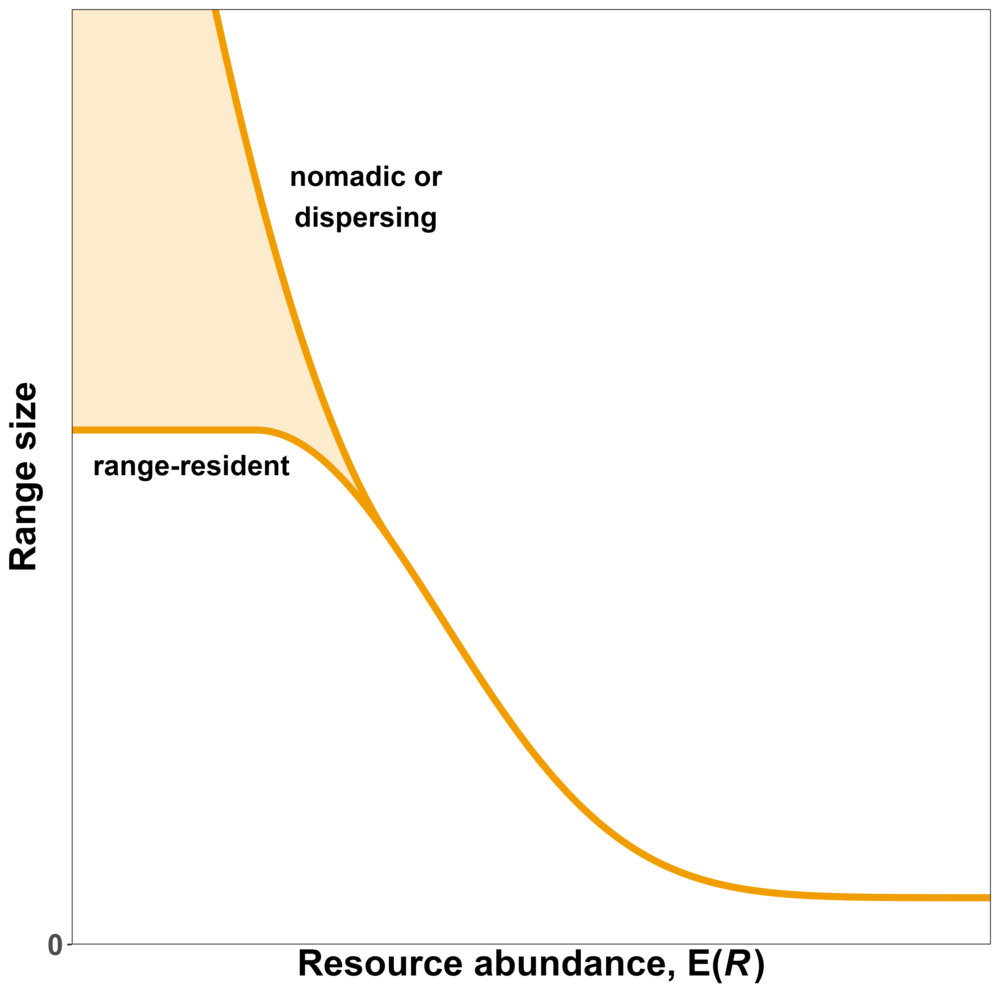
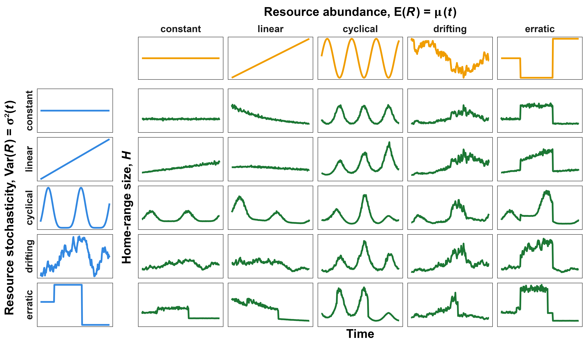

<!-- define custom math symbols -->

\newcommand*\e{\mathbb E} <!-- expectation (blackboard bold) E -->

\newcommand*\var{\mathbb V} <!-- variance (blackboard bold) V -->

\newcommand*\vpos{\var (\text{position})} <!-- positional variance -->

<!-- place table of contents on a new page -->
\newpage

\singlespacing

\tableofcontents

\doublespacing

<!-- start main body on a new page -->
\newpage

```{r setup, include=FALSE}
# set chunk defaults: don't print code, images 75% of page width and centered
knitr::opts_chunk$set(echo = FALSE, out.width = '75%', fig.align = 'center')
```

```{r wrap-figure-function, include = FALSE}
# this chunk is needed to wrap text around or beside figures
# code modified from https://stackoverflow.com/questions/54100806/r-markdown-how-do-i-make-text-float-around-figures

defOut <- knitr::knit_hooks$get('plot')  # save the default plot hook

knitr::knit_hooks$set(plot = function(x, options) {  # set the new plot hook ...
  
  x <- defOut(x, options)  # first apply the default hook
  
  # if wrapfigure options are given, create the new opening string for the wrapfigure
  # environment using custom figure alignment and text width
  if(!is.null(options$wrapfigure)) {
    
    # options must be numeric, they cannot be characters
    wf <- sprintf('\\begin{wrapfigure}{%s}{%g\\textwidth}',
                  options$wrapfigure[[1]], # figure alignment
                  options$wrapfigure[[2]]) # caption width relative to text width
    x  <- gsub(pattern = '\\begin{figure}', # and replace the default one with it
               replacement = wf,
               x = x,
               fixed = TRUE) # pattern is a string, so evaluate as is
    x  <- gsub(pattern = '{figure}', # also replace the environment ending
               replacement = '{wrapfigure}',
               x = x,
               fixed = TRUE)
  }
  return(x)
}
)

# chuck options used to wrap figures:
## fig.align = "right":          align figures right
## out.width = "0.5\\textwidth": output width = 0.5 * the width of the text
## wrapfigure = list("R", 0.5)   wrap caption to right, caption width = 0.5 text width

#' place figures before the paragraph they are referred to so `wrapfigure` places them
#' beside the paragraph
```

<!--
@ciuti and @berger-tal: human presence in nature for reasons other than hunting
"When habitats ensuring different functions (Dunning et al., 1992; Camp et al., 2013) are far from each other..."
-->

# Abstract

\noindent Animals' spatial needs are thought to be tightly linked to the amount of resources within their habitats, such that animals living in productive habitats generally require less space than those in resource-poor habitats. Although this hypothesis has widespread empirical support, existing studies have focused primarily on responses to the mean amount of resources, while responses to the variance around the mean are still largely unknown. This is not a trivial oversight. Animals adjust to variable environmental conditions, so failing to account for the effect of resource unpredictability can result in a limited understanding of animals' spatial needs. In this study, we first review the literature of studies that estimate animals' spatial needs as a function of resource abundance. We then leverage this information to provide a unifying framework and hypotheses for the effect of mean *and* variance in resources on animals' space use. Next, we use simulated movement data to demonstrate how the combined effects of mean and variance in resource abundance interact to shape predictable patterns in animal space use. Finally, we use real-world tracking data on a lowland tapir (\textit{Tapirus terrestris}) from the Brazilian Cerrado to show how this framework can be applied to better understand the movement ecology of free-ranging animals. Results from the simulations and empirical examples are presented using a fully transparent approach that allows researchers to apply the framework to their own data and inform area-based conservation efforts.

\newpage

# Introduction

\noindent The amount of resources an organism is able to access is a strong determinant of its odds of survival and reproduction. Resource limitations can cause individuals to experience a negative energetic balance, which can then result in lower fitness [@hou_cold_2020; @le_bot_fishery_2019], changes to community structure [@haney_tipping_2018; @burson_competition_2018; @riotte-lambert_environmental_2020; @ghislandi_resource_2018], altered physiology [@dai_pra_ground_2022; @rocha_life_2021; @le_bot_fishery_2019; @wessling_seasonal_2018], lower chance of reproduction [@stefanescu_timing_2021; @schmidt_interplay_2020; @le_bot_fishery_2019; @douglas_relative_2014], and even death [@foley_severe_2008; @berger_climate_2018]. Thus, many organisms will adapt their behaviors in response to changes in local resource abundance. Some species may respond to fluctuations in resource abundance by, if possible, switching to other food sources [@steinmetz_effects_2021; @le_bot_fishery_2019], and reducing energetic costs by reducing body heat [@schmidt_interplay_2020] or entering hibernation or torpor [@fjelldal_nightly_2021; @mohr_cellular_2020; @boyles_optimal_2020], but movement represents one of the most readily available traits that species can adjust, whether this be by modifying their home range [@bista_effect_2022; @bradsworth_using_2022; @lucherini_habitat_1996; @relyea_home_2000; @yu_artificial_2022; @arechavala-lopez_common_2019], migrating [@middleton_green-wave_2018; @geremia_migrating_2019], dispersing [framework: @southwood_habitat_1977; amphibians: @cayuela_determinants_2020; birds: @pretorius_movement_2020; @ref; mammals: @ref], or moving nomadically [@teitelbaum_beyond_2019; @nandintsetseg_variability_2019].

While there are many other causes of animal movement, the relationship between animal movement and resource abundance has been of interest to biologists for over half a century. @burt_territoriality_1943 considered the search for food as the primary driver for animal movement within an animal's home range. Three decades after, @southwood_habitat_1977 suggested change in resource abundance is a strong determinant of how animals decide when and where to live and reproduce. Two years later, @harestad_home_1979 proposed that the simplest relationship between resource abundance and an animal's home range size is

\begin{equation} \label{harestad-eq}
H = C / R,
\end{equation}

\noindent where $H$ is the animal's **home range size**, $C$ is the animal's resource consumption, and $R$ is the abundance of (usable) resources. More recently, various researches reported that home range size decreases linearly with resource abundance [desert mule deer: @relyea_home_2000; red panda: @bista_effect_2022]. Others demonstrated that spatial needs decrease nonlinearly as habitat productivity increases, with stronger decreases when resources are scarce [e.g., Canadian lynx: @herfindal_prey_2005; carnivores: @nilsen_can_2005; tigers: @simcharoen_female_2014; ferruginous hawks: @watson_ferruginous_2020]. Additionally, an animal's spatial requirements depend strongly on its metabolic rate, diet, and body weight [@harvey_primate_1981; @lindstedt_home_1986; @reiss_scaling_1988; @harvey_primate_1981; @gittleman_carnivore_1982; @boratynski_energetic_2020; @noonan_effects_2020]. Thus, there are many drivers of animal movement and many causes of variety between behaviors, and we currently lack a unifying framework for quantifying the effects of resource abundance and unpredictability on animals' spatial needs. And while abundant work has been done on estimating animals' responses to changes in resource abundance, there is little to no information on they respond to unpredictable changes in the resources they depend on.

In this paper, we refer to a location's average amount of available and accessible resources as **resource abundance**, while use the phrase **resource unpredictability** to indicate the variability in resource abundance due to *unpredictable* causes. On its own, a habitat's long-term resource abundance is not sufficient to assess the habitat's quality. A grassland with relatively low but constant forage availability will require drastically different behaviors and adaptations from a desert location with rare, sudden, and strong pulses of resources. In the first scenario, an animal may require a large but constant home range as it moves between locations in search of food, while an animal in the second scenario may switch between dispersal as it searches for high-resource patches and short-term range residency until the local resources are exhausted. Although both habitats may have the same long-term average resource abundance, the differences in resource unpredictability result in substantially different habitats. Despite this, little work has been done on estimating the effects of resource unpredictability on animals' spatial needs [but see @rizzuto_forage_2021; @herfindal_prey_2005; @nilsen_can_2005].

In this study, we illustrate how animals' spatial needs depend on the abundance and unpredictability of resources. First, we set the theoretical background necessary for the successive sections, and concepts and notation are introduced without assuming any previous knowledge of statistical notation or movement ecology. Next, we provide a review of the effects of resource abundance on animals spatial needs while suggesting a unifying hypothesis. Afterwards, we provide a review of the effects of resource unpredictability on animals spatial needs while suggesting a second unifying hypothesis. Subsequently, we test the two hypotheses using quantitative simulated animal responses to changes in resource abundance and unpredictability. Finally, we demonstrate how this framework can be used in practice to describe the movement ecology of a lowland tapir living in the Brazilian Cerrado. Results from the simulations and empirical example are presented using a fully transparent approach that allows researchers to replicate the work and apply the methods to their own tracking data.

\newpage

# Concepts and definitions

## Resources as a random variable

\noindent In statistics, **random variables** indicate random (i.e., unknown) quantities and are indicated with capital letters (e.g., $R$). Known values, such as realizations of random variables (i.e., known observations or instances), are indicated with lower-case letters (e.g., $r$). Using this notation, we can write the statement "the probability of random variable $R$ taking the value $r$" as $P(R = r)$. Since resource abundance depends on a variety of factors, including climate, weather, competitive pressure, and individual- and species-specific energetics, it is often unpredictable (and hard to quantify). Thus, we can let the random variable $R$ indicate the *resource* abundance at a given point in space and time.

### Probability distributions

\noindent In probability and statistics, random variables are defined by specifying the **distribution** the variable follows. Since the variable is random, it can take multiple values (minimum 2), each with different probabilities. Commonly known distributions include the normal (i.e., Gaussian) distribution, the Student's T distribution, and the Bernoulli distribution.

The set or range of values which have non-zero probabilities in a distribution are referred to as the distribution's **support**. The support of the normal and T distributions are all real numbers (i.e., from $-\infty$ to $\infty$), while the Bernoulli distribution only has support over values 0 and 1. 

There are many distributions we can assign to $R$, depending on how we quantify it. If $R$ is the number of calories an animal is able to access from food in a given location, we can let $R$ follow any distribution with support over all real numbers between 0 and infinity, which we can indicate with $r \in (0, \infty)$. (We use round parentheses rather than square brackets (i.e., $[0, \infty]$) because both 0 and infinity are not included in the support set.) In this case, we can let $R$ follow a Gamma distribution. If $R$ was a discrete variable, such as the number of prey in a location during a period of time, we can use a Poisson or negative binomial distribution for $R$. Alternatively, if we measure $R$ using the Normalized Difference Vegetation Index [**NDVI**, see @pettorelli_normalized_2011], we should use a distribution with support over the interval $[-1, 1]$, since NDVI can only take on values between -1 and 1 (extremes included). The next two sections introduce two parameters that are often used to visualize and define distributions: the expectation and the variance of a random variable.

### Expected resource abundance, $\e(R)$

\noindent The **expectation** of a random variable (i.e. its mean or average, indicated here with the symbol $\e$) is the value one can *expect* the random variable to take. $\e(R) = \mu$ to indicate the expectation of the random variable $R$. The mean may not be within the distribution's support (e.g., a non-integer number of prey per day), but $\e(R)$ is still useful for estimating the average long-term resource abundance. When the mean changes over time, as in the case changes in $R$ in highly seasonal regions, we explicitly indicate that $\e(R) = \mu$ changes over time by writing the expectation of $R$ as a function of time, $t$: $\e(R) = \mu(t)$. We indicate the estimated average resource abundance by adding a caret on the symbol: $\hat \mu(t)$.

The hypothesis that spatial needs decrease with resource abundance is common and well supported, but many studies assume a linear relationship [e.g., @harestad_home_1979; @relyea_home_2000; @rizzuto_forage_2021; @bista_effect_2022; @bradsworth_using_2022; @mcclintic_effects_2014]. This is problematic because it can lead to questionable estimates and problematic biases, such as negative or excessively small home ranges [e.g., figure 2 in the work of @bista_effect_2022]. Conceptually, the relationship between spatial needs and resource abundance must be nonlinear, since there are limits to how much space an animal is able to explore in its lifetime and the minimum amount of space it requires to survive (which is necessarily greater than zero). The relationship between resource abundance and animals' spatial needs is explored in more depth in a following section.

### Variance in resource abundance, $\var(R)$

\noindent A random variable's **variance** is a measure of its unpredictability or variability. We use  $\var(R) = \sigma^2$ to indicate the variance in $R$, after accounting for changes in $\mu(t)$, and $\widehat{\sigma^2}(t)$ to indicate its estimate conditional on time. For instance, while one may consider $R$ to vary within years, we define $\var(R)$ as the variation in $R$ after accounting for the fact that $R$ is lower during some seasons and higher in others. Additionally, we distinguish between two different sources of variation. We refer to known differences or expected spatiotemporal changes as **heterogeneity**, while we use the term **stochasticity** for unpredictable and unexpected variation. For example, the location of (high-yield) berry bushes in a valley and the time at which they produce fruit may be heterogeneous, but predictable once an animal visits the valley. In contrast, whether next year will be a good or bad year for berries is stochastic.

### Simulating resource abundance

\noindent In this paper, we simulate $R$ using a Gamma distribution with time-dependent mean $\mu(t)$ and time-dependent variance $\sigma^2(t)$ (which we write as $R \sim \Gamma(\mu(t), \sigma^2(t))$). Although Gamma distributions are more often parameterized using parameters shape and scale ($k, \theta$) or shape and rate ($\alpha, \beta = 1/\theta$), we use $\mu = k \theta$ and $\sigma^2 = k \theta^2$ to facilitate visualizing the examples. However, note that $\mu$ and $\sigma^2$ are not independent because the variance depends strongly on the mean. As the mean approaches zero (from the positive side, which we write as $\mu \rightarrow0^+$) the variance also does: $\mu \rightarrow 0^+ \iff k \theta \rightarrow 0^+ \iff k \theta^2 = 0^+ \iff \sigma^2 = 0^+$.

### Estimating resource abundance using NDVI

\noindent In this paper's empirical example, we estimate resource abundance using NDVI [for more information, see the relevant section later in the paper and @pettorelli_normalized_2011]. However, since there is no commonly used distribution with a support over the interval $[-1, 1]$ we scale NDVI to the interval $[0, 1]$ to use a Beta distribution by applying the linear transformation

\begin{equation} \label{ndvi-to-r}
R = \frac{\nu + 1}{2},
\end{equation}

where $\nu$ indicates the NDVI value. Note that only **linear transformations** (i.e. only addition, subtraction, multiplication, and division) should be applied to random variables to avoid biases while estimating the distribution and its parameters [@denny_fallacy_2017; @jensen_sur_1906]. In this case, we can define $R$ as following a Beta distribution with mean and variance that depend on time using the notation $B (\mu(t), \sigma^2(t))$. We use this parameterization here for ease of explanation, but note that Beta distributions are generally parameterized using the shape parameters $\alpha$ and $\beta$ such that the mean is

\begin{equation} \label{beta-mean}
\mu = \frac{\alpha}{\alpha + \beta}
\end{equation}

\noindent while the variance is

\begin{equation} \label{beta-var}
\sigma^2 = \frac{\alpha\beta}{(\alpha+\beta)^2(\alpha+\beta+1)}.
\end{equation}

\noindent Failing to model or simulate resource abundance appropriately can fail to produce robust, sensible, and accurate results.

## Animal movement as a stochastic process

### Drivers of animal movement

\noindent @nathan_movement_2008 generalized animal movement from location $\vec l_t$ to location $\vec l_{t+1}$ using the model

\begin{equation} \label{nathan-movement}
\vec l_{t+1} = F(\Omega, \Phi, \vec w_t, \vec l_t, \vec \xi_t),
\end{equation}

\noindent such that an animal's position as time $t+1$ depends on its motion capacity ($\Omega$), navigation capacity ($\Phi$), internal state ($\vec w_t$) and current location ($\vec l_t$), as well as how each of the parameters may change in response to the current environmental factors ($\vec \xi_t$). This model is conceptually useful, as it can form the basis for many models, experiments, and hypotheses, but fitting such a model would be very difficult in practice (if not impossible). The parameters $\Omega, \Phi, \vec w_t$ and $\vec \xi_t$ cannot be quantified directly, and although it may be possible to monitor proxies for the parameters (e.g., body size, memory, cortisol levels), doing so with sufficient frequency and accuracy would not be simple. Thus, we can instead focus on animals' behavior and spatial needs as a response to overall resource abundance and unpredictability.

### Visualizing movement as a stochastic process

\noindent To understand how movement can be viewed as a **stochastic process**, imagine an animal that leaves its den or nest to collect resources and returns to it once it has collected enough resources for the day. If we do not know why the animal is choosing to move in one direction or another, nor do we know what the environment is like, we cannot predict where the animal may move from one time point to another. However, we can use the animal's positional data to estimate the amount of time it spends collecting resources before returning "home" (or the time required for the position to "decay" back to the average position). This period is often referred to as the **range crossing time** or the positional autocorrelation parameter, $\tau_p$. Similarly, we can define $\tau_v$ to be amount of time the animal moves with the same direction and speed, or the time required for an animal's velocity to "decay" back to the average velocity. $\tau_v$ is referred to the animal's **directional persistence** or the velocity autocorrelation parameter.

By modeling movement via stochastic models which account for autocorrelation in position [e.g., Ornstein–Uhlenbeck or OU models, see @uhlenbeck_theory_1930] and autocorrelation in velocity [Ornstein–Uhlenbeck Foraging or OUF models, see @fleming_fine-scale_2014], one is able to account for and leverage autocorrelation in tracking data. While autocorrelation is problematic for models that assume locations to be independent, modeling movement as a stochastic, autocorrelated process avoids systematic biases in the estimation of home ranges [@noonan_comprehensive_2019] as well as travelling distances and speeds [@noonan_scale-insensitive_2019].

Accurate speed estimates require the **sampling interval**, $\Delta t$, to be sufficiently small [$\Delta t < \tau_v$, see @noonan_scale-insensitive_2019], since the dataset must contain multiple consecutive samples where the animal is moving with a similar speed and direction. However, since the time required for an animal to cross the area it uses is orders of magnitude larger than the time it moves with a consistent behavior (i.e., $\tau_p > \tau_v$), it is still possible to produce good estimates of range crossing time even if there is no information on the animal's speed. Similarly, if the data is too sparse to estimate $\tau_p$, one can still obtain good estimates of the animal's spatial needs and home range size, provided that the total **sampling duration**, $T$, is sufficiently long. Model selection procedures with criteria such as AIC [@akaike_new_1974] can help choose the most appropriate model for the available data [@silva_autocorrelationinformed_2022].

Predicting animal movement using stochastic models may seem less straightforward and more complex than using deterministic models, but ignoring the exact causes and decisions that determine the movement allows us to focus on *how* the animal moved and less *why* it moved. Animals may temporarily change their behavior in response to many causes, including predators [mule deer: @ciuti_effects_2012; shovelnose sturgeon: @hintz_shovelnose_2013; rodents: @randler_predator_2020; macaques: @liu_predator_2022; but also see beaked whales: @siegal_beaked_2022], competitors [Capuchin monkeys: @torrez-herrera_monkeys_2020], weather [framework: @gibert_crossing_2016; giant anteaters: @giroux_role_2022], and mates or mating periods [feral cats: @zhang_home_2022; yellow mongoose: @cronk_home_2021].

### Quantifying spatial needs

\noindent The concept of a home range has a long history in ecological research as an indicator of the space an animal requires to satisfy its essential requirements during a period of time [@burt_territoriality_1943], but home range analysis is not appropriate for animals which are not range-resident, such as migrating animals [e.g., @jonzen_rapid_2006; @geremia_migrating_2019; @abrahms_memory_2019] and nomadic animals [e.g., @morato_space_2016; @nandintsetseg_variability_2019]. Although here we quantify animal's spatial needs using 50% and 95% home range estimates, we expect that similar conclusions can be drawn about the positional variance, $\vpos$, of animals that are not range-resident. In the case of animals that are range resident for short periods of time, we can model their movement and short-term spatial needs using a sliding window approach (see the discussion section).

**I don't think we need this paragraph:** Although range-resident animals will generally have smaller positional variance ($\vpos$) than migratory and nomadic animals, $\vpos$ is not sufficient to distinguish between range residency, migration, and nomadism, since $\vpos$ determines the scale and size of an animal's spatial needs but not its behavior. Instead, the animal's $\tau_p$, $\tau_v$, and $\bar v$ can help discriminate between different behaviors. Animals with a $\tau_p$ shorter than a year are likely range-resident, while animals with a $\tau_p$ on the order of a year are likely to be migratory (as long as their life expectancy is greater than a year). In contrast, when an animal's $\tau_p$ is on the order of its expected lifespan, it is most often nomadic, since it does not have a position it returns to regularly.

\newpage

# Effects of resource abundance, $\e(R)$

```{r mu-hyp, fig.cap="Hypothesized spatial needs (indicated as positional variance, $\\vpos$) of an animal as a function of mean resource abundance ($\\e(R)$). We expect low values of $\\e(R)$ to result in high $\\vpos$ as animals are forced to explore greater areas to collect the resources they require to survive, whether they be range-resident or nomadic. As $\\e(R)$ increases, spatial needs should decrease nonlinearly until they reach the minimum amount of space required by the animal to survive. Note that the relationship between $\\e(R)$ and $\\vpos$ cannot be linear because it would require $\\vpos$ to be negative for high values of $\\e(R)$.", out.width = '0.5\\textwidth', fig.align = 'right', wrapfigure = list('R', 0.5)}

```

```{r, eval=FALSE, echo=FALSE}
# to help visualize the consequences of different means and variances
dgamma2 <- function(x, mu, sigma2, lower.tail = FALSE) {
    # mean = k * theta
    # sigma^2 = k * theta^2
    dgamma(x = x,
           shape = mu^2 / sigma2, # (k * theta)^2 / (k * theta^2)
           scale = sigma2 / mu)   # (k * theta^2) / (k * theta)
}
x <- seq(0, 10, length.out = 250)
layout(matrix(1:4, ncol = 2, byrow = TRUE))
plot(x, dgamma2(x, mu = 1, sigma2 = 0.5), type = 'l', ylim = c(0, 0.8),
     xlab = NA, ylab = 'Density', main = 'low \U03BC, low \U03C3\U00B2')
plot(x, dgamma2(x, mu = 5, sigma2 = 0.5), type = 'l', ylim = c(0, 0.8),
     xlab = NA, ylab = 'Density', main = 'high \U03BC, low \U03C3\U00B2')
plot(x, dgamma2(x, mu = 1, sigma2 = 5), type = 'l', ylim = c(0, 0.8),
     xlab = NA, ylab = 'Density', main = 'low \U03BC, high \U03C3\U00B2')
plot(x, dgamma2(x, mu = 5, sigma2 = 5), type = 'l', ylim = c(0, 0.8),
     xlab = NA, ylab = 'Density', main = 'high \U03BC, high \U03C3\U00B2')
layout(1)
```

\noindent While animals' needs vary greatly between taxonomic groups, some needs are essential for most species for survival and reproduction. All heterotrophic organisms require sources of chemical energy (i.e., food), water, and various limiting nutrients to survive, grow, and reproduce [@harvey_primate_1981; @baldwin_nutritional_1984; @reich_body_2001]. Failing to acquire sufficient resources is likely to result in lower fitness, behavioral changes, physiological changes or damage, inability to reproduce, and death. Motile organisms can move to new locations in search of resources, but they must also account for a higher metabolism and movement costs [@taylor_energetics_1982].

The size of an animal's spatial needs is often hypothesized to be depend on resource abundance [@burt_territoriality_1943], such that spatial needs increase when resources are low, but the relationship is likely not linear, as illustrated in figure \@ref(fig:mu-hyp) [also see: @nilsen_can_2005; @herfindal_prey_2005; @bista_effect_2022]. Low values of $\e(R)$ force animals to have larger home ranges [@relyea_home_2000; @nilsen_can_2005; @herfindal_prey_2005; @bista_effect_2022], migrate to better locations [@samarra_movements_2017; @middleton_green-wave_2018; @geremia_migrating_2019], or move nomadically [@singh_migration_2012; @polansky_elucidating_2015; @teitelbaum_beyond_2019; @nandintsetseg_variability_2019], although large-scale changes in behavior (such as species-wide shifts to dispersal, migration, or nomadism) are more likely to occur over evolutionary timescales rather than an animal's lifespan.

As $\e(R)$ increases, we expect animals' spatial requirements to decrease nonlinearly until they reach the smallest amount of space required to survive [see @relyea_home_2000; @bista_effect_2022, although the latter uses models which assume linear relationships]. The spatial requirements initially decrease rapidly since small additive increases (e.g., from 1 to 2) are proportionally large (i.e., 2 is twice 1). In contrast, at higher values of $\e(R)$, the same additive changes (e.g. from 50 to 51) are proportionally small (i.e., 51 is only 2% larger than 50).

Animals living in large groups will often require larger home ranges because they will have to share resources with conspecifics [@prox_framework_2020], and larger home ranges can be harder to defend and also result in higher rates of competition and movement costs [@grant_whether_1993; @jetz_scaling_2004; but also see @dickie_resource_2022]. While competition may push animals to explore other areas and expand their home range [@jetz_scaling_2004], strong and consistent competition paired with territorial defense may also prevent them from doing so [wolves: @rich_anthropogenic_2012; feral cats: @bengsen_feral_2016; Capuchin monkeys: @torrez-herrera_monkeys_2020].

It is unclear when animals switch from range residency to migration or nomadism (or vice-versa), but understanding the connection between the types of movement is important for quantifying the effect of resource abundance on animal's spatial needs and when an animal may choose to migrate or disperse rather than remaining range-resident [mammals: @teitelbaum_how_2015; moose: @singh_migration_2012; eagles: @wheat_migrate_2017; @poessel_interpreting_2022; flamingos: @pretorius_movement_2020]. From a quantitative perspective, the switch is related to an animal's home range crossing time (or positional autocorrelation, $\tau_p$). As the amount of space an animal uses over its lifespan, the amount of time required to cross the area ($\tau_p$) will also increase, so animals with $\tau_p$ on the order of their expected lifespan will necessarily be nomadic.

```{r multipanel-constant-var, fig.cap="Fictitious example of variation in resource abundance in a heterogeneous environment with constant variance (after accounting for changes in mean abundance). (a.) Although resource abundance ($R$, raster fill) varies over time and space, the overall amount of variance (dot color) remains constant. (b.) Arbitrary definition of $R$ as following a Gamma distribution with mean $\\mu$ and variance $\\sigma^2$. (c.) Simulated animal movement at a time of lowest $\\e(R)$ and average $\\var(R)$. (d.) Simulated animal movement at a time of peak $\\e(R)$ and average $\\var(R)$.", out.width = '0.5\\textwidth', fig.align = 'right', wrapfigure = list('R', 0.5)}
knitr::include_graphics('../figures/habitat-examples-constant-variance.png')
```
Consider the simplistic scenario where the average in resource abundance, $\e(R) = \mu$, changes over time but $\var(R) = \sigma^2$ is constant over time and space (and non-zero, see figure \@ref(fig:multipanel-constant-var)a). We can use the notation $R \sim \Gamma\big(\mu(t), \sigma^2\big)$ to indicate that $R$ follows a Gamma distribution with a mean $\mu(t)$ that changes over time (i.e., it is a function of time) while the variance is constant (figure \@ref(fig:multipanel-constant-var)b). Since $R$ is spatiotemporally random, an animal that moves in the landscape will not find the same $R$ at different time points or throughout the habitat (figures \@ref(fig:multipanel-constant-var)c-d). However, if $\mu(t)$ changes repetitively and regularly over time (e.g. peaks each spring and decreases in winter), an animal may learn to predict times of high or low $R$ [e.g., @falcon-cortes_hierarchical_2021; @geremia_migrating_2019; @abrahms_memory_2019; @samarra_movements_2017; @abrahms_memory_2019] although it will not be possible to predict where high-$R$ locations are, since $\e(R)$ does not vary predictably over space.

This model is somewhat simplistic, but its simplicity makes it easy to fit and conceptualize. Such a model may be appropriate in regions with little to no changes in variability and where unpredictable events occur at a similar frequency over time, or when data availability is too low to produce appreciable measures of variance. Examples of temporally homogeneous habitats include regions where productivity remains fairly predictable throughout the year (e.g., equatorial rain forests or highly homogeneous deserts). When productivity is approximately stable over long periods of time, it may be possible to further simplify the model by assuming a constant mean, but this is likely rarely the case. Most often, $\e(R)$ will vary over time, and animals' behaviors will change in response. Additionally, when data availability is sufficiently high to produce precise estimates of $\var(R)$, the effect of $\var(R)$ on animals' spatial needs should be estimated before assuming the effect is negligible. The need to account for $\var(R)$ is compounded by recent changes in climate, which exposes species to novel situations and increasingly common stochastic events [@ipcc_global_2018; @noonan_situ_2018].

Anthropogenic changes, including human-built structures and urban areas reduce the habitat available to many terrestrial species [@wilson_habitat_2016], who struggle to move in fragmented [@fahrig_non-optimal_2007], human-dominated landscapes [@tucker_moving_2018]. Although some species rely on anthropogenic areas and structures for predicable and dependable sources of resources [wild boar: @ikeda_home_2022; elephants: @benitez_precipitation_2022; steppe rat snake: @yu_artificial_2022; yellow mongoose: @cronk_home_2021; common octopus: @arechavala-lopez_common_2019; raccoon dog: @mitsuhashi_home_2018; coyote: @peron_periodic_2017], anthropogenic environments can be highly unpredictable and pose high mortality risks [giant anteaters: @noonan_roads_2021; killer whales: @matkin_ongoing_2008]. Although it is generally acknowledged that animals will modify their behavior in response to human activity [@rogala_human_2011] as well as changing conditions [@walther_ecological_2002; @chevin_adaptation_2010; @sih_evolution_2011], a fine-scale understanding of behavioral responses is lacking [@sih_evolution_2011; @beever_behavioral_2017].


# Effects of resource unpredictability, $\var(R)$

```{r s2-hyp, fig.cap="Hypothesized spatial needs (indicated as positional variance, $\\vpos$) of an animal as a function of resource unpredictability ($\\var(R)$). We expect low values of $\\var(R)$ to result in low $\\vpos$ as animals are able to depend on somewhat predictable resources. As $\\var(R)$ increases, spatial needs should increase nonlinearly, whether this results in an expansion of the home range (in the case of range-resident animals) or a switch to dispersal, nomadism, or migration. Note that the relationship between $\\var(R)$ and $\\vpos$ cannot be linear because it would require $\\vpos$ to be negative for low values of $\\var(R)$.", out.width = '0.5\\textwidth', fig.align = 'right', wrapfigure = list('R', 0.5)}
knitr::include_graphics('../figures/variance-abundance-hr-hypotheses.png')
```

\noindent Although the effect of $R$ on animals' spatial needs is often recognized and accounted for in ecology [@burt_territoriality_1943; @southwood_habitat_1977; @relyea_home_2000; @nilsen_can_2005; @williams-guillen_resource_2006; @rickbeil_plasticity_2019], $\var(R)$ has received far less attention [but see @lucherini_habitat_1996; @nilsen_can_2005; @di_stefano_resource_2011; @rizzuto_forage_2021; @seigle-ferrand_systematic_2021]. However, $\var(R)$ can change strongly due to many important causes, including repetitive and predictable patterns as well as infrequent and unpredictable events. Examples of predictable changes in $\var(R)$ include changes that occur between seasons, such as changes in temperature in continental summers (e.g., between 15 and 30 $^\circ$C) and winter temperatures (e.g., from -40 to -10$^\circ$C within the span of a few days), changes in precipitation frequency and unpredictability between the dry season (predictable lack of rain) and the wet season (frequent but sudden and unpredictable rains), or changes in fruit and berry abundance with the arrival of spring and summer (since the timing between plants can depend on many unaccounted factors). Although each of these events is unpredictable, the change in unpredictability can be predicted and expected. In contrast, other sources of stochasticity can be much less predictable, such as new competitors [@ref], fires [@jolly_animal_2022], floods [@ramos_pereira_structure_2013], droughts [@foley_severe_2008; @haig_assessment_2013], and changes in climate [@ipcc_global_2018; @noonan_situ_2018; @berger_climate_2018; @grant_evolution_2017; @yao_emergence_2022].

Environmental variability, including extreme events [@logares_black_2012; @anderson_black-swan_2017; @yao_emergence_2022], can reduce a landscape's energetic balance [@chevin_adaptation_2010], which, in turn, decreases animals' fitness [@berger_climate_2018] and increases their spatial needs. A few recent studies support this hypothesis [@morellet_seasonality_2013; @nandintsetseg_variability_2019; @riotte-lambert_environmental_2020], but many of them are limited in geographic and taxonomic scales, so the extent to which these preliminary findings can be generalized is still very limited. Thus, there remains a need for developing a more complete understanding of how animals' spatial needs change with environmental stochasticity.

```{r, eval=FALSE, echo=FALSE}
# the median decreases as V(R) increases, even if E(R) is constant
source('functions/qgamma2.R')
plot(1:10, qgamma2(p = 0.5, mu = 1, sigma2 = 1:10))
```

Similarly to the effect of $\e(R)$, we expect $\var(R)$ to have a nonlinear effect on animals' spatial needs. When $\var(R)$ is low enough that $R$ is relatively predictable, we do not expect changes in $\var(R)$ to have a noticeable effect, but as resources become increasingly unpredictable, we expect spatial needs to increase progressively faster (figure \@ref(fig:s2-hyp)). This is because as $\var(R)$ increases, the chances of finding low $R$ increase superlinearly. Additionally, stochastic environments tend to be less productive [@@chevin_adaptation_2010], and the added movement required to search for food increases animals' energetic requirements. If resources remain highly unpredictable over long periods of time (e.g., multiple lifespans), animals may evolve or develop new behaviors (such as nomadism, dispersal, and migration) or adaptations (such as increased fat storage, food caching, torpor, and hibernation).

```{r multipanel-changing-var, fig.cap="Fictitious example of variation in resource abundance in a heterogeneous environment with changing variance (even after accounting for changes in mean abundance). (a.) Although resource abundance ($R$, brown-green fill) varies over time and space, variance (dot color) is lowest at the beginning and end of the observational period and highest when $R$ peaks. (b.) Arbitrary definition of $R$ as following a Gamma distribution with mean $\\mu$ and variance $\\sigma^2$. (c.) Simulated animal movement at a time of lowest $\\e(R)$ and $\\var(R)$. (d.) Simulated animal movement at a time of peak $\\e(R)$ and $\\var(R)$.", out.width = '0.5\\textwidth', fig.align = 'right', wrapfigure = list('R', 0.5)}
knitr::include_graphics('../figures/habitat-examples-changing-variance.png')
```

When the unpredictability in $R$ chances over time (figure \@ref(fig:multipanel-changing-var)a), changes in $\var(R)$ may have an appreciable effect on the location's favourableness. In this scenario, we can define $\var(R)$ as a function of time using the notation $\var(R) = \sigma^2(t)$ (figure \@ref(fig:multipanel-changing-var)b). When both $\e(R)$ and $\var(R)$ change over time, accurately and precisely predicting $R$ becomes more complex (figure \@ref(fig:multipanel-changing-var)c-d).

Most habitats with appreciable seasonal changes in climate will require models to account for changes in both $\e(R)$ and $\var(R)$, as they often change within and between years, and periods of high productivity can often be more variable than times of lower productivity or dormancy. During times of resource unpredictability, animals will likely have higher spatial needs, particularly if they need to collect and store resources for periods scarcity or increased energetic needs. These include higher energetic needs during reproductive periods, whether this be due to pregnancy [@schmidt_interplay_2020], to feed offspring [@saraux_plasticity_2011], or because the animal's needs change over time [e.g., male deer growing antlers: @french_nutrient_1956; @smolko_soil_2022]. Failing to account for changes in $\var(R)$ can result in serious underestimations of animals' spatial needs, which may lead to decreases in the fitness and size of a population while also increasing the risk of population collapse and human-wildlife conflict [@mukeka_human-wildlife_2019].

The effects of $\var(R)$ on animals' spatial needs likely vary between species, since energetic and nutritional needs vary between species [@boratynski_energetic_2020; @noonan_effects_2020]. Small-scale variations may be sufficient to causes changes in behavior for some small animals, while animals with larger spatial needs may not even notice a change. @rizzuto_forage_2021 found that the 50%, 75%, and 90% utilization distributions of snowshoe hares (*Lepus americanus*) increased with average C:N in lowbush blueberry as well as the coefficient of variation (i.e., standard deviation over mean) in C:N, which suggests that the hares expanded their home range in response to both nitrogen abundance and nitrogen variability. Similarly, @mueller_how_2011 demonstrated that ungulates in more variable ecosystems move more and are more likely to be nomadic. In contrast, @lucherini_habitat_1996 found that red foxes (*Vulpes vulpes*) living in areas with more more heterogeneous habitats required exponentially less space than foxes that lived in more homogeneous regions. Similarly, @herfindal_prey_2005 found that the home ranges Canadian lynx (*Lynx canadensis*) decreased with seasonality. A subsequent analysis by @nilsen_can_2005 with the lynx data of @herfindal_prey_2005 along with data on wolverines (*Gulo gulo*), bobcats (*Lynx rufus*), and coyotes (*Canis latrans*), found that carnivores respond differently to resource variability and seasonality, although it is worth disentangling the effects of heterogeneity (i.e., changes in $\e(R)$) and and stochasticity ($\var(R)$).

@nilsen_can_2005 also demonstrate that the effect of $\var(R)$ on the home range size of wolves (*Canis lupus*) and fishers (*Martes pennanti*) depends on $\e(R)$. Therefore, it is not only important to account for both $e(R)$ and $\var(R)$ but also interaction effects between the two. It is also worth noting that carnivores may be more susceptible to $\var(R)$ since animal prey's ability to move makes their abundance and location less predictable than those of plants. Since, the effects of $e(R)$ and $\var(R)$ may also affect prey abundance, it is important to account for both $e(R)$ and $\var(R)$ as well as any interactive effects between the two and how the effects may vary between animals with different diets or from different trophic levels, since animals from higher trophic levels will be affected by the cascading effects of $\e(R)$ and $\var(R)$ on each of the lower trophic levels [@harestad_home_1979; @noonan_effects_2020].

# Interactive effects of $\e(R)$ and $\var(R)$

\noindent In habitats where both $\e(R)$ and $\var(R)$ change substantially over time, models should account for not only the effects of $\e(R)$ and $\var(R)$ separately, but also their interactive effects. A highly unpredictable habitat may be very inhospitable if resources are poor, but $\var(R)$ will have little effect if resources are always sufficiently abundant. Thus, we expect $\var(R)$ to have a stronger effect on spatial needs when $\e(R)$ is low, and less of an effect when $\e(R)$ is high.

Figure \@ref(fig:5-5-sims) illustrates simulated spatial requirements as a function of $\e(R)$ and $\var(R)$. The top row (constant $\var(R)$) shows how simulated spatial needs vary for different trends in $\e(R)$ while $\var(R)$ remains constant. As $\e(R)$ increases at a constant slope (linear $\e(R)$) the spatial needs decrease nonlinearly, with larger changes when $\e(R)$ is low, until home range size approaches the minimum size required by the animal. As described in the section on $\e(R)$, the nonlinear decrease is because changes in $\e(R)$ have a larger effect when $\e(R)$ is low. Additionally, the 95% home range is more sensitive to changes in $\e(R)$ than the core home range simply because larger quantiles (e.g., 95% > 50%) are more sensitive to changes in the distribution. Additionally, when $\e(R)$ is lower, $\var(H)$ is higher (particularly for the 95% quantile), since resource-poor regions force animals to move more, which results in a greater uncertainty in a longer and thus also more unpredictable search.

```{r 5-5-sims, fig.cap="Simulated spatial requirements for animals living in habitats where the mean and variance in resource abundance ($R$) are constant, linearly increasing, cyclical, drifting, or erratic over time. The lower green line indicates the animal's core home range (50\\% quantile), while the top line indicates the 0.95 utilization quantile. Note how both quantiles decrease nonlinearly as $\\e(R)$ increases, and they increase nonlinearly as $\\var(R)$ increases. Additionally, the variance in both quantiles is higher when $\\var(R)$ is higher, and changes in $\\var(R)$ have greater impacts when $\\e(R)$ is low.\nSimulations were run such that animals followed the same 1000 tracks at each time point starting from the location $\\langle 0, 0\\rangle$ until they reach satiety, after which they returned to $\\langle 0, 0\\rangle$ over the same amount of time required to reach satiety. The animal's home range was then estimated using an Ornstein-Uhlenbeck Foraging (OUF) model via the $\\tt{ctmm}$ package (Fleming and Calabrese 2021). ", out.width='100%'}

```

In regions where the average resource abundance changes over time [e.g., seasonal changes -- see cyclical $\e(R)$ and @lai_movement_2017], animals should have access to sufficient space to fulfill their needs during periods of scarcity, whether the space available is sufficiently large year-round or it changes seasonally with the expected changes in $\e(R)$ (e.g., winter park closures). However, estimates of spatial requirements based on estimated changes in $\e(R)$ should be interpreted carefully, since model error and unforeseeable decreases in $\e(R)$ (such as following fires or floods) may increase animals' spatial needs suddenly and unpredictably. Thus, it is best to include a "buffer" area so the available space is larger than the estimated spatial needs. This is particularly the case in environments where resource abundance changes unpredictably (drifting $\e(R)$), since accurate long-term estimates of $\e(R)$ may be hard to produce, if not impossible. In cases where $\e(R)$ is highly unpredictable, animals should have enough space to collect resources during times of greatest predicted scarcity, particularly if the changes in resource abundance occur rapidly, often, or for long periods of time (erratic $\e(R)$).

The leftmost column of figure \@ref(fig:5-5-sims) (constant $\e(R)$) illustrates the effects of $\var(R)$ on the simulated spatial needs while $\e(R)$ remains constant. Overall, both quantiles increase with $\var(R)$, although $H_{95\%}$ is more sensitive to changes in $\var(R)$ than $H_{50\%}$, as with changes in $\e(R)$. Additionally, note how both $H$ and $\var(H)$ increase with $\var(R)$ (e.g., constant $\e(R)$, linear $\var(R)$). This is because, similarly to resource-poor areas, more stochastic times require the animal to move for longer periods of time, which results in a greater uncertainty in how much time and space it will require to reach satiety.

The remaining panels in figure \@ref(fig:5-5-sims) illustrate how the effect of $\var(R)$ depends on $\e(R)$ (and vice-versa) as well as how complex the relationships can be. Since $\e(R)$ and $\var(R)$ have opposite effects on $H$, disentangling the effects can be particularly difficult when both parameters change monotonically, especially when the trends are linear (i.e., linear $\e(R)$ and $\var(R)$). When both $\e(R)$ and $\var(R)$ increase linearly, the change in $H_{95\%}$ is small an not monotonic, while there is no clearly visible change in $H_{50\%}$. However, when $\e(R)$ changes nonlinearly (e.g., cyclical $\e(R)$ with linear $\var(R)$), it is easy to see how the increase in $\var(R)$ amplifies the effects of $\e(R)$ (and vice-versa). Similarly, the effect of $\var(R)$ is stronger when $\e(R)$ is low (e.g., linear $\e(R)$ with cyclical $\var(R)$). Thus, the estimated spatial needs are largest when $\e(R)$ is low and $\var(R)$ is high, and they are smallest when $\e(R)$ is high and $\var(R)$ is low [see the panel with cyclical $\e(R)$ and $\var(R)$ as well as @lai_movement_2017].

Not all 25 scenarios depicted in figure \@ref(fig:5-5-sims) may be realistic, but the trends in $\e(R)$ and $\var(R)$, and their impacts on animal space use are useful examples that can be thought of as simplified scenarios. $\e(R)$ and $\var(R)$ can be assumed to be (approximately) constant in highly homogeneous environments, or environments where resources are sufficiently abundant that changes in $\e(R)$ and $\var(R)$ are relatively small and remain undetected. Although it is impossible for $\e(R)$ and $\var(R)$ to increase linearly forever, such increases may be possible for short periods of time (followed by periods of no change or decrease). Cyclical oscillations in $\e(R)$ and $\var(R)$ may occur in urban environments as human activity changes within and between days [@peron_periodic_2017; @ikeda_home_2022] and as temperatures fluctuate daily and seasonally [@geremia_migrating_2019; @alston_temperature_2020], while $\e(R)$ and $\var(R)$ may drift randomly in highly complex environments which are too hard to predict. Finally, erratic changes in $\e(R)$ and $\var(R)$ may occur in environments where changes are very sudden, such as areas prone to fires or floods, as well as habitats with drastic human alteration (e.g., a forest which is clear-cut with a subsequent artificial re-forestation). However, if stochastic changes are sufficiently small and frequent, animals may perceive them as continuous and smooth changes rather a series of small and sudden changes. Estimating trends in $\e(R)$ and $\var(R)$ requires animals have high cognitive capacity, since distinguishing between changes in $\e(R)$ and $\var (R)$ is not easy [@steixner-kumar_strategies_2020], especially if $\e(R)$ and $\var(R)$ are not independent, as in the case of $R \sim \Gamma(\mu(t), \sigma^2(t))$.

Although the trends in figure \@ref(fig:5-5-sims) are complex and the effects of $\e(R)$ and $\var(R)$ do not seem easy to disentangle, both $\e(R)$ and $\var(R)$ affect spatial needs as we hypothesized (figure \@ref(fig:5-5-reg)). In the following discussion section, we detail how this framework can be applied to empirical data and used for conservation decision-making.

```{r 5-5-reg, eval=TRUE, echo=FALSE, fig.cap="Effects of $\\e(R)$ and $\\var(R)$ on simulated spatial requirements. The relationships were estimated using a Generalized Linear Model with a Gamma family of distributions that accounted for the effects of both $\\e(R)$ and $\\var(R)$ as well as differences between the two quantiles. The bottom line indicates the relationships with the animal's core home range (0.5 quantile), while the top line indicates the relationship with the 0.95 utilization quantile. Note the nonlinear decrease in both utilization quantiles as $\\e(R)$ increases and the nonlinear increase in both utilization quantiles as $\\var(R)$ increases.", out.width='100%'}
knitr::include_graphics('../figures/simulation-regression-plots.png')
```

# Discussion

\noindent This paper presents a new unifying framework for estimating the effects of resource abundance and stochasticity on animals' spatial needs. The hypotheses and methods we present allow researchers to generalize the effects $\e(R)$ and $\var(R)$ have on animals' spatial needs by building upon previous work rather than stating their results as *de novo* findings. Instead, one can test whether members of the same population or species behave similarly, and whether all members of the group have a common functional response using hierarchical models [@pedersen_hierarchical_2019]. Individuals and populations that were thought to have different behaviors and spatial needs may instead have a single common behavior as they respond to $\e(R)$ and $\var(R)$ following the same functional response [@examples].

In this discussion section, we make considerations about the effects of $\e(R)$ and $\var(R)$ on various animal adaptations, including movement behaviors, energy storage, and spatiotemporal memory. We then illustrate how one may apply this framework to their own data by providing an empirical example using tracking data on a lowland tapir (*Tapirus terrestris*) from the Brazilian Cerrado. Finally, we demonstrate how to use this framework to create products that can inform conservation-based decisions, including predicting animals' spatial needs and assessing the quality of potential (and current) conservation areas. 

## Animal adaptations to changes in $\e(R)$ and $\var(R)$

\noindent The spatiotemporal scales over which an event occurs are a main determinant of whether an animal will be able to predict the event and how it will respond to it (or fail to do so). Events which occur at the scale of the organism [i.e. approximately one or more times per lifetime and within the animal's spatial range, see @frankham_importance_2004] are more likely to be perceived as a threat or boon worth preparing for [e.g., elephants: @foley_severe_2008; bison and mule deer: @geremia_migrating_2019]. Smaller and short-lived organisms (e.g., mice) are more likely to be be severely impacted by stochastic events than larger ones (e.g. elephants), since larger organisms can have bigger energy reserves [@lindstedt_seasonality_1985], can move longer distances over short periods of time [@hirt_general_2017], and tend to have longer lifespans, generation times, and developmental periods [@brown_toward_2004] that allow them to adapt their behavior to such events, including the development of memory [framework: @riotte-lambert_environmental_2020; elephants: @foley_severe_2008; @polansky_elucidating_2015; bison and mule deer: @geremia_migrating_2019; elk: @falcon-cortes_hierarchical_2021; @rickbeil_plasticity_2019; blue whales: @abrahms_memory_2019].

The short generation time and high reproductive rate of smaller, *r-selected* species [@pianka_r-_1970; @brown_toward_2004] may also promote traits that increase survival following frequent extreme events by increasing population survival rates through higher population size, dispersal, and genetic diversity [@examples]. Events that occur over large spatiotemporal scales can promote slow changes through adaptation, natural selection, and evolution [@grant_evolution_2017; @logares_black_2012; @anderson_black-swan_2017; @gienapp_climate_2008], which are numerically more likely if the starting population is large with abundant offspring [@examples; but see @leung_smaller_2022].

Events which occur multiple times at relatively predictable intervals during an animal's lifespan and over multiple generations (such as the alternating of seasons) allow the animal to anticipate times of scarcity and prepare for them by, for instance, increasing its fat storage [marmots: @armitage_energetics_2003; bears: @nespolo_why_2022], caching resources [@post_caching_2006], or migrating [@geremia_migrating_2019; @mueller_social_2013]. Of course, an animal with a lifespan shorter than a year will be unable to perceive the cyclical alternating of the seasons, and an animal with a lifespan of a few weeks or days may not even experience substantial changes in weather and temperature other than lower temperatures at night than during the day.

When an animal's expected lifespan is longer than a year, preparing for predictable times of abundance and scarcity becomes an advantage (and often a necessity). In such cases, animals can increase their chances of survival via physiological and behavioral adaptations, including adapting the timing of reproduction [@ref] and torpor [marmots: @inouye_climate_2000; ground squirrels: @goldberg_hibernation_2021], as well as memory [framework: @riotte-lambert_environmental_2020; @fagan_spatial_2013; roe deer: @ranc_memory_2022; caribou: @cavedon_genomic_2022; elk: @falcon-cortes_hierarchical_2021; elephants: @polansky_elucidating_2015], which is required for migration [butterflies: @stefanescu_timing_2021; whooping cranes: @mueller_social_2013; bison and mule deer: @geremia_migrating_2019; mule deer: @merkle_spatial_2019; blue whales: @abrahms_memory_2019; elk: @rickbeil_plasticity_2019; @middleton_green-wave_2018]. However, relying on environmental cues rather than on memory alone [ungulates: @severson_spring_2021; @rickbeil_plasticity_2019; @buntgen_elevational_2017; birds: @jonzen_rapid_2006], can prevent animals from becoming trapped in sub-optimal conditions [@abrahms_memory_2019].

An animal's fitness and chances of survival in a changing environment depend strongly on its adaptability and responsiveness to change [@riotte-lambert_environmental_2020]. An animal's ability to recognize cues that precede extreme events or periods of scarcity or abundance can have appreciable effects on the animal's chance of survival and reproduction. For example, ungulates' ability to time their yearly migrations on available forage biomass, snow fall, snow melt, and hunting pressure allow them to adapt to changes in both $\e(R)$ and $\var(R)$, while their spatial memory [@falcon-cortes_hierarchical_2021; @ranc_memory_2022] allows them to optimize their large-scale movement by reducing the amount of time and energy spent exploring. Similarly, the ability of trans-Saharan migrant birds to adapt their migration timing based on environmental cues allows them to account for differences $\e(R)$ between years [@jonzen_rapid_2006]. However, relying strongly on short-term changes rather than depending on memory can also cause animals to fail to find crucial resources [@polansky_elucidating_2015; @foley_severe_2008].

Recent changes in climate during the last few decades have caused some species to shift their ranges [terrestrial animals: @chen_rapid_2011; ungulates: @severson_spring_2021; @buntgen_elevational_2017], including migratory animals [@examples]. While range shifts can help species overcome changing conditions, they can still result in phenological mismatches [@lameris_arctic_2018], and they also add pressure to the species that already live in the habitat. Additionally, specialists and obligate symbionts are less likely to shift their range since it is determined by their food sources' and associates' ability to move and adapt, too. Consequently, the arrival of new species may exacerbate the stressors such animals are already facing.

<!--
Notes:

@rickbeil_plasticity_2019:
- Many species use seasonal migration to track emerging resources (Fryxell, Greever, & Sinclair, 1988), reduce predation risk (Hebblewhite & Merrill, 2009), or avoid disease and parasites (Altizer, Bartel, & Han, 2011).
- Migrations to track resources are often timed to coincide with peak plant and insect emergence (Aikens et al., 2017; Jonzén et al., 2006)
- there is growing evidence that some [bird] populations are adjusting their behavior, suggesting that migration, specifically migration timing, may be more plastic than previously expected (Jonzén, Hedenstrom, & Lundberg, 2007; Jonzén et al., 2006) and highlighting a potential measure of resilience in the face of climate change
-->

## Applying this framework

\noindent The hypotheses we present here allow researchers to combine findings and generalize results to a single, common set of functional responses. We expect the two hypotheses we present here (figures \@ref(fig:mu-hyp) and \@ref(fig:s2-hyp)) to be applicable to all animals, once differences in metabolic needs and diet are accounted for. In this subsection, we illustrate how researchers can test these hypotheses using their own data to build on previous work rather than listing the results as *de novo* findings. Additionally, the analyses can be expanded to test whether members of the same population or species behave according to common functional responses to $\e(R)$ and $\var(R)$ while also quantifying any deviation from the hypothesized behavior. In the following sections, we illustrate how one can apply this framework to empirical data.

We start by providing examples and considerations on how one may model $R$, animals' spatial needs, and the effects of $\e(R)$ and $\var(R)$ on animals' spatial needs. Next we provide an empirical example using tracking data on a lowland tapir (*Tapirus terrestris*) from the Brazilian Cerrado and NDVI as a proxy for $R$. Finally, we offer suggestions on how this approach can be used to inform conservation-related decisions, including assessing habitat quality and estimating animals spatial needs under different scenarios.

### Modeling $R$

\noindent Location-scale models [@stasinopoulos_generalized_2007; @rigby_generalized_2005] are a class of statistical models that allow us to estimate changes in a random variable's mean (i.e. its location) and variance (which depends on its scale) while allowing the mean-variance relationship to vary. `mgcv` [@wood_generalized_2017] is a commonly-used `R` package that allows one to fit Generalized Linear Models [GLMS, see @zuur_mixed_2009] and generalized additive models [GAMs, see @wood_generalized_2017], including location-scale GLMs and GAMs. Currently, the `mgcv` package allows one to fit location-scale models with a variety families of distributions, including Gaussian (i.e., normal), scaled t, gamma, Tweedie, and Gumbel.

The Gaussian family of distributions is the most flexible, since the mean and standard deviation parameters are assumed to be independent, and the response can be either positive or negative. The scaled t family is similar to the Gaussian family, but it is best for high-variance data with heavy tails. However, the two distributions' flexibility can also result in unreliable estimates for non-Gaussian responses, such as strictly positive data (e.g. area), count data, proportions (e.g., percentage of forested habitat), NDVI [@pettorelli_normalized_2011], and extremes (such as daily maximum or minimum temperatures).

The Gamma location-scale family is best for strictly positive responses, such as areas (including home ranges), elemental compositions [e.g., carbon to nitrogen ratio, see @rizzuto_forage_2021], total biomass (e.g., kg of carbon per m$^2$), or energetic intake (e.g., kcal/day). The Tweedie family is similar to the Gamma family, but it allows allows for zero data, so it is appropriate for data with a non-trivial amount of zeros, such as daily precipitation or prey abundance. Lastly, the Gumbel distribution is suitable for modeling the extremes of a distribution, such as maximum or minimum daily temperatures.

If one is interested in using other families of distributions, including zero-inflated and hurdle models, we suggest using the `brms` package [@burkner_brms_2017], which allows full control over all of the family's parameters using a fully Bayesian approach [@burkner_advanced_2018]. In this paper, we use the `mgcv` package because although `brms` provides more flexibility and a greater choice of families, its computational costs can be prohibitive for large datasets, particularly for location-scale models. 

Irrespectively of whether one uses a frequentist or Bayesian approach, it is important to model the mean and variance terms carefully. Since trends in both $\e(R)$ and $\var(R)$ can be nonlinear and nonmonotonic, we suggest using a GAM rather than a GLM. However, the complexity of the spatio-temporal terms should be chosen carefully, particularly for mean term. An excessively wiggly $\hat \mu(t)$ will cause $\widehat{\sigma^2}(t)$ to be under-estimated and under-fit, and an excessively smooth $\hat \mu(t)$ will inflate $\widehat{\sigma^2}(t)$. Thus, models should be fit with care to avoid inaccurate estimates. Although there is no error-proof system, choosing the complexity of the terms based on the animal's ability to detect change and adapt should be sufficient. Additionally, using REstricted Marginal Likelihood [REML, a form of penalized maximum likelihood optimization, see @wood_fast_2011] and setting the basis dimension (`k`) of the scale terms to be half or less than that of the mean terms should provide reasonably accurate results. We suggest starting with low values of `k` and adjusting `k` based on the trends in the residuals. Note that since $R$ is likely spatiotemporally autocorrelated, it may be easy to overfit the model if $R$ is measured at high frequencies and with a large sample size (but low effective sample size).

### Modeling spatial needs

\noindent Recent improvements in animal tracking technologies (e.g., increasing sampling duration and frequency of GPS units) have allowed scientists to demonstrate that changes in animals movement and behavior may be more common than previously thought [leatherback turtles: @hays_flexible_2006; arctic foxes: @lai_movement_2017; elephants: @foley_severe_2008; bison and mule deer: @geremia_migrating_2019; bald eagles: @wheat_migrate_2017; @wheat_migrate_2017]. However, most commonly-used movement models assume animals' behaviors to remain consistent during the entirety of the tracking period [but see state-space models, e.g., @polansky_elucidating_2015].

To quantify an animal's changes in behavior in response to $\e(R)$ and $\var(R)$, we suggest using a **sliding window** approach. The width of the window, $w$, should be a fixed value greater than two or three times the animal's expected range crossing time [@ref]. If the animal's spatial use is relatively consistent over time, one may fit a movement model to the whole dataset, and then choose $w$ based on the model's $\tau_p$. Alternatively, if the animal's behavior changes repeatedly (e.g., uses a small area for a short period of time before moving to a new one), then one may want to test multiple values of $w$ to find a value sufficiently large for an effective sample size of 2 or 3 range crossings (i.e., $w \approx 2.5 \,\tau_p$). Modeling animal movement as a continuous-time stochastic process is particularly useful in this approach, since it accounts for the uncertainty and limited amount of information contained in short periods of (autocorrelated) tracking data by differentiating between the sample size (i.e., the number of locations) and effective sample size [i.e., the number of range crossings, see @noonan_scale-insensitive_2019; @noonan_comprehensive_2019]. In this paper, we model tracking data using continuous-time movement models via the `ctmm` package [@fleming_ctmm_2021] for `R` [@r_core_team_r_2022].

### Modeling effects of $\e(R)$ and $\var(R)$

***CONTINUE READING HERE***

***CHANGE MODELS FOR SIMS REG TO LOCATION-SCALE GAMMA***

\noindent As discussed in the section on modeling $R$, the first step to modeling $H$ is to choose an appropriate distribution. Since $H$ is strictly positive and continuous, a Gamma distribution seems the most appropriate among the distributions currently offered by the `mgcv` package [@wood_generalized_2017]. The Tweedie distribution would also be appropriate if the mean-variance relationship of the Gamma distribution does not fit the data well. The decrease in $\var(H)$ as $\e(R)$ increases and $\var(R)$ decreases in figure \@ref(fig:5-5-reg) suggests that a location-scale model is likely required. If there is not sufficient data to fit a location scale model, a simple Gamma model may be sufficient, but we suggest selecting the best distribution using an information criterion such as the Akaike Information Criterion [AIC, see @akaike_new_1974]. While a GAM would allow the effects of $\e(R)$ and $\var(R)$ on $H$ to be quite flexible, we suggest using a GLM rather than a GAM (unlike when modeling $R$) because we expect the relationship to be fairly simple and monotonic. Additionally, restricting the model to a GLM reduces the risk of issues that may arise due to limited sample size and temporal autocorrelation in $\e(R)$ and $\var(R)$. If one interested in fitting a GAM but imposing shape restrictions, such as monotonicity, we sugget using the `scam` package [@pya_scam_2022].

### An empirical example: Lowland tapir in the Brazilian Cerrado

***CHANGE MODELS FOR TAPIR REG TO LOCATION-SCALE GAMMA***

***ENSURE NDVI MODEL IS BASED ON DATA WITHOUT THE DEC 2017 RASTER***

In this section, we use real-world tracking data on a lowland tapir (\emph{Tapirus terrestris}) from the Brazilian Cerrado to show how this framework can be applied to better understand the movement ecology of free-ranging animals. We estimate $\e(R)$ and $\var(R)$ by modeling NDVI [@pettorelli_normalized_2011] using a location-scale Gaussian GAM. Although a beta model would be more appropriate, the `mgcv` package does not currently support location-scale beta models. While the `brms` model supports beta location-scale models, the dataset is sufficiently large and with data sufficiently away from the boundaries (i.e., -1 and 1) that we expect the estimates to be reasonably accurate for an illustrative example. Additional information regarding the modeling can be found in Appendix 2.

```{r tapir-mw, fig.cap="Seven-day home range size of a tapir (\\emph{Tapirus terrestris}) in response to changes in mean and variance in resource abundance. (a.) GPS tracking data of the tapir. (b.) Mean resource abundance esimated as the mean NDVI at the locations visited by the tapir. (c.) Varince in resource abundance esimated as the average variance in NDVI at the locations visited by the tapir. (d.) Estimated home range size during each seven-day period, based on 50\\% (bold) and 95\\% (thin) utilization quantiles. (e.) Effect of resource abundance on home range size. (f.) Effect of resource unpredictability on home range size. The effects in panels e and f were estimated using two generalized linear models with Gamma families of distributions. The tapir movement data corresponds to the individual named \"Anna\" from the Cerrado sample of Medici $et~al.$ (2022).", out.width='100%'}
knitr::include_graphics('../figures/tapir-example.png')
```

Figure \@ref(fig:tapir-mw) illustrates  the tapir's response to changes in $\e(R)$ and $\var(R)$. Panel **a** provides an overview of the tracking data, while panels **b** and **c** show the changes in mean and variance in NDVI, respectively. Panel **d** shows the changes in the tapir's spatial use over time. Note how the home range size is larger during periods of lower average NDVI (e.g., August 2017) and smallest during periods with high NDVI (January 2018), despite an increase in the variance in NDVI. In contrast, when resources are scarce and highly unpredictable (August 2018), the tapir uses up to 5 times as much space. Finally, panels **e** and **f** suggest that the tapir's spatial needs change based on the simple relationships we hypothesized (figures \@ref(fig:mu-hyp) and \@ref(fig:s2-hyp)) and found in the simulated responses (figure \@ref(fig:5-5-reg)).

## Applications for conservation

\noindent The designation of high-quality habitats is a central concern of many conservation initiatives. Using this framework, one can quantify the quality of a habitat based on its resource abundance and stochasticity while also estimating the amount of space animals would need in the habitat. Researchers and conservation organizations can use the methods presented in this paper to assess the quality of current protected areas and predict whether or not the areas will be sufficiently large or appropriate in future decades. Additionally, the methods can also be used to evaluate new potential conservation areas. In light of Canada's pledge to conserve 30% of its landmass and waters by 2030 [@ref], the framework presented here provide useful metrics for maximizing the quality and stability of protected areas while estimating their quality in the decades to come.

Accounting for changes in resource abundance and resource stochasticity (e,g, between seasons or "good" and "bad" years) allows researchers and conservation managers can ensure the quality of protected areas is sufficiently high to sustain biodiversity for decades after the designation of the protected area. Protecting areas with high resource abundance and low resource unpredictability will decrease animal's spatial needs while also increasing the resiliency in home range size to small changes in resource abundance or stochasticity, since changes in spatial needs are more drastic when $\e(R)$ is low or $\var(R)$ is high (figure \@ref(fig:5-5-reg), panels e and f).

<!-- create a pdf for supplementary information on how to create the 5x5 panel and run methods w real data, as well as considerations and potential issues about modeling means and variances -->

\newpage

# Conclusion

\noindent The work presented here provides a unifying framework for viewing animal movement as a function of resource abundance. We provide realistic and flexible hypotheses of the effects of $\e(R)$ and $\var(R)$ on animals' spatial needs and movement behavior. We demonstrate that animals' spatial needs respond nonlinearly to both $\e(R)$ and $\var(R)$, and we demonstrate the importance of accounting for $\var(R)$ besides $\e(R)$. We also provide way of modeling animal movement continuously rather than imposing arbitrary thresholds between range-resident and nomadic animals. The methods presented here can be applied to assess the current and future quality of protected areas while also estimating the amount of space animals will need.

\newpage

# MISC

Extreme events [@logares_black_2012; @anderson_black-swan_2017] such as heat domes [@emerton_predicting_2022], hurricanes [@widmer_effects_2004]; severe storms [@berger_climate_2018], fires [@ruthrof_how_2016], new diseases [@murray_pathogens_2006; @hollings_trophic_2014; @hoyt_ecology_2021], and anthropogenic die-offs [@matkin_ongoing_2008] are important events which are hard to predict (i.e., highly stochastic) and can cause great population instability by drastically reducing the size and genetic diversity of a population [@reed_frequency_2003; @ameca_y_juarez_natural_2012]. Managing the intensity of and frequency of extreme events [e.g., @aponte_forest_2016] can increase the stability of a habitat while promoting habitat diversity and adaptations to the event [@staver_tree_2011; @tingley_pyrodiversity_2016; @nimmo_animal_2019].

@mueller_social_2013: Whooping Cranes migrate better when there are elders

Other empirical refs to possibly add: @wolkovich_warming_2012, @nathan_big-data_2022

Simulation refs: @cain_random_1985, @blackwell_heterogeneity_2007, @quaglietta_simulating_2019, @tucker_humaninduced_2021

Patch connectivity and ease of movement may widen HRs by decreasing the energetic cost of movement and favoring exploration [@dickie_resource_2022], or they may shrink HRs by decreasing the energetic cost of movement while increasing encounter rates with resources [@martinez-garcia_how_2020; @bartumeus_influence_2008; @visser_plankton_2006].

However, not all animals take advantage of linear features or higher predictability in human-altered habitats. @noonan_roads_2021 found that giant anteaters (*Myrmecophaga tridactyla*) in Brazil did not use roads to reduce movement costs or increase movement speed. Instead, roads increased anteater mortality because the animals were attracted to the high-quality foraging found on roadside habitat. Similarly, @medici_movement_2022 found that the movement of tapirs (*Tapirus terrestris*) was unaffected by anthropogenic activity or habitat type.

\newpage

<!--
## Frontiers  Hierarchical, Memory-Based Movement Models for Translocated Elk (Cervus canadensis)  Ecology and Evolution

Refs to check:

* humans, nonhuman primates and other large-brained vertebrates make movement decisions based on spatial representations of their environments (https://www.frontiersin.org/articles/10.3389/fevo.2021.702925/#B50)
* These representations may allow animals to move directly to important sites in their environment that lie outside of their perceptual range (https://www.frontiersin.org/articles/10.3389/fevo.2021.702925/#B40, https://www.frontiersin.org/articles/10.3389/fevo.2021.702925/#B35)
* Attribute memory, i.e., non-spatial memory, e.g., food type and abundance (https://www.frontiersin.org/articles/10.3389/fevo.2021.702925/#B13)
* memory in capuchin monkeys (https://www.frontiersin.org/articles/10.3389/fevo.2021.702925/#B8)
* memory in bison (https://www.frontiersin.org/articles/10.3389/fevo.2021.702925/#B18)
* memory in sheep (https://www.frontiersin.org/articles/10.3389/fevo.2021.702925/#B18)
* memory in woodland caribou (https://www.frontiersin.org/articles/10.3389/fevo.2021.702925/#B1)
* memory in chimpanzees (https://www.frontiersin.org/articles/10.3389/fevo.2021.702925/#B20)
* memory constitutes an important mechanism for home range emergence (https://www.frontiersin.org/articles/10.3389/fevo.2021.702925/#B6, Börger et al., 2008; Van Moorter et al., 2009)
-->

\clearpage <!-- to prevent figures from floating to the references -->

\newpage <!-- place references on a separate page -->

# References
